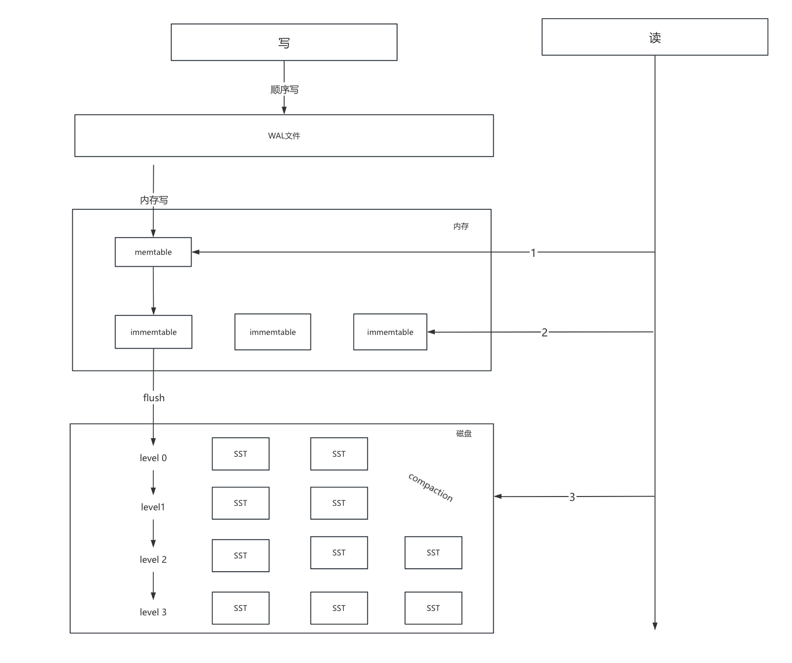

# RocksDB

## 概述

RocksDB 是一个高性能、嵌入式的键值存储引擎，是一个 C++ 库，基于 LevelDB 进行优化和扩展。它专为高并发、低延迟的读写操作设计，特别适用于大规模数据处理场景。RocksDB 采用 LSM（Log-Structured Merge-Tree）存储结构，具备高效的顺序写入性能，同时支持数据压缩、事务处理、多版本控制等功能，适合在 SSD 和持久化存储设备上运行。

## 基本结构



### 流程介绍

rocksdb通过wal的方式将随机写转变为顺序写，先将数据写入到内存中的memtable中，当memtable被写满时转变为只可读的immemtable，等待flush流程进行刷盘操作。之后在内存中开始写入新的memtable。immemtable进行flush之后生成SST文件保存在磁盘中，磁盘中数据存放的数据结构是LSM树，由于L0是内存刷盘而保存的文件，所以L0层的数据不严格排序，从L1层开始所有SST文件的key严格排序（例如在L2层的第一个SST文件是key0 - key99，第二个SST文件key100 - key200）。SST文件会进行定期的compaction操作，会将数据进行整合处理并保存在层级更高的地方，compaction之后的数据也是有序的。

## RocksDB的优缺点

### 优点

1. 插入、删除、修改操作快，具有优秀的写入性能
2. 数据冷热层分离，对于新写入、修改、删除的数据能较快的读到
3. 提供了事务支持，确保了数据在写入过程中的原子性和一致性

### 缺点

1. 由于分层的原因导致了写放大，可能造成不必要的性能损失和浪费
2. 在缓存memtable和compaction过程中对于内存消耗极大，造成性能下降和资源紧张
3. RocksDB的性能优势主要体现在写密集型和查询频率低的场景，在只读密集型应用中表现效果不佳

## 编译

```
git clone https://github.com/facebook/rocksdb.git
git checkout v9.9.3
//安装rocksdb常用库支持
sudo apt install libzstd-dev libbz2-dev liblz4-dev libsnappy-dev zlib1g-dev			 		

//可查看官方示例 , 展示了如何使用 RocksDB 的 API 实现基础功能和一些高级特性。这些示例代码对于学习 RocksDB 的用法、测试其性能以及快速构建原型非常有帮助。
make shared_lib 
cd examples
make all

//RocksDB提供了一个命令行工具 ldb，用于操作 RocksDB 数据库文件，例如查询、调试和验证数据
//使用cmake编译ldb
mkdir -p build
cd build
cmake -DCMAKE_BUILD_TYPE=Release ..
make ldb
cd tools

//在build/tools目录下查看ldb是否编译成功
./ldb --version
  
//基于cmake集成到项目编译：   
//rocksdb可以作为一个子项目去编译，在主目录添加自定义编译目标
add_custom_target(build-rocksdb          
		COMMAND make -j4 shared_lib -C ${ROCKSDB_SOURCE_DIR}
                  COMMENT "Building RocksDB"    
) 
 
```
