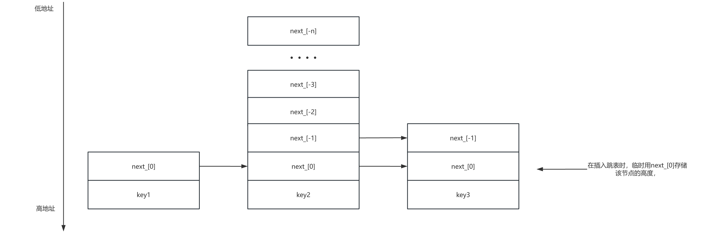

## MemTable文件

RocksDB的写请求写入到MemTable后就认为是写成功了，MemTable存放在内存中的，他保存了__落盘到SST文件前的数据__。同时服务于读和写，新的写入总是将数据插入到MemTable。一旦一个MemTable被写满（或者满足一定条件），他会变成不可修改的MemTable，即ImMemTable，并被一个新的MemTable替换。一个后台线程会将ImMemTable的内容落盘到一个SST文件，然后ImMemTable就可以被销毁了。

单个memtable的key分布是有序的，最常用的是基于SkipList（跳表）实现，有较好的读写性能，支持**并发写入**和**Hint插入**



除了默认的 memtable 实现，用户还可以使用其他类型的 memtable 实现，例如 HashLinkList（将数据组织在哈希表中，每个哈希桶都是一个排序的单链表）、HashSkipList（将数据组织在哈希表中，每个哈希桶都是一个跳表），来加速某些查询。

#### Flush

1. 单个 MemTable 超出大小范围，会触发刷盘
2. 所有 Column Family 的 MemTable 总大小超过限额
3. WAL 文件的总大小超过限额，则会刷存储最旧数据的 MemTable，以便删除该 WAL 文件

memtable 可以在其满之前被刷新，后续章节会对flush进行详细的讲解

```c++
//存入MemTable的kv数据格式
|-internal_key_size-|---key---|--seq--type|--value_size--|--value--|
//internal_key_size : varint类型，包括key、seq、type所占的字节数
//key：字符串，就是Put进来的key字符串seq：
//序列号，占7个字节type：
//操作类型，占1个字节（Put or Dlete）
//value_size：varint类型，表示value的长度
//value：字符串，就是Put进来的value字符串
```

```c++
class MemTable{  
  ...  
  KeyComparator comparator_; // 用于比较key的大小  	
  std::unique_ptr<MemTableRep> table_; // 指向skiplist  
  std::unique_ptr<MemTableRep> range_del_table_;// 指向skiplist，用于kTypeRangeDeletion类型(memtable支持范围删除)

  // 统计信息
  std::atomic<uint64_t> data_size_;  
  std::atomic<uint64_t> num_entries_;  
  std::atomic<uint64_t> num_deletes_;    
  
  // 动态可变选项
  std::atomic<size_t> write_buffer_size_;	//可支持最大写数据的大小，控制 MemTable 刷盘的阈值
  	
  // 记录第一个插入键值对的序列号,帮助确定恢复或刷盘的起始点
  std::atomic<SequenceNumber> first_seqno_;
  // 记录 MemTable 创建时的全局序列号,支持事务处理和崩溃恢复
  std::atomic<SequenceNumber> earliest_seqno_; 
  // 记录 MemTable 的创建序列号,用于判断该 MemTable 的历史记录
  SequenceNumber creation_seq_;
  // 记录 MemTable 中最旧键的时间戳,控制数据的生命周期和刷盘逻辑
  std::atomic<uint64_t> oldest_key_time_;
  
  std::unique_ptr<DynamicBloom> bloom_filter_; // Bloom Filter，用于快速判断键是否存在
  UnorderedMapH<Slice, void*, SliceHasher32> insert_hints_; // 存储每个前缀的插入提示
  
  // 范围删除的缓存
  std::mutex range_del_mutex_;
  CoreLocalArray<std::shared_ptr<FragmentedRangeTombstoneListCache>>
      cached_range_tombstone_;
  
  
  bool flush_in_progress_;   // started the flush  
  bool flush_completed_;     // finished the flush  
  uint64_t file_number_;     // 记录当前 MemTable 刷盘生成的 SST 文件编号
  
  VersionEdit edit_;         // 记录 MemTable 刷盘到存储时的元数据信息
  uint64_t mem_next_logfile_number_{0}; // 表示可以安全删除的日志文件（WAL）的最小编号
  
  // 表示负责该 MemTable 的 原子刷盘 的序列号，确保一致性
  // 小于此序列号的所有写入都已刷盘，大于等于此序列号的写入不会被刷盘
  SequenceNumber atomic_flush_seqno_{kMaxSequenceNumber}; 
};


Status MemTable::Add(SequenceNumber s, ValueType type, const Slice& key, /* user key */  
                   const Slice& value, bool allow_concurrent,
                   MemTablePostProcessInfo*post_process_info, void** hint) {  
  // kv编码     
  // Format of an entry is concatenation of:   
  // key_size     : varint32 of internal_key.size()    
  // key bytes    : char[internal_key.size()]  
  // value_size   : varint32 of value.size()  
  // value bytes  : char[value.size()]  
  uint32_t key_size = static_cast<uint32_t>(key.size());  
  uint32_t val_size = static_cast<uint32_t>(value.size());  
  uint32_t internal_key_size = key_size + 8;  		//8是 序列号的7字节 + 操作形式的1字节
  const uint32_t encoded_len = VarintLength(internal_key_size) + 
    internal_key_size + VarintLength(val_size) +                               
    val_size; 
  char* buf = nullptr;  
  
  // 通过判断key-value的类型来选择memtable, 范围删除的kv插入range_del_table_
  std::unique_ptr<MemTableRep>& table =      
    type == kTypeRangeDeletion ? range_del_table_ : table_;
  
  //申请内存空间，并将数据拷贝到内存中去
  KeyHandle handle = table->Allocate(encoded_len, &buf);
  char* p = EncodeVarint32(buf, internal_key_size);  
  memcpy(p, key.data(), key_size);  
  Slice key_slice(p, key_size);  
  p += key_size;  
  uint64_t packed = PackSequenceAndType(s, type);  
  EncodeFixed64(p, packed);  
  p += 8;  
  p = EncodeVarint32(p, val_size);  
  memcpy(p, value.data(), val_size);  
  UpdateEntryChecksum(kv_prot_info, key, value, type, s,
                      buf + encoded_len - moptions_.protection_bytes_per_key);
  
  
  // allow_concurrent默认为false 
  //是否开启并发写入
  if (!allow_concurrent) {    
    // 带hint插入，通过map记录一些前缀插入skiplist的位置，从而再次插入相同前缀的key时快速找到位置    
    // 默认不启用   
    if (insert_with_hint_prefix_extractor_ != nullptr && 
        insert_with_hint_prefix_extractor_->InDomain(key_slice)) {      
      Slice prefix = insert_with_hint_prefix_extractor_->Transform(key_slice);  
      bool res = table->InsertKeyWithHint(handle,&insert_hints_[prefix]);      
      if (UNLIKELY(!res)) {        
          return res;      
      }    
    } else {   
      //插入到skiplist   
      bool res = table->InsertKey(handle); 
    }
    
    // 更新统计信息
    num_entries_.store(num_entries_.load(std::memory_order_relaxed) + 1,    
                       std::memory_order_relaxed);
    data_size_.store(data_size_.load(std::memory_order_relaxed) + encoded_len,
                       std::memory_order_relaxed);   
    if (type == kTypeDeletion) {      
        num_deletes_.store(num_deletes_.load(std::memory_order_relaxed) + 1,             
                           std::memory_order_relaxed);    
    }    
    
    //更新布隆过滤器    
    if (bloom_filter_ && prefix_extractor_ &&        
          prefix_extractor_->InDomain(key)) {      
        bloom_filter_->Add(prefix_extractor_->Transform(key));
    }
    if (bloom_filter_ && 
      moptions_.memtable_whole_key_filtering) {      
        bloom_filter_->Add(StripTimestampFromUserKey(key, ts_sz));    
    }
    
    // 确保内存表中序号的一致性
    // 第一个序号为0或者当前操作序号大于等于第一个序号
    assert(first_seqno_ == 0 || s >= first_seqno_);    
    if (first_seqno_ == 0) {      
      first_seqno_.store(s, std::memory_order_relaxed);
      if (earliest_seqno_ == kMaxSequenceNumber) {        
        earliest_seqno_.store(GetFirstSequenceNumber(),                              
                              std::memory_order_relaxed);      
      }      
        assert(first_seqno_.load() >= earliest_seqno_.load());    
    }    
    
    // 更新 MemTable 的刷新状态
    UpdateFlushState(); 
  } else {    
    // 并发插入
    // 插入键值对
    bool res = (hint == nullptr)
      ? table->InsertKeyConcurrently(handle)
      : table->InsertKeyWithHintConcurrently(handle, hint);

   // 更新统计信息...

    // 利用 CAS 原子更新序号
    uint64_t cur_seq_num = first_seqno_.load(std::memory_order_relaxed);
    while ((cur_seq_num == 0 || s < cur_seq_num) &&
           !first_seqno_.compare_exchange_weak(cur_seq_num, s)) {
    }
    uint64_t cur_earliest_seqno =
        earliest_seqno_.load(std::memory_order_relaxed);
    while (
        (cur_earliest_seqno == kMaxSequenceNumber || s < cur_earliest_seqno) &&
        !earliest_seqno_.compare_exchange_weak(cur_earliest_seqno, s)) {
    }
  }  
  // 处理范围删除
  if (type == kTypeRangeDeletion) {
    // 创建新的范围删除缓存
    auto new_cache = std::make_shared<FragmentedRangeTombstoneListCache>();
    // CPU 的核心数
    size_t size = cached_range_tombstone_.Size();
    if (allow_concurrent) {
      // 并发模式需要加锁
      post_process_info->num_range_deletes++;
      range_del_mutex_.lock();
    }
    // 分别为每个核心更新其范围删除缓存
    for (size_t i = 0; i < size; ++i) {
      // 每个核心需要独立管理自己的引用，且不能干扰其他核心
      std::shared_ptr<FragmentedRangeTombstoneListCache>* local_cache_ref_ptr =
          cached_range_tombstone_.AccessAtCore(i);
      auto new_local_cache_ref = std::make_shared<
          const std::shared_ptr<FragmentedRangeTombstoneListCache>>(new_cache);
      // 原子更新缓存指针
      std::atomic_store_explicit(
          local_cache_ref_ptr,
          std::shared_ptr<FragmentedRangeTombstoneListCache>(
              new_local_cache_ref, new_cache.get()),
          std::memory_order_relaxed);
    }

    if (allow_concurrent) {
      range_del_mutex_.unlock();
    }
    is_range_del_table_empty_.store(false, std::memory_order_relaxed);
  }
  // 更新最旧键的时间戳
  UpdateOldestKeyTime();
  return Status::OK();
}

bool MemTable::Get(const LookupKey& key, std::string* value,
                   PinnableWideColumns* columns, std::string* timestamp,
                   Status* s, MergeContext* merge_context,
                   SequenceNumber* max_covering_tombstone_seq,
                   SequenceNumber* seq, const ReadOptions& read_opts,
                   bool immutable_memtable, ReadCallback* callback,
                   bool* is_blob_index, bool do_merge) {
  
  // ...
	
  // 在range_del_table_上初始化一个迭代器，用于遍历范围删除的记录
  std::unique_ptr<FragmentedRangeTombstoneIterator> range_del_iter(
      NewRangeTombstoneIterator(read_opts,
                                GetInternalKeySeqno(key.internal_key()),
                                immutable_memtable));
  if (range_del_iter != nullptr) {
    // 获取范围删除中包含此键的最大序号
    SequenceNumber covering_seq =
        range_del_iter->MaxCoveringTombstoneSeqnum(key.user_key());
    // 如果删除的序号大于此序号，则范围删除优先级最高
    if (covering_seq > *max_covering_tombstone_seq) {
      *max_covering_tombstone_seq = covering_seq;
      //更新时间戳
    }
  }

  //...
  
  //用布隆过滤器判断键是否可能存在memtable里面
  if (bloom_filter_) {
    // 全键过滤
    if (moptions_.memtable_whole_key_filtering) {
      may_contain = bloom_filter_->MayContain(user_key_without_ts);
      bloom_checked = true;
    } else {
      //如果设置了前缀提词器则对前缀进行过滤，前缀过滤器通常用于范围查询
      if (prefix_extractor_->InDomain(user_key_without_ts)) {
        may_contain = bloom_filter_->MayContain(
            prefix_extractor_->Transform(user_key_without_ts));
        bloom_checked = true;
      }
    }
  }
	
  if (bloom_filter_ && !may_contain) {
    // 如果布隆过滤器判断键不在，则键肯定不存在
    PERF_COUNTER_ADD(bloom_memtable_miss_count, 1);
    *seq = kMaxSequenceNumber;
  } else {
    if (bloom_checked) {
      PERF_COUNTER_ADD(bloom_memtable_hit_count, 1);
    }
    //进行精确查找
    GetFromTable(key, *max_covering_tombstone_seq, do_merge, callback,
                 is_blob_index, value, columns, timestamp, s, merge_context,
                 seq, &found_final_value, &merge_in_progress);
  }

  //...
  
  PERF_COUNTER_ADD(get_from_memtable_count, 1);
  return found_final_value;
}

bool MemTable::ShouldFlushNow() {
  // 判断是否因为范围删除触发刷盘
  if (memtable_max_range_deletions_ > 0 &&
      num_range_deletes_.load(std::memory_order_relaxed) >=
          static_cast<uint64_t>(memtable_max_range_deletions_)) {
    return true;
  }

  // 判断是否有足够的内存继续分配
  size_t write_buffer_size = write_buffer_size_.load(std::memory_order_relaxed);
  const double kAllowOverAllocationRatio = 0.6;
  auto allocated_memory = table_->ApproximateMemoryUsage() +
                          range_del_table_->ApproximateMemoryUsage() +
                          arena_.MemoryAllocatedBytes();
  approximate_memory_usage_.store(allocated_memory, std::memory_order_relaxed);
  if (allocated_memory + kArenaBlockSize <
      write_buffer_size + kArenaBlockSize * kAllowOverAllocationRatio) {
    return false;
  }
  if (allocated_memory >
      write_buffer_size + kArenaBlockSize * kAllowOverAllocationRatio) {
    return true;
  }

  // 如果最后一块内存块的未使用空间小于其总大小的 1/4，返回 true，触发刷盘
  return arena_.AllocatedAndUnused() < kArenaBlockSize / 4;
}


```

```c++
char* InlineSkipList<Comparator>::AllocateKey(size_t key_size) {  
  //这里会随机一个高度，也就是跳表里面一个节点的高度  
  return const_cast<char*>(AllocateNode(key_size, RandomHeight())->Key());
}

//为一个新的跳表节点分配内存
InlineSkipList<Comparator>::AllocateNode(size_t key_size, int height) {  
  //每个指针指向该高度的下一个节点高度，最底下的节点暂时无指向
  auto prefix = sizeof(std::atomic<Node*>) * (height - 1);
  //通过Arena::AllocateAligned或者ConcurrentArena::AllocateAligned去申请内存  
  char* raw = allocator_->AllocateAligned(prefix + sizeof(Node) + key_size);  

  //将节点高度暂时存储在高度为1的位置，插入跳表完成后就不需要高度了,这个位置就会存放指向下一个节点的指针 
  Node* x = reinterpret_cast<Node*>(raw + prefix);
  x->StashHeight(height); 
  
  return x;
}
```

