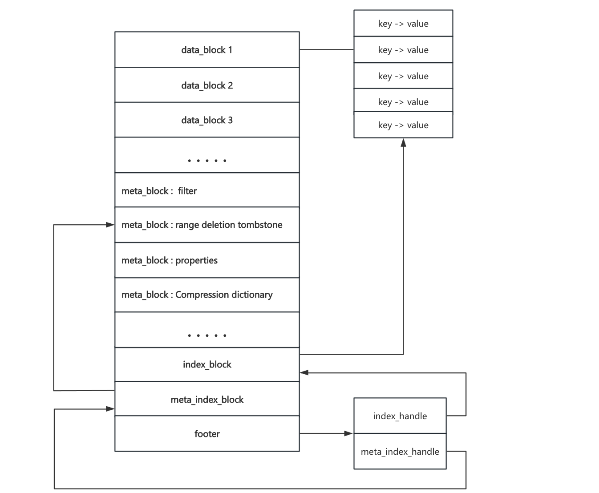

## SST文件

在rocksdb内通过flush和compaction生成SST文件， SST 文件是用来存储一系列**有序的 KV对**，Key 和 Value 都是任意长度的字符串；在rocksdb层级里面，L0的各个SST文件之间是**没有严格排序**的，而L1及L1+层级中SST文件之间是**严格有序**的



```
sst_dump解析sst文件
./sst_dump --file=my_rocksdb/000008.sst --command=raw
处理成功会有如下打印，并写入到000008_dump.txt文件
from [] to []
Process my_rocksdb/sst_file.sst
Sst file format: block-based
raw dump written to file my_rocksdb/000008_dump.txt

输出解析的sst文件内容
cat 000008_dump.txt
 
Footer Details:
--------------------------------------  
checksum: 1                                //校验和  
metaindex handle: D10736                   //索引Metaindex Details  
index handle: 9F3A16                       //索引Index 
Details  footer version: 6                 //版本  
table_magic_number: 9863518390377041911    //固定值，验证文件是否为合法的 SST 文件  
  
//元数据
Metaindex Details:
--------------------------------------  
Filter block handle: C30345            // 索引布隆过滤器数据块  
Properties block handle: F204C805      // 索引Table Properties  属性
Range deletion block handle: AF043E    // 索引Range deletions   范围删除

Table Properties:
--------------------------------------  
# data blocks: 1                                     // Data Block个数  
# entries: 22                                        // 条目数 20put + 2delete_range  
# deletions: 2                                       // deletion个数 deletion + deletion range  
# merge operands: 0                                  // merge操作个数  
# range deletions: 2                                 // deletion range个数  
raw key size: 330                                    // 原始key大小  
raw average key size: 15.000000                      // 平均每个key占用的空间大小  
raw value size: 194                                  // 原始value大小  
raw average value size: 8.818182                     // 平均每个value占用的空间大小  
data block size: 451                                 // data block大小  
index block size (user-key? 0, delta-value? 0): 34   // index block大小  
filter block size: 69                                // filter block大小  
(estimated) table size: 554                          // 预估table大小  
filter policy name: rocksdb.BuiltinBloomFilter       // 过滤器名称  
prefix extractor name: nullptr                       // 前缀提取器名称  
column family ID: N/A                                // 列族ID，这里直接写的sst，没有列族  
column family name: N/A                              // 列族名称  
comparator name: leveldb.BytewiseComparator          // 比较器名称  
merge operator name: nullptr                         // 合并操作符名称  
property collectors names: []                        // 属性收集器名称  
SST file compression algo: NoCompression             // 压缩方式，不压缩  
SST file compression options: window_bits=-14; level=32767; strategy=0; max_dict_bytes=0; zstd_max_train_bytes=0; enabled=0;   
creation time: 0                                     // 最先写入memtable的时间  
time stamp of earliest key: 0                        //   
file creation time: 0                                // sst文件创建时间  

// 索引块
Index Details:    
--------------------------------------  
Block key hex dump: Data block handle  
Block key ascii
HEX    6B65795F626239: 00BE03  
ASCII  k e y _ b b 9   
------

// 范围删除数据
Range deletions: 
--------------------------------------    
HEX    6B65795F626232: 6B65795F626235  
ASCII  k e y _ b b 2 : k e y _ b b 5   		//bb2-bb5全部是删除
------ 
...

//key value
Data Block # 1 @ 00BE03  
--------------------------------------  
HEX    6B65795F616130: 76616C75655F616130  
ASCII  k e y _ a a 0 : v a l u e _ a a 0   
------  
HEX    6B65795F616131: 76616C75655F616131  
ASCII  k e y _ a a 1 : v a l u e _ a a 1   
------
...

Data Block Summary:
--------------------------------------  
# data blocks: 1  
min data block size: 446         // 最小block大小  
max data block size: 446         // 最大block大小  
avg data block size: 446.000000  // 平均block大小
```

### Index Block

索引块存储的是 **数据块的键信息及其位置**，允许 RocksDB 在不读取整个数据文件的情况下快速找到所需的数据块。

#### Partitioned Index

**两级索引结构**：第一层索引指向第二层索引块，而第二层索引块指向具体的数据块

```
[Index Block - 1st Level]  # 顶层索引，指向多个二级索引块
[Index Block - 1st Level]
...
[Index Block - 2nd Level]  # 细粒度索引，每个条目指向一个数据块
```

#### 索引 key 的优化

索引条目的 key 介于当前数据块的最后一个 Key 和下一个数据块的第一个 Key 之间，由于这两个 Key 之间可能有多个可选 Key，RocksDB 允许选择**更短的 Key** 来减少索引块大小

```
Block 1: [apple, banana, cherry]
Block 2: [date, elderberry, fig]
Block 3: [grape, honeydew, kiwi]

默认情况
Index Entry for Block 1 → cherry
Index Entry for Block 2 → fig

key 优化后可变为
Index Entry for Block 1 → c
Index Entry for Block 2 → f
```

#### Restart Point

RocksDB **使用变长编码（Variable-Length Encoding）** 存储 Key，并采用 **共享前缀压缩（Prefix Compression）** 技术来减少存储占用，在索引块或数据块中，**相邻的 Key 可能有相同的前缀**，通过**只存储前缀差异部分**，可以显著减少索引块或数据块的存储开销。

**RocksDB 在一定间隔内设定 Restart Point**，用于**重置前缀压缩**，以便查找时可以跳跃式定位，而不是线性扫描整个块

#### 索引块存储格式优化

1. format_version=2

   索引块格式与数据块类似，Key 采用 <user_key, seq> 形式，Value 采用 <offset, size>，指向对应的数据块

   默认  index_block_restart_interval=1：

   - 每个索引 Key 都是一个 restart point，查询速度快，但**内存占用高**
   - 设为 8 或 16 可以减少索引块大小，但可能增加 CPU 负担。

2. format_version=3

   索引块中的 sequence number（seq）大部分情况下不需要，因此省略 seq

3. format_version=4

   使用**增量编码**优化索引值存储，**第一个** value **仍完整存储** <offset, size>，**后续索引条目仅存储相对于上一个** BlockHandle **的差值（delta-size）**。

   ```
   restart_point   0: k, v (off, sz), k, v (delta-sz), ..., k, v (delta-sz)
   restart_point   1: k, v (off, sz), k, v (delta-sz), ..., k, v (delta-sz)
   ...
   restart_point n-1: k, v (off, sz), k, v (delta-sz), ..., k, v (delta-sz)
   where, k is key, v is value, and its encoding is in parenthesis.
   ```

   - **索引块大小显著减少**，适用于超大 SST 文件
   - **提高查询性能**，减少重复存储的信息

4. format_version=5

   当 RocksDB 需要执行**二分查找**时，它必须先读取数据块才能确认数据块的 Key 是否匹配查询条件，如果某个数据块实际上不包含查询 Key，那么 RocksDB 仍然会读取它，导致不必要的 I/O。

   在索引块中存储每个数据块的**第一个 Key**

   ```
   restart_point 0:
       k (block_key), v (block_offset, block_size, size_of_first_key, first_key)
       k (block_key), v (delta_size, size_of_first_key, first_key)
       k (block_key), v (delta_size, size_of_first_key, first_key)
   restart_point 1:
       k (block_key), v (block_offset, block_size, size_of_first_key, first_key)
       k (block_key), v (delta_size, size_of_first_key, first_key)
       k (block_key), v (delta_size, size_of_first_key, first_key)
   ```

   - 适用于大规模范围查询
   - 无需读取磁盘即可获取数据块的第一个 Key
   - 延迟数据块读取，仅在查询需要时才加载数据块

### PlainTable

PlainTable 是 RocksDB 提供的一种 SST 文件格式，针对**纯内存存储或超低延迟存储设备**进行了优化，减少了查询延迟。

- 采用内存索引加速查询
- 不使用 block cache，减少额外的缓存开销
- 采用 mmap 机制，避免内存拷贝

#### 文件格式

```
[data row1]
[data row1]
[data row1]
...
[data rowN]
[Property Block]
[Footer]               // 固定大小，存储在文件末尾，starts at file_size-sizeof(Footer)

data row：
  encoded key
  length of value: varint32
  value bytes

Property Block： 
   data_size：文件数据部分的结束位置。
   fixed_key_len：如果所有 Key 长度相同，则存储 Key 长度；否则为 0。
   
Footer：固定大小，格式与 BlockBasedTable 相同
```

##### Key 编码方式

1. Plain Encoding

   - 如果 **所有 Key 长度相同**，则 Key 直接存储

     ```
     [user key] + [internal bytes]
     ```

   - 如果 **Key 是变长的**，则 Key 需要前缀长度信息

     ```
     [length of key: varint32] + [user key] + [internal bytes]
     ```

2. Prefix Encoding

   一种特殊的增量编码，用于避免重复存储相同前缀的 Key

   - 第一条 Key（Full Key，FK）：完整存储整个 Key。
   - 第二条 Key（Prefix From Previous Key，PF）：存储前缀长度 + 后缀部分（Suffix）。
   - 第三条及以后（Key Suffix，SF）：仅存储后缀部分。

   ```
   +----+----+----+----+----+----+----+----+
   |  Type   |            Size             |
   +----+----+----+----+----+----+----+----+
   
   Type 为前两位表示 Key 的类型
   Size 为后6位：
   	如果 Size < 0x3F（即 63 以下），则这个值就是 Key 长度
   	如果 Size = 0x3F（即全 1，值 63），则后续存储一个 Varint32，表示真正的 Key 长度。
   ```

Internal Bytes：

```
[user key] + [type: 1 byte] + [sequence ID: 7 bytes]

type（1 字节）：表示 Key 类型，如 Put、Delete、Merge 等。
sequence ID（7 字节）：RocksDB 版本控制用的序列号。
```

如果 sequence ID = 0，可以用 0x80 代替 8 字节，减少 7 字节存储开销

#### 内存索引

- 在 BlockBasedTable 中，先在索引块进行二分查找，定位数据块，读取数据块后，再次执行 **二分查找** 定位具体 Key

- 在 PlainTable 中，内存索引通过**哈希表**直接定位数据块位置，减少索引查找开销，数据块内仅执行一次**二分查找**

##### 哈希桶

内存索引在顶层是一个哈希表，哈希表的存储桶是文件的偏移量或索引（多个前缀被哈希到同一个桶中或一个前缀的键太多）

```
+--------------+------------------------------------------------------+
| Flag (1 bit) | Offset to binary search buffer or file (31 bits)     +
+--------------+------------------------------------------------------+
Flag:
0 表示该桶直接指向 SST 文件的偏移量（线性扫描），偏移量指向 SST 文件中数据的起始位置
1 表示需要从二分查找缓冲区查找，偏移量指向二分查找缓冲区
```

##### 二分查找缓冲区

```
+--------------------------------+
| number_of_records (varint32)   |  // 记录数量 N
+--------------------------------+
| record 1 file offset (fixed32) |  // Key 1 在 SST 文件中的偏移量
+--------------------------------+
| record 2 file offset (fixed32) |  // Key 2 在 SST 文件中的偏移量
+--------------------------------+
| ...                            |
+--------------------------------+
| record N file offset (fixed32) |  // Key N 在 SST 文件中的偏移量
+--------------------------------+
```

- 二分查找缓冲区存储的是 SST 文件中 Key 的偏移量，按升序排列
- 在哈希桶发生冲突或 Key 过多时，RocksDB 先在二分查找缓冲区中进行二分查找，然后在 SST 进行线性查找。


SST 文件的 Get 操作请在 [version](../ch03/RocksDB_Version.md) 中查看
