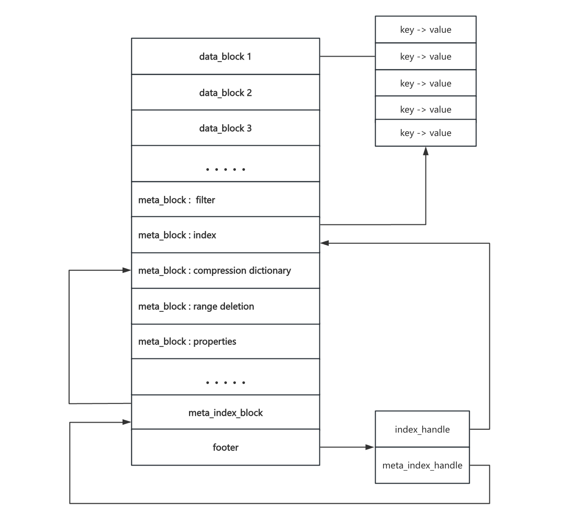

## SST文件

在rocksdb内通过flush和compaction生成SST文件， SST 文件是用来存储一系列**有序的 KV对**，Key 和 Value 都是任意长度的字符串；在rocksdb层级里面，L0的各个SST文件之间是**没有严格排序**的，而L1及L1+层级中SST文件之间是**严格有序**的



```
sst_dump解析sst文件
./sst_dump --file=my_rocksdb/000008.sst --command=raw
处理成功会有如下打印，并写入到000008_dump.txt文件
from [] to []
Process my_rocksdb/sst_file.sst
Sst file format: block-based
raw dump written to file my_rocksdb/000008_dump.txt

输出解析的sst文件内容
cat 000008_dump.txt
 
Footer Details:
--------------------------------------  
checksum: 1                                //校验和  
metaindex handle: D10736                   //索引Metaindex Details  
index handle: 9F3A16                       //索引Index 
Details  footer version: 6                 //版本  
table_magic_number: 9863518390377041911    //固定值，验证文件是否为合法的 SST 文件  
  
//元数据
Metaindex Details:
--------------------------------------  
Filter block handle: C30345            // 索引布隆过滤器数据块  
Properties block handle: F204C805      // 索引Table Properties  属性
Range deletion block handle: AF043E    // 索引Range deletions   范围删除

Table Properties:
--------------------------------------  
# data blocks: 1                                     // Data Block个数  
# entries: 22                                        // 条目数 20put + 2delete_range  
# deletions: 2                                       // deletion个数 deletion + deletion range  
# merge operands: 0                                  // merge操作个数  
# range deletions: 2                                 // deletion range个数  
raw key size: 330                                    // 原始key大小  
raw average key size: 15.000000                      // 平均每个key占用的空间大小  
raw value size: 194                                  // 原始value大小  
raw average value size: 8.818182                     // 平均每个value占用的空间大小  
data block size: 451                                 // data block大小  
index block size (user-key? 0, delta-value? 0): 34   // index block大小  
filter block size: 69                                // filter block大小  
(estimated) table size: 554                          // 预估table大小  
filter policy name: rocksdb.BuiltinBloomFilter       // 过滤器名称  
prefix extractor name: nullptr                       // 前缀提取器名称  
column family ID: N/A                                // 列族ID，这里直接写的sst，没有列族  
column family name: N/A                              // 列族名称  
comparator name: leveldb.BytewiseComparator          // 比较器名称  
merge operator name: nullptr                         // 合并操作符名称  
property collectors names: []                        // 属性收集器名称  
SST file compression algo: NoCompression             // 压缩方式，不压缩  
SST file compression options: window_bits=-14; level=32767; strategy=0; max_dict_bytes=0; zstd_max_train_bytes=0; enabled=0;   
creation time: 0                                     // 最先写入memtable的时间  
time stamp of earliest key: 0                        //   
file creation time: 0                                // sst文件创建时间  

// 索引块
Index Details:    
--------------------------------------  
Block key hex dump: Data block handle  
Block key ascii
HEX    6B65795F626239: 00BE03  
ASCII  k e y _ b b 9   
------

// 范围删除数据
Range deletions: 
--------------------------------------    
HEX    6B65795F626232: 6B65795F626235  
ASCII  k e y _ b b 2 : k e y _ b b 5   		//bb2-bb5全部是删除
------ 
...

//key value
Data Block # 1 @ 00BE03  
--------------------------------------  
HEX    6B65795F616130: 76616C75655F616130  
ASCII  k e y _ a a 0 : v a l u e _ a a 0   
------  
HEX    6B65795F616131: 76616C75655F616131  
ASCII  k e y _ a a 1 : v a l u e _ a a 1   
------
...

Data Block Summary:
--------------------------------------  
# data blocks: 1  
min data block size: 446         // 最小block大小  
max data block size: 446         // 最大block大小  
avg data block size: 446.000000  // 平均block大小
```
