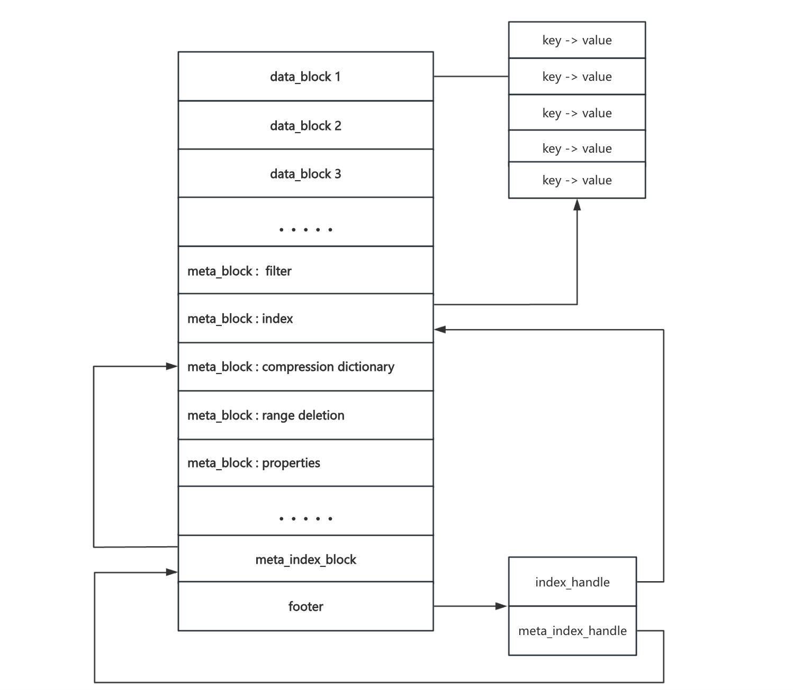

## SST文件

在rocksdb内通过flush和compaction生成SST文件， SST 文件是用来存储一系列**有序的 KV对**，Key 和 Value 都是任意长度的字符串；在rocksdb层级里面，L0的各个SST文件之间是**没有严格排序**的，而L1及L1+层级中SST文件之间是**严格有序**的



```c++
sst_dump解析sst文件
./sst_dump --file=my_rocksdb/000008.sst --command=raw
处理成功会有如下打印，并写入到000008_dump.txt文件
from [] to []
Process my_rocksdb/sst_file.sst
Sst file format: block-based
raw dump written to file my_rocksdb/000008_dump.txt

输出解析的sst文件内容
cat 000008_dump.txt
 
Footer Details:
--------------------------------------  
checksum: 1                 			//校验和  
metaindex handle: D10736   				//索引Metaindex Details  
index handle: 9F3A16         				//索引Index 
Details  footer version: 6        //版本  
table_magic_number: 9863518390377041911  //固定值，验证文件是否为合法的 SST 文件  
  
//元数据
Metaindex Details:
--------------------------------------  
Filter block handle: C30345            // 索引布隆过滤器数据块  
Properties block handle: F204C805      // 索引Table Properties  属性
Range deletion block handle: AF043E    // 索引Range deletions		范围删除

Table Properties:
--------------------------------------  
# data blocks: 1                                     // Data Block个数  
# entries: 22                                        // 条目数 20put + 2delete_range  
# deletions: 2                                       // deletion个数 deletion + deletion range  
# merge operands: 0                                  // merge操作个数  
# range deletions: 2                                 // deletion range个数  
raw key size: 330                                    // 原始key大小  
raw average key size: 15.000000                      // 平均每个key占用的空间大小  
raw value size: 194                                  // 原始value大小  
raw average value size: 8.818182                     // 平均每个value占用的空间大小  
data block size: 451                                 // data block大小  
index block size (user-key? 0, delta-value? 0): 34   // index block大小  
filter block size: 69                                // filter block大小  
(estimated) table size: 554                          // 预估table大小  
filter policy name: rocksdb.BuiltinBloomFilter       // 过滤器名称  
prefix extractor name: nullptr                       // 前缀提取器名称  
column family ID: N/A                                // 列族ID，这里直接写的sst，没有列族  
column family name: N/A                              // 列族名称  
comparator name: leveldb.BytewiseComparator          // 比较器名称  
merge operator name: nullptr                         // 合并操作符名称  
property collectors names: []                        // 属性收集器名称  
SST file compression algo: NoCompression             // 压缩方式，不压缩  
SST file compression options: window_bits=-14; level=32767; strategy=0; max_dict_bytes=0; zstd_max_train_bytes=0; enabled=0;   
creation time: 0                                     // 最先写入memtable的时间  
time stamp of earliest key: 0                        //   
file creation time: 0                                // sst文件创建时间  

//索引块
Index Details:    
--------------------------------------  
Block key hex dump: Data block handle  
Block key ascii
HEX    6B65795F626239: 00BE03  
ASCII  k e y _ b b 9   
------

//范围删除数据
Range deletions: 
--------------------------------------    
HEX    6B65795F626232: 6B65795F626235  
ASCII  k e y _ b b 2 : k e y _ b b 5   		//bb2-bb5全部是删除
------ 
...

//key value
Data Block # 1 @ 00BE03  
--------------------------------------  
HEX    6B65795F616130: 76616C75655F616130  
ASCII  k e y _ a a 0 : v a l u e _ a a 0   
------  
HEX    6B65795F616131: 76616C75655F616131  
ASCII  k e y _ a a 1 : v a l u e _ a a 1   
------
...

Data Block Summary:
--------------------------------------  
# data blocks: 1  
min data block size: 446         // 最小block大小  
max data block size: 446         // 最大block大小  
avg data block size: 446.000000  // 平均block大小
```


## Bloom过滤器

#### 作用

1. 判断一个元素**肯定不在**一个集合中
2. 判断一个元素**可能在**一个集合中

#### 原理

布隆过滤器由**一个长度为m的位数组和k个哈希函数**组成。

- 在添加key时，先通过k个hash函数计算出在位数组上的k个位置，然后将数组对应的位置记为1。

- 在查找key时，先通过k个hash函数计算出在位数组上的k个位置，判断数组对应的每个位置的值是否为1，如果全部为1说明元素**可能**在集合中，反之**一定**不在集合中

在 RocksDB 中，当设置了过滤策略时，每个新创建的 SST 文件都会包含一个布隆过滤器，该过滤器嵌入在 SST 文件本身中，用于确定文件是否可能包含我们要查找的键。过滤器本质上是一个位数组。多个哈希函数应用于给定的键，每个函数指定数组中将设置为 1 的位。在读取时，也会对搜索键应用相同的哈希函数，检查位，即探测，如果至少一个探测返回 0，则该键肯定不存在。**RocksDB通过减少布隆过滤器的误判率进行性能调优**


#### Block-based Bloom Filter（old format）

为每个 **数据块** 构建布隆过滤器，它按照 SST 文件的 **字节偏移范围** 将键值分组，并为每个范围生成一个独立的过滤器。

```
+----------------------------------------+
| filter 0 data (256 bytes)              |				//布隆过滤器的数据部分，256bytes表示这部分大小
+----------------------------------------+
| filter 1 data (256 bytes)              |
+----------------------------------------+
| filter 2 data (256 bytes)              |
+----------------------------------------+
| padding (256 bytes)                    |  			//内存对齐，
+----------------------------------------+
| offset of filter 0 = 0   			(4 byte) |        // 偏移量数组，过滤器在此block的位置
+----------------------------------------+
| offset of filter 1 = 256  		(4 byte) |						
+----------------------------------------+
| offset of filter 2 = 512  		(4 byte) |
+----------------------------------------+
| offset of offset array = 1024 (4 byte) | 				//偏移量数组起始位置
+----------------------------------------+
| lg(base) = 11                 (1 byte) |        // base = 2^11 每个过滤器覆盖2KB的偏移范围
+----------------------------------------+
```

```
Legacy Bloom filter data:
              0 +-----------------------------------+
                | Raw Bloom filter data             |		 	//存储布隆过滤器的位数组
                | Raw Bloom filter data             |	
                | ...                               |
            len +-----------------------------------+
                | byte for num_probes or            |			//哈希探测次数
                |   marker for new implementations  |			//标识布隆过滤器是否使用新实现
          len+1 +-----------------------------------+
                | four bytes for number of cache    |			//缓存行数量
                |   lines                           |			//对齐缓存行，以优化内存访问
  len_with_meta +-----------------------------------+


```

存在的问题：

1. 由于需要找到key属于对应的哪个块再找的对应的fliter，所以无论布隆过滤器是否过滤掉此key都需要加载数据的index
2. 由于filter block可能过大，访问其中的过滤器可能导致内存随机访问，各个过滤器块未与缓存对齐，因此在查找过程中可能会导致大量缓存未命中
3. 范围查询效率低，需要跨多个数据块


#### Full Filters (new format)

- 通过为**整个SST文件**创建一个过滤器来解决block filter所产生的问题1，代价是需要更多内存来缓存布隆过滤器的。
- 为了解决问题2，Full Filters利用CPU缓存局部性来提高效率。限制每个键的哈希探测位位于同一个缓存行，避免跨行访问

如下图所示，位置(0 - len)为过滤器位数组n个数据块的位置，位置(len2 - len3)规定了数据块的大小，通常块大小为CPU缓存行大小。

查询时，首先通过计算key的hash值确定此key映射到其中一个filter位数组块中，Full Filter 将每个键的所有哈希探测限制在布隆过滤器位数组的同一个块中，避免了跨缓存行的访问，减少了CPU缓存未命中的概率，之后每次hash都在此块进行查找

```
New Bloom filter data:
            0 +-----------------------------------+				//存储布隆过滤器的位数组
              | Raw Bloom filter data  1          |
              | Raw Bloom filter data  2          |
              | ...                               |
          len +-----------------------------------+				//标志字节，例如-1表示新格式	
              | char{-1} byte -> new Bloom filter |				//区分新旧实现
        len+1 +-----------------------------------+
              | byte for subimplementation        |				//标志字节，支持多种过滤器实现
              |   0: FastLocalBloom               |				//例如0表示 FastLocalBloom 实现
              |   other: reserved                 |
        len+2 +-----------------------------------+
              | byte for block_and_probes         |				//存储块大小和哈希探测次数
              |   0 in top 3 bits -> 6 -> 64-byte |				//高三位表示的是布隆过滤器块大小
              |   reserved:                       |				//块大小为2的（6+vlaue）次方
              |   1 in top 3 bits -> 7 -> 128-byte|				//块最大大小为8KB
              |   2 in top 3 bits -> 8 -> 256-byte|
              |   ...                             |
              |   num_probes in bottom 5 bits,    |				//低五位是哈希探测次数（1-30）
              |     except 0 and 31 reserved      |
        len+3 +-----------------------------------+
              | two bytes reserved                |				//预留两字节方便未来扩展
              |   possibly for hash seed          |
len_with_meta +-----------------------------------+
```


#### Partitioned Index Filters

通常对于256MB的SST文件，通常数据块大小为4 - 32KB，而过滤器为5MB，很容易造成过滤器和数据块争夺内存空间的情况

所以RocksDB在过滤器块上添加了一个顶级索引，只有顶级索引会加载到内存中去，使用顶级索引将过滤器查询所需的分区加载到缓存中去优点：

- 更高的缓存命中率：不会让过滤器的无用块污染缓存空间，而是允许以更细的粒度加载过滤器，从而有效利用缓存空间。
- 更少的 IO 效用：只需要从磁盘加载一个分区，与读取 SST 文件的整个过滤器相比，这会减轻磁盘负载。
- 可灵活调整索引大小：不进行分区，减少过滤器内存占用的替代方法是牺牲它们的准确性，例如通过更大的数据块或更少的布隆位来分别获得更小的索引和过滤器。

##### 缺点：

- 顶级索引的额外空间：仅为索引/过滤器大小的 0.1-1％。
- 更多磁盘 IO：如果顶级索引尚未在缓存中，则会导致一次额外的 IO。为了避免这种情况，可以将它们存储在堆中或以高优先级存储在缓存中
- 失去空间局部性：如果工作负载需要频繁但随机地读取同一个 SST 文件，则会导致每次读取时加载单独的过滤器分区，这比一次读取整个过滤器效率更低。它只可能发生在 LSM 的 L0/L1 层，可以禁用分区


......continue.......

1. 向布隆过滤器添加key

```c++
void FullFilterBlockBuilder::Add(const Slice& key_without_ts) {
  //是否适合前缀提取
  if (prefix_extractor_ && prefix_extractor_->InDomain(key_without_ts)) {
    Slice prefix = prefix_extractor_->Transform(key_without_ts);
    //是否添加完整键
    if (whole_key_filtering_) {
      filter_bits_builder_->AddKeyAndAlt(key_without_ts, prefix);
    } else {
      filter_bits_builder_->AddKey(prefix);
    }
  } else if (whole_key_filtering_) {
    filter_bits_builder_->AddKey(key_without_ts);
  }
}


```


2. 判断key是否有可能包含在集合内

```c++
bool FullFilterBlockReader::MayMatch(const Slice& entry,
                                     GetContext* get_context,
                                     BlockCacheLookupContext* lookup_context,
                                     const ReadOptions& read_options) const {
  
  //加载过滤块
  CachableEntry<ParsedFullFilterBlock> filter_block;
  const Status s = GetOrReadFilterBlock(get_context, lookup_context,
                                        &filter_block, read_options);
 	//...
	
  //获取布隆过滤器位读取器
  FilterBitsReader* const filter_bits_reader =
    filter_block.GetValue()->filter_bits_reader();
  if (filter_bits_reader) {
    //判断是否匹配
    if (filter_bits_reader->MayMatch(entry)) {
      //计数器，方便之后统计性能
      PERF_COUNTER_ADD(bloom_sst_hit_count, 1);
      return true;
    } else {
      PERF_COUNTER_ADD(bloom_sst_miss_count, 1);
      return false;
    }
  }
  return true;
}

bool MayMatch(const Slice& key) override {
  uint32_t hash = BloomHash(key);
  uint32_t byte_offset;
  //预取，减少查询时的缓存未命中开销
  //由于位数组通常存储在内存中，频繁的随机访问可能导致大量缓存未命中
  //提前将相关内存加载到 CPU 缓存中，降低访问延迟
  LegacyBloomImpl::PrepareHashMayMatch(
        hash, num_lines_, data_, /*out*/ &byte_offset, log2_cache_line_size_);
  return LegacyBloomImpl::HashMayMatchPrepared(
        hash, num_probes_, data_ + byte_offset, log2_cache_line_size_);
}

// h:            根据key计算出的hash值  
// total_bits:   bloom过滤器位数组长度  
// num_probes：	嗅探次数，即一个key最终映射到布隆过滤器位数组上的bit个数，也就是k  
// data：				布隆过滤器位数组  
static inline bool HashMayMatchPrepared(uint32_t h, int num_probes,
                                          const char *data_at_offset,
                                          int log2_cache_line_bytes) {
  //数组通常存在为字节数组中，由于操作目标是位数组（bite），需要避免跨字节的操作，
  //3表示log2(8)，需要1字节空间避免溢出或越界（比如511bit这种情况）
  const int log2_cache_line_bits = log2_cache_line_bytes + 3;
	
  //循环位移，用delta模拟多个独立的hash函数
  const uint32_t delta = (h >> 17) | (h << 15);
  
  for (int i = 0; i < num_probes; ++i) {
    const uint32_t bitpos = h & ((1 << log2_cache_line_bits) - 1); 
    //这里以一个字节去比较对应位，只要有一个bit不为1就直接返回false      
    // (1 << (bitpos % 8))  该字节上对应pos置为1      
    // data[bitpos / 8]  布隆过滤器位数组上该bit所属的对应字节      
    // if也就是判断布隆过滤器位数组上对应pos的位是否为0，      
    // 是说明该key不在集合内，直接返回false      
    if (((data_at_offset[bitpos / 8]) & (1 << (bitpos % 8))) == 0) {    
      return false；      
    }   
    //是否更新哈希值，增加哈希值的分布随机性
    if (ExtraRotates) {  
      h = (h >> log2_cache_line_bits) | (h << (32 - log2_cache_line_bits));      
    }     
    h += delta;
  }    
  return true;
}

```


#### 2. PartitionedFilter

分区过滤器

```c++
void PartitionedFilterBlockBuilder::AddImpl(const Slice& key_without_ts,
                                            const Slice& prev_key_without_ts) {
  // 判断是否需要切分分区
  bool cut = DecideCutAFilterBlock();

  // 如果支持前缀提取器，并且当前键在前缀域中
  if (prefix_extractor() && prefix_extractor()->InDomain(key_without_ts)) {
    Slice prefix = prefix_extractor()->Transform(key_without_ts);

    if (cut) {
      // 如果需要切分分区，调用 CutAFilterBlock
      CutAFilterBlock(&key_without_ts, &prefix, prev_key_without_ts);
    }

    // 根据配置，将键和前缀添加到布隆过滤器
    if (whole_key_filtering()) {
      filter_bits_builder_->AddKeyAndAlt(key_without_ts, prefix);
    } else {
      filter_bits_builder_->AddKey(prefix);
    }
  } else {
    // 如果当前键不在前缀域中
    if (cut) {
      CutAFilterBlock(&key_without_ts, nullptr /*no prefix*/,
                      prev_key_without_ts);
    }

    // 添加完整键到布隆过滤器
    if (whole_key_filtering()) {
      filter_bits_builder_->AddKey(key_without_ts);
    }
  }
}
```


#### 3. 传统布隆过滤器

```c++
//传统布隆过滤器，快速将哈希值映射到布隆过滤器的位数组中
//LegacyBloomImpl

//bits_per_key即一个key占用多少个bit
//use_block_based_builder是否使用旧版本基于块的Bloom过滤器实现模式
const FilterPolicy* NewBloomFilterPolicy(double bits_per_key,
                                         bool /*use_block_based_builder*/) {
  // 现在已经不支持块过滤了
  return new BloomFilterPolicy(bits_per_key);
}

//判断key是否有可能包含在集合内
bool BloomFilterPolicy::KeyMayMatch(const Slice& key , const Slice& bloom_filter) const 
{  
  
  //...
  const size_t len = bloom_filter.size();  
  const char* array = bloom_filter.data();  
  const uint32_t bits = static_cast<uint32_t>(len - 1) * 8;  
  const int k = static_cast<uint8_t>(array[len - 1]);   
  return LegacyNoLocalityBloomImpl::HashMayMatch(BloomHash(key), bits, k,array);
}


static inline bool HashMayMatch(uint32_t h, uint32_t total_bits,                   
                                int num_probes, const char *data) {  
  
  //循环位移，用delta模拟多个独立的hash函数
  const uint32_t delta = (h >> 17) | (h << 15);   
  
  for (int i = 0; i < num_probes; i++) {      
    const uint32_t bitpos = h % total_bits;      
    //这里以一个字节去比较对应位，只要有一个bit不为1就直接返回false      
    // (1 << (bitpos % 8))  该字节上对应pos置为1      
    // data[bitpos / 8]  布隆过滤器位数组上该bit所属的对应字节      
    // if也就是判断布隆过滤器位数组上对应pos的位是否为0，      
    // 是说明该key不在集合内，直接返回false      
    if ((data[bitpos / 8] & (1 << (bitpos % 8))) == 0) {        
      return false;      
    }      
    h += delta;    
  }    
  return true;  
};

//添加一个key到布隆过滤器内
static inline void AddHash(uint32_t h, uint32_t num_lines, int num_probes,
                             char *data, int log2_cache_line_bytes) {
  const int log2_cache_line_bits = log2_cache_line_bytes + 3;
    
  char *data_at_offset =
        data + (GetLine(h, num_lines) << log2_cache_line_bytes);
  
  //循环位移，用delta模拟多个独立的hash函数
  const uint32_t delta = (h >> 17) | (h << 15);
  for (int i = 0; i < num_probes; ++i) {
    const uint32_t bitpos = h & ((1 << log2_cache_line_bits) - 1);
    data_at_offset[bitpos / 8] |= (1 << (bitpos % 8));
    if (ExtraRotates) {
      h = (h >> log2_cache_line_bits) | (h << (32 - log2_cache_line_bits));
    }
    h += delta; 
  }
}

```

