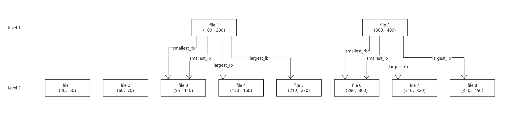

## 列族

列族将一个数据库的数据进行逻辑划分，允许用户将不同类型的数据存储在同一个数据库中，对数据库的记录进行进行逻辑划分，而在物理上分隔为不同的数据结构

- 支持跨列族的原子写入，弥补了 rocksdb 在单个进程内只能操作一个数据库的问题
- 在不同的列族，提供数据库的一致性视图，可以跨多个 Column Family 读取数据
- 可以对列族进行独立配置
- 支持动态添加和drop列族

每个列族有自己的 LSM 结构，**多个列族共享 WAL**，不共享 memtable、immemtable、SST

rocksdb 默认情况下只有一个列族，名称为default（可理解为数据库里的一张表），rocksdb 里面的配置为ColumnFamilyOptions （单个列族的配置）和 DBOptions（数据库粒度的配置）


```c++
Class DBImpl {    
  // 根据列族id获取列族数据 ColumnFamilyData    
  ColumnFamilyHandle* GetColumnFamilyHandle(uint32_t column_family_id);        
  // 通过间接指向最新版本的 LSM 树获取列族集合 ColumnFamilySet 
  std::unique_ptr<ColumnFamilyMemTablesImpl> column_family_memtables_;    
  std::unique_ptr<VersionSet> versions_;
}

class ColumnFamilyMemTablesImpl {     
  ColumnFamilySet* column_family_set_;
}

class VersionSet {    
  std::unique_ptr<ColumnFamilySet> column_family_set_;
}

class ColumnFamilySet {

  // 从 Column Family 名称到 ID 的映射,每个 Column Family 都有唯一的 uint32_t id
  UnorderedMap<std::string, uint32_t> column_families_;
  // 存储具体的 ColumnFamilyData 结构，保存该列族的元数据、配置等
  UnorderedMap<uint32_t, ColumnFamilyData*> column_family_data_;
  
  // 双向链表，dummy_cfd_ 是这个链表的头（哨兵节点）
  ColumnFamilyData* dummy_cfd_;
  
  // ...
};

class ColumnFamilyData {
  
  // 唯一 id
  uint32_t id_;
  // ColumnFamilyData 名称
  const std::string name_;
  // 引用计数，确保 ColumnFamilyData 不会在使用中被删除
  std::atomic<int> refs_; 
  // 标记是否已经初始化
  std::atomic<bool> initialized_;
  // 表示该 CF 是否被删除。如果有其它操作持有对它的引用，它依然会继续存在，直到所有引用被释放
  std::atomic<bool> dropped_;  
  
  // 版本链表头（哨兵节点），管理所有 Version 组成的双向循环链表
  Version* dummy_versions_;  
  // 最新的 Column Family 状态
  Version* current_;
  
  MemTable* mem_;
  MemTableList imm_;
    
  // 追踪和管理当前 SuperVersion 的编号，如果一个操作持有的编号低于当前编号，则说明已经过期
  std::atomic<uint64_t> super_version_number_;  
  // 表示 LSM 树的一个具体时间点的视图，包含了该时间点的所有 MemTable 和 SST 文件
  SuperVersion* super_version_;
  // 每个线程存储一个局部 SuperVersion，优化并发读
  std::unique_ptr<ThreadLocalPtr> local_sv_;  
  
  // 双向链表，用于 支持 ColumnFamilySet 的遍历
  ColumnFamilyData* next_;
  ColumnFamilyData* prev_;
  
  // 表示它属于哪个 ColumnFamilySet
  ColumnFamilySet* column_family_set_;
  // ...
};
```

### MemTableListVersion

MemTableListVersion 是 MemTableList 的一个快照，表示当前所有正在管理的 Immutable MemTable 集合，是一个只读的数据结构，专门用于查询操作，而不会与写入发生冲突，为 MVCC 机制提供了稳定的版本数据。

MemTableList 的设计可以方便地管理多个 Immutable MemTable，并行 Flush 到磁盘（SST 文件）。

```c++
class MemTableList {    
  MemTableListVersion* current_; // 管理多个 immemtable
}

class MemTableListVersion {    
  std::list<ReadOnlyMemTable*> memlist_;  // immemtable 的链表，等待 flush
  std::list<ReadOnlyMemTable*> memlist_history_;  // 已经刷到磁盘的 immemtable 的链表
}
```

## Version

RocksDB 是通过 version 管理某一个时刻的 db 状态，任何读写都是对一个 version 的操作；

Version 用于管理 LSM 中的 SST 文件集合。在每次 compaction 结束或者 memtable 被 flush 到磁盘时，将会创建一个新的 version，用来**记录新的 LSM 结构**。随着数据不断的写入以及 compaction 的执行，RocksDB 中会存在多个 version，但在任何时刻只有一个 current version。新的 Get 查询操作或者迭代器在其整个查询过程和迭代器的生命周期内都会使用 current version。没有被任何 Get 或者 iterator 迭代器使用的 version 需要清除。被任何 version 都未使用的 SST 文件则会被删除

```
示例：
初始状态：   
version 1 = {f1, f2, f3}（current version）    //当前磁盘上存在文件： f1, f2, f3 
  
//创建迭代器：    
Iterator* iter = db_->NewIterator(); 		//最新的version被iter引用    

//随着数据的写入，flush新生成了一个 SST 文件 f4，并且生成了新的 version：    
version 2 =  {f1, f2, f3, f4} （current version）    
//当前磁盘上存在文件： f1, f2, f3, f4 
  
后台发生一次 compaction 操作，将 f2, f3, f4 合并得到一个 f5，此时新生成了一个 version：    
version 3 = {f1, f5} (current version)

这个时候各个 version 的结构为：    
version 3 = {f1, f5} (current version)    
version 2 =  {f1, f2, f3, f4}     
version 1 = {f1, f2, f3}    
当前磁盘存在文件：f1, f2, f3, f4, f5 

由于 version2 不是 current version，并且没有被引用，所以 version2 被删除，那么此时各个 version 的结构为：  
version 3 = {f1, f5} (current version)    
version 1 = {f1, f2, f3}    
当前磁盘存在文件： f1, f2, f3, f5（由于f4没有被任何version引用，所以删除）    

如果此时迭代器 iter 被删除，那么 version 1 将被删除，此时各个 version 结构为：    
version 3 = {f1, f5} (current version)    
当前磁盘存在文件： f1, f5（由于f2, f3没有被任何version引用，所以删除）
```

```c++
// 每个 Version 表示 LSM 树中某一时刻的状态
// version 保存着 LSM 结构的SST文件信息，一个 version 属于某一个列族，
// 它会和该列族的其他 version 组成一个链表
class Version {    
// 该 version 所属的 columnFamilyData    
ColumnFamilyData* cfd_;      
// 保存当前 version 的所有SST文件信息，以及层级相关信息，compaction 依赖于其中储存和计算的信息；    
VersionStorageInfo storage_info_;    
// version 所属的 versionSet    
VersionSet* vset_;    
// 保存 version 链表上的下一个 version 指针，新插入的 version 会在链表头；    
Version* next_;    
// 保存上一个 version 版本指针    
Version* prev_;
}

// 一个 db 一个 versionSet，包含这个 db 的所有列族，
// 在新生成 SST 文件的时候通过该类的 LogAndApply 接口写入新的 version
class VersionSet {    
// 保存了所有的列族集合    
std::unique_ptr<ColumnFamilySet> column_family_set_;    
// 维护 version number，作为下一个 version 的 version_number 参数    
uint64_t current_version_number_;
}
```


#### Get 操作

```c++
void Version::Get(const ReadOptions& read_options, const LookupKey& k,
                  PinnableSlice* value, PinnableWideColumns* columns,
                  std::string* timestamp, Status* status,
                  MergeContext* merge_context,
                  SequenceNumber* max_covering_tombstone_seq,
                  PinnedIteratorsManager* pinned_iters_mgr, bool* value_found,
                  bool* key_exists, SequenceNumber* seq, ReadCallback* callback,
                  bool* is_blob, bool do_merge) {
  Slice ikey = k.internal_key();
  Slice user_key = k.user_key();

  if (key_exists != nullptr) {
    *key_exists = true;
  }

  // KV 分离架构，后续 compaction 章节有介绍
  // 旧版 blob_index 通过外部参数 is_blob 显示标记，新版内部支持原生的 blob_index，通过 value 类型进行隐式识别
  bool is_blob_index = false;
  bool* const is_blob_to_use = is_blob ? is_blob : &is_blob_index;
  // 初始化 blob 数据读取
  BlobFetcher blob_fetcher(this, read_options);

  GetContext get_context(
      user_comparator(), merge_operator_, info_log_, db_statistics_,
      status->ok() ? GetContext::kNotFound : GetContext::kMerge, user_key,
      do_merge ? value : nullptr, do_merge ? columns : nullptr,
      do_merge ? timestamp : nullptr, value_found, merge_context, do_merge,
      max_covering_tombstone_seq, clock_, seq,
      merge_operator_ ? pinned_iters_mgr : nullptr, callback, is_blob_to_use,
      tracing_get_id, &blob_fetcher);

  // merge 操作锁定 block 防止提前释放数据块
  if (merge_operator_) {
    pinned_iters_mgr->StartPinning();
  }

  // 初始化 FilePicker，根据 key 定位文件
  FilePicker fp(user_key, ikey, &storage_info_.level_files_brief_,
                storage_info_.num_non_empty_levels_,
                &storage_info_.file_indexer_, user_comparator(),
                internal_comparator());
  FdWithKeyRange* f = fp.GetNextFile();

  while (f != nullptr) {
    if (*max_covering_tombstone_seq > 0) {
      // 在一个比当前查询目标 Key 更新的删除操作
      break;
    }
  
    // 从 tablecache 中查询 Key 可能所在的 SST 文件及具体数据块，在 cache 章节有详细解析
    *status = table_cache_->Get(
        read_options, *internal_comparator(), *f->file_metadata, ikey,
        &get_context, mutable_cf_options_,
        cfd_->internal_stats()->GetFileReadHist(fp.GetHitFileLevel()),
        IsFilterSkipped(static_cast<int>(fp.GetHitFileLevel()),
                        fp.IsHitFileLastInLevel()),
        fp.GetHitFileLevel(), max_file_size_for_l0_meta_pin_);

    if (!status->ok()) {
      return;
    }

    switch (get_context.State()) {
      case GetContext::kNotFound:
        break;
      case GetContext::kMerge:
        break;
      case GetContext::kFound:
        if (is_blob_index && do_merge && (value || columns)) {
          // 获取 blob 索引数据
          Slice blob_index =
              value ? *value
                    : WideColumnsHelper::GetDefaultColumn(columns->columns());

          constexpr FilePrefetchBuffer* prefetch_buffer = nullptr;

          // 加载 blob 数据
          PinnableSlice result;
          constexpr uint64_t* bytes_read = nullptr;
          *status = GetBlob(read_options, get_context.ukey_to_get_blob_value(),
                            blob_index, prefetch_buffer, &result, bytes_read);
          if (!status->ok()) {
            if (status->IsIncomplete()) {
              get_context.MarkKeyMayExist();
            }
            return;
          }

          if (value) {
            *value = std::move(result);
          } else {
            assert(columns);
            columns->SetPlainValue(std::move(result));
          }
        }

        return;
      case GetContext::kDeleted:
        *status = Status::NotFound();
        return;
      case GetContext::kCorrupt:
        *status = Status::Corruption("corrupted key for ", user_key);
        return;
      case GetContext::kUnexpectedBlobIndex:
        ROCKS_LOG_ERROR(info_log_, "Encounter unexpected blob index.");
        *status = Status::NotSupported(
            "Encounter unexpected blob index. Please open DB with "
            "ROCKSDB_NAMESPACE::blob_db::BlobDB instead.");
        return;
      case GetContext::kMergeOperatorFailed:
        *status = Status::Corruption(Status::SubCode::kMergeOperatorFailed);
        return;
    }
    // 没有发现对应的值则从下一个文件查找
    f = fp.GetNextFile();
  }

  if (GetContext::kMerge == get_context.State()) {
    // 进行合并处理
    if (!do_merge) {
      *status = Status::OK();
      return;
    }
    if (!merge_operator_) {
      *status = Status::InvalidArgument(
          "merge_operator is not properly initialized.");
      return;
    }
    if (value || columns) {
      // 合并执行逻辑
      *status = MergeHelper::TimedFullMerge(
          merge_operator_, user_key, MergeHelper::kNoBaseValue,
          merge_context->GetOperands(), info_log_, db_statistics_, clock_,
          /* update_num_ops_stats */ true, /* op_failure_scope */ nullptr,
          value ? value->GetSelf() : nullptr, columns);
      if (status->ok()) {
        if (LIKELY(value != nullptr)) {
          value->PinSelf();
        }
      }
    }
  } else {
    if (key_exists != nullptr) {
      *key_exists = false;
    }
    *status = Status::NotFound();  
  }
}
```

**table cache 的 操作详见 [Cache章节](https://github.com/LiuRuoyu01/learn-rocksdb/blob/main/ch03/RocksDB_Cache.md#table-cache)**

`GetNextFile` 函数会遍历所有的 level，然后再遍历每个 level 的所有的文件,这里会对 level 0 的文件做一个特殊处理，这是因为只有 level0 的 sst 的 range 不是有序的，而在非 level0，只需要按照二分查找来得到对应的文件即可，如果二分查找不存在，那么就需要进入下一个 level 查找

```c++
FdWithKeyRange* GetNextFile() {
  while (!search_ended_) {  
    // 第一层循环按层级高低（level0 --> 最高层）
    while (curr_index_in_curr_level_ < curr_file_level_->num_files) {
      // 第二层循环当前层级所有的文件
      FdWithKeyRange* f = &curr_file_level_->files[curr_index_in_curr_level_];
      hit_file_level_ = curr_level_;
      is_hit_file_last_in_level_ =
          curr_index_in_curr_level_ == curr_file_level_->num_files - 1;
      int cmp_largest = -1;

      if (num_levels_ > 1 || curr_file_level_->num_files > 3) {
        // 总层级数大于 1 或者当前层级文件数大于 3

        // 比较目标 user_key_ 与当前 SST 文件的最小键 
        int cmp_smallest = user_comparator_->CompareWithoutTimestamp(
            user_key_, ExtractUserKey(f->smallest_key));
        if (cmp_smallest >= 0) {
          // // 比较目标 user_key_ 与当前 SST 文件的最大键
          cmp_largest = user_comparator_->CompareWithoutTimestamp(
              user_key_, ExtractUserKey(f->largest_key));
        }

        if (curr_level_ > 0) {
          // 根据当前层级的 key 比较结果预测下一层级的搜索范围，从而减少无效文件扫描
          file_indexer_->GetNextLevelIndex(
              curr_level_, curr_index_in_curr_level_, cmp_smallest,
              cmp_largest, &search_left_bound_, &search_right_bound_);
        }
        if (cmp_smallest < 0 || cmp_largest > 0) {
          if (curr_level_ == 0) {
            // Level 0：继续查本层下一个文件
            ++curr_index_in_curr_level_;
            continue;
          } else {
            // 非Level 0：跳过本层剩余文件，直接进入下一层
            break;
          }
        }
      }

      returned_file_level_ = curr_level_;
      if (curr_level_ > 0 && cmp_largest < 0) {
        // user_key < 当前文件最大键，无需再遍历后续文件，终止当前层搜索并跳转下一层
        search_ended_ = !PrepareNextLevel();
      } else {
        ++curr_index_in_curr_level_;
      }
      return f;
    }
    // 遍历下一层
    search_ended_ = !PrepareNextLevel();
  }
  return nullptr;
}
```

**层级关联性** ： 目的解决 LSM-Tree 深层 SST 文件二分查找开销过大的问题，上层文件的键范围与下层文件存在固定映射关系

在 Compaction 过程中，为每个上层文件预计算其键范围在下一层对应的 **文件索引边界**（`smallest_lb`, `largest_lb`, `smallest_rb`, `largest_rb`），建立跨层级索引，查询时根据键与当前文件范围的比较结果（`cmp_smallest`, `cmp_largest`），直接映射到下层文件的子集，避免全层二分搜索

- `smallest_lb`：下层中第一个满足` largest >= 上层 smallest 的文件索引`
- `smallest_rb`：下层中最后一个满足` smallest <= 上层.smallest 的文件索引`
- `largest_lb`：下层中第一个满足` largest >= 上层.largest 的文件索引`
- `largest_rb`：下层中最后一个满足` smallest <= 上层.largest 的文件索引`



如图所示，当上层文件边界（如 100）落到下层文件内（如 file 3 [95, 110]）时，该边界 lb 和 rb 指针指向相同；当文件边界（如 400）落到下层文件**空隙内**（如 file 7 和 file 8 之间），lb 和 rb 才指向不同。

举个例子，现在需要查找 key = 230，在 level 1 通过二分查找定位到 file 2，230 小于 smallest = 300，因此 level 1 不含有此 key 需要查找 level 2，目标键的范围在 200 到 300 之间，level 2 中不重叠的文件都可以排除，通过索引得知只有 file 5 - file 6 可能包含小于 key = 230 的键，因此最终将搜索范围从 8 个文件 缩小为 2 个文件

```c++
struct IndexUnit {
    IndexUnit()
        : smallest_lb(0), largest_lb(0), smallest_rb(-1), largest_rb(-1) {}
    int32_t smallest_lb;
    int32_t largest_lb;
    int32_t smallest_rb;
    int32_t largest_rb;
  };


void FileIndexer::GetNextLevelIndex(const size_t level, const size_t file_index,
                                    const int cmp_smallest,
                                    const int cmp_largest, int32_t* left_bound,
                                    int32_t* right_bound) const {
  assert(level > 0);
  if (level == num_levels_ - 1) {
     // 最后一层
    *left_bound = 0;
    *right_bound = -1;
    return;
  }

  const IndexUnit* index_units = next_level_index_[level].index_units;
  const auto& index = index_units[file_index];

  if (cmp_smallest < 0) {
    *left_bound = (level > 0 && file_index > 0)
                      ? index_units[file_index - 1].largest_lb
                      : 0;
    *right_bound = index.smallest_rb;
  } else if (cmp_smallest == 0) {
    *left_bound = index.smallest_lb;
    *right_bound = index.smallest_rb;
  } else if (cmp_largest < 0) {
    *left_bound = index.smallest_lb;
    *right_bound = index.largest_rb;
  } else if (cmp_largest == 0) {
    *left_bound = index.largest_lb;
    *right_bound = index.largest_rb;
  } else {
    *left_bound = index.largest_lb;
    *right_bound = level_rb_[level + 1];
  }

}
```


#### SuperVersion

SuperVersion 是管理数据版本一致性的核心机制，包含当前活跃的 **MemTable**、**Immutable MemTables** 以及磁盘上的 **SST 文件版本（Version）**，访问 SuperVersion 的成员变量线程不安全，需要锁机制保障

触发变更

1. Memtable 写满后转为 Immutable，新 MemTable 创建，生成新 SuperVersion 。
2. 触发 Flush / Compaction ，SST 文件变更后，生成新 Version，更新 SuperVersion
3. 旧 SuperVersion 在无引用后被安全回收

```c++
// 代表列族当前状态的一个快照，指向 LSM 树的视图
// SuperVersion 会保存多个 Version，并且每个 Version 是 LSM 树的一个快照版本
// 可被多个对象共享
struct SuperVersion {    
  // 所属 ColumnFamily    
  ColumnFamilyData* cfd;    
  // 持有的 memtable    
  ReadOnlyMemTable* mem;    
  // 当前列族所有的 immutable    
  MemTableListVersion* imm;    
  // 当前最新 version 指针    
  Version* current;    
  // 当前 SuperVersion 的版本号    
  uint64_t version_number;   
  
  // 表示当前Superversion正在使用    
  static void* const kSVInUse;    
  // 表示当前Superversion已经释放    
  static void* const kSVObsolete;
}

void ColumnFamilyData::InstallSuperVersion(
    SuperVersionContext* sv_context,
    const MutableCFOptions& mutable_cf_options) {
  // 初始化新的 SuperVersion
  SuperVersion* new_superversion = sv_context->new_superversion.release();
  new_superversion->mutable_cf_options = mutable_cf_options;
  new_superversion->Init(this, mem_, imm_.current(), current_,
                         sv_context->new_seqno_to_time_mapping
                             ? std::move(sv_context->new_seqno_to_time_mapping)
                         : super_version_
                             ? super_version_->ShareSeqnoToTimeMapping()
                             : nullptr);
  //  替换旧 SuperVersion
  SuperVersion* old_superversion = super_version_;
  super_version_ = new_superversion;
  
  // ...
  
  if (old_superversion != nullptr) {
    // 重置线程本地存储中缓存的 SuperVersion
    // 确保 local_sv_ 永远不会保留 SuperVersion 的最后一个引用（以便安全清理旧的 SuperVersion）
    ResetThreadLocalSuperVersions();

    // 更新信息..
    
    // 如果旧的 SuperVersion 引用计数为 0 则执行清理
    if (old_superversion->Unref()) {
      old_superversion->Cleanup();
      sv_context->superversions_to_free.push_back(old_superversion);
    }
  }
  // 增加版本号
  ++super_version_number_;
  super_version_->version_number = super_version_number_;
}

// 清理所有 TLS 中的旧 SuperVersion 引用,确保线程不会继续使用已被替换的 SuperVersion 
void ColumnFamilyData::ResetThreadLocalSuperVersions() {
  // 将线程 TLS 变量记录的缓冲标识过期
  autovector<void*> sv_ptrs;
  local_sv_->Scrape(&sv_ptrs, SuperVersion::kSVObsolete);
  for (auto ptr : sv_ptrs) {
    if (ptr == SuperVersion::kSVInUse) {
      continue;
    }
    auto sv = static_cast<SuperVersion*>(ptr);
    // 减少引用计数，sv 不会是最后一个引用
    bool was_last_ref __attribute__((__unused__));
    was_last_ref = sv->Unref();
    assert(!was_last_ref);
  }
}
```


##### ThreadLocalPtr

TLS 全称为 Thread-Local-Storage，也就是线程私有存储。每个线程有一个私有的存储区域，通过 key 来索引。当线程访问 TLS 变量时，实际上是通过 key 获取自己线程内的数据，是允许**多线程程序中的每个线程拥有独立数据副本**的机制，解决了多线程环境下全局变量或静态变量的共享冲突问题。

RocksDB 使用 Version 用于维护当前 DB 的状态信息，SuperVersion 作为 Version 系统的重要模块之一，需要被后台线程（compaction / flush）更新和前台用户线程读取，多线程访问形成了竞态条件，为了降低前台线程的访问延迟，RocksDB 对 SuperVersion 模块使用 TLS，通过乐观锁机制来控制并发，做到读不上锁（读的时候如果感知到共享变量发生变化，再利用共享变量的最新值填充本地缓存），读写无并发冲突，只有写写冲突（需要加锁，通知所有线程局部变量发生变化）。

RocksDB 需要 TLS 满足两个条件

1. 所有线程的 TLS 变量**在运行时才确定**
2. **可以被一个线程清空或重置**（全局只定义了一个线程局部变量）
3. 需要一个全局变量，线程局部变量只是作为全局变量的缓存

应用场景

TLS 作为 cache，仍然需要一个全局变量，全局变量保持最新值，而 TLS 则可能存在滞后，这就要求使用场景不要求读写实时严格一致。全局变量和局部缓存有交互，交互逻辑是，全局变量变化后，局部线程要能及时感知到，但不需要实时。允许读写并发，即允许读的时候，使用旧值读，待下次读的时候，再获取到新值。Rocksdb 中的 superversion 管理则符合这种使用场景，swich / flush / compaction 会产生新的 superversion，读写数据时，则需要读 supversion。往往读写等前台操作相对于 switch / flush / compaction 更频繁，所以读 superversion 比写 superversion 比例更高，而且允许系统中同时存留多个 superversion。

```c++
class ThreadLocalPtr {
  ...
  static StaticMeta* Instance();
  const uint32_t id_;
}

// 单例，管理所有的 ThreadLocalPtr 对象
class ThreadLocalPtr::StaticMeta {
  ...
  ThreadData head_;
  static __thread ThreadData* tls_;
};
__thread ThreadData* ThreadLocalPtr::StaticMeta::tls_ = nullptr;
```

ThreadLocalPtr 类就是 RocksDB 提供的 TLS 实现接口，ThreadLocalPtr::StaticMeta 是一个单例对象。该对象的成员 tls_ 是一个 TLS 变量，指向 ThreadData 类型。**所有定义的 ThreadLocalPtr 对象都挂载在了 tls_ 变量上**。

```c++
struct ThreadData {
  explicit ThreadData(ThreadLocalPtr::StaticMeta* _inst)
    : entries(),
      next(nullptr),
      prev(nullptr),
      inst(_inst) {}
  std::vector<Entry> entries;
  ThreadData* next;
  ThreadData* prev;
  ThreadLocalPtr::StaticMeta* inst;
}
struct Entry {
  Entry() : ptr(nullptr) {}
  Entry(const Entry& e) : ptr(e.ptr.load(std::memory_order_relaxed)) {}
  std::atomic<void*> ptr;
};

// 读线程通过Swap接口来获取变量内容，写线程则通过Scrape接口
// 获取某个 id 对应的局部缓存内容，通过单例StaticMeta对象管理。
void* ThreadLocalPtr::StaticMeta::Swap(uint32_t id, void* ptr) {
  auto* tls = GetThreadLocal();
  if (UNLIKELY(id >= tls->entries.size())) {
    // Need mutex to protect entries access within ReclaimId
    MutexLock l(Mutex());
    tls->entries.resize(id + 1);
  }
  return tls->entries[id].ptr.exchange(ptr, std::memory_order_acquire);
}
// 将所有管理的对象指针设置为 nullptr（obsolote），将过期的指针返回，供上层释放
// 下次从局部线程栈获取时，发现内容为 nullptr（obsolote），则重新申请对象。
void ThreadLocalPtr::StaticMeta::Scrape(uint32_t id, autovector<void*>* ptrs,
                                        void* const replacement) {
  MutexLock l(Mutex());
  for (ThreadData* t = head_.next; t != &head_; t = t->next) {
    if (id < t->entries.size()) {
      void* ptr =
          t->entries[id].ptr.exchange(replacement, std::memory_order_acquire);
      if (ptr != nullptr) {
        // 搜集各个线程缓存，进行解引用，必要时释放内存
        ptrs->push_back(ptr);
      }
    }
  }
}
```

ThreadData 对象用于一个元素类型为 Entry 的 vector，vector 保存所有线程对应的原子指针列表，每次定义的 ThreadLocalPtr 对象都有一个 id，该 id 对应于 entries 的索引，所以当需要获取一个 ThreadLocalPtr 的数据时，只需要通过 ThreadData::entries[id] 获取。

每个线程有一个线程局部变量 ThreadData，里面包含了一组指针，用于指向不同 ThreadLocalPtr 对象指向的数据。另外，ThreadData 之间相互通过指针串联起来，所有线程的 TLS 变量可以被一个线程清空或者重置。


#### VersionEdit

VersionEdit 主要是用于记录版本修改的日志，每当数据库发生变化时，就会创建一个 VersionEdit 实例，这个实例记录了所有变化（ WAL 文件变化、SST 文件新增/删除、列族的添加/删除、列族添加/删除数据等）。这些修改会被[写入到 MANIFEST 文件中](https://github.com/LiuRuoyu01/learn-rocksdb/blob/main/ch02/RocksDB_Manifest.md#manifest%E6%96%87%E4%BB%B6)

