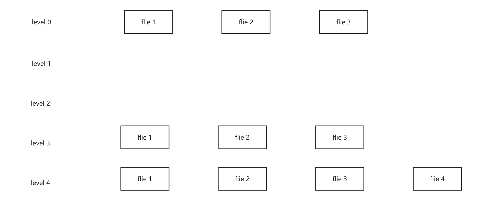

# Compaction

在 RocksDB 中，数据写入和修改普遍采用**追加写**的方式，例如先后插入两个相同 Key 的 KV 对（`{key1, xxx}`和 `{key1, yyy}`）时，磁盘中会存在两个包含 `key1`的不同版本；虽然上层读取 `key1`时根据 LSM-Tree 的查找规则（从新到旧）只会返回最新值 `yyy`，但旧数据 `{key1, xxx}`仍占据存储空间成为**无效数据**。

**Compaction（压缩）流程的核心作用**正是消除这类冗余数据：通过将多个 SST 文件（尤其是包含重叠 Key 范围的文件）合并、排序并仅保留每个 Key 的最新版本，显著**降低空间放大**（直接回收无效数据占用的磁盘空间）并**缓解读放大**（减少需扫描的文件数量和数据量）。

##### 查找数据时：

1. **跨文件二分查找**：通过比较各层 SST 文件的起始/结束键（MinKey/MaxKey）定位可能包含目标 Key 的文件；
2. **文件内二分查找**：在目标 SST 文件内进一步精确定位 Key。

Compaction 通过持续合并文件并维持层级容量（如 L1 超过阈值时触发向 L2 的合并），确保数据存储紧凑且查询高效


## Compaction algorithms

1. Classic Leveled Compaction
   - **每层文件间的 key range 互斥，合并时选取该层的一个文件与下层所有 key range 重叠的文件进行归并排序**
   - 读写放大都比较严重：合并时需重写下层大量重叠文件，读最坏需要扫描所有层
   - 但是空间放大较低：每层文件Key Range互斥，同一Key的旧版本或删除标记（Tombstone）会在合并时被及时清理，数据冗余度极低
2. Leveled-N Compaction
   - **每层存在多个 key range，合并时选取该层所有的文件与下层的单个文件进行合并**
   - 比 Leveled Compaction 写放大更低，读放大更高
3. Tiered Compaction

   - **每层存在多个 key range，合并时选取该层所有的文件合并成新文件写入下层，不重写下层数据**
   - 空间放大和读放大严重，但是写放大最小
4. Tiered + Leveled Compaction

   - **L0 层采用 Tiered，L1+ 层采用 Leveled，L0积累到阈值后，合并所有L0文件及L1重叠文件，生成有序文件写入L1**
   - 空间放大比 Tiered Compaction 更低，写放大比 Leveled Compaction 低
5. FIFO
   - 所有 SST 文件按**写入时间排序**，形成逻辑队列，新文件追加至队尾，旧文件位于队首，总文件大小超过阈值时，**删除最旧文件**
   - 通常用于保存日志数据等，定期删除旧数据

Rocksdb 实现了 Tiered + Leveled（ Level Compaction）、Tiered（ Universal ）和 FIFO。


### Level Compaction

##### 磁盘文件被组织为多层级结构：

- **L0 层**包含刚从内存缓冲区（memtable）刷写的文件，其 SST 文件间 Key 范围可能重叠。
- **L1 及更高层**的数据按范围划分为互不重叠的 SST 文件，每层设有预定义的最大容量限制。

#### Compaction Rule

##### L0 层 Compaction

触发 L0→L1 Compaction 时，由于 L0 层的文件无序，所以需选择 **L0 所有文件** 和 **L1 重叠文件**，形成一次巨型 Compaction 任务，很可能成为成为性能瓶颈。[将任务分成多个实现并行处理](https://github.com/LiuRuoyu01/learn-rocksdb/blob/main/ch04/RocksDB_Compaction.md#compactionjobprepare)

1. 将所有文件中按照 Key Range 划分为均匀的子区间
2. 将 key 合并去重
3. 按照范围的 size 大小和用户设置的 `max_subcompactions`，将任务均匀分给不同的线程
4. 每个线程并行执行 Compaction 并生成 SST 文件

##### L1+ 层 Compaction

从 Ln 层选取至少 1 个文件，将其与 Ln+1 层重叠范围进行合并，新生成的文件放置在 L2 中，可以选择不重叠的范围进行多个 compaction 任务


#### Compaction Picking

当多个层级同时达到压缩触发条件时，RocksDB 通过计算每层的 **压缩分数（Score）** 确定优先级，分数最高的层级优先执行压缩。Ln 的数据固定写入到 Ln+1

- L0 层 ：`Score = max(文件数/触发阈值, 总大小/基础容量)`
- L1 层及以上 ：`Score = 当前层级实际数据大小 / 该层级的目标容量上限`

##### `PickCompaction` 步骤：

1. 从 L0 到最高层选择得分最高，则根据优先级算法选择优先级最高的文件，如果该文件已经在执行任务则选择次优先级的文件

2. 如果层级分数小于 1 或者未能根据得分选出文件进行 compaction，则从任务队列中取任务（TTL，Periodic，BlobGC等）

3. 如果是 L0 层需要确保所有键范围重叠文件都被包含进本次压缩任务中

4. 将文件扩展，确保 Compaction 过程中不丢失任何 key

   例如 ： 此时有 5 个文件 ` f1[a1 a2] f2[a3 a4] f3[a4 a6] f4[a6 a7] f5[a8 a9]`，如果选择了 f3，则必须将输入从 `{f3}` 扩展为 `{f2, f3, f4}`，因为 f2 和 f3 的边界是连续的，f3 和 f4 的边界也是连续的。两个文件可能共享相同的用户键边界的原因是，RocksDB 将 InternalKey 存储在由用户键和键类型序列号组成的文件中。因此，文件可能存储多个具有相同用户键的 InternalKey。因此，如果发生压缩，所有具有相同用户键的 InternalKey 都必须一起压缩。

5. 检查当前输入的文件是否有任务重叠

6. compaction 对象并注册到 `compactions_in_progress_`，并更新 compaction score

```c++
void LevelCompactionBuilder::SetupInitialFiles() {
  start_level_inputs_.clear();
  bool skipped_l0_to_base = false; 
  for (int i = 0; i < compaction_picker_->NumberLevels() - 1; i++) {
    start_level_score_ = vstorage_->CompactionScore(i);
    start_level_ = vstorage_->CompactionScoreLevel(i);
    
    // 只考虑分数 >=1 的层级
    if (start_level_score_ >= 1) {
      if (skipped_l0_to_base && start_level_ == vstorage_->base_level()) {
        continue;
      }
      output_level_ =
          (start_level_ == 0) ? vstorage_->base_level() : start_level_ + 1;
    
      // 尝试在当前层级选择文件进行压缩压缩至下面层级
      bool picked_file_to_compact = PickFileToCompact();
      if (picked_file_to_compact) {
        break;
      } else {
        start_level_inputs_.clear();
        if (start_level_ == 0) {
          skipped_l0_to_base = true; 
          // L0->base压缩阻塞，尝试 L0 层内压缩，减少L0文件数，降低写停滞风险
          if (PickIntraL0Compaction()) {
            output_level_ = 0; // 输出仍在L0层
            compaction_reason_ = CompactionReason::kLevelL0FilesNum;
            break;
          }
        }
      }
    } else {
      // 分数已排序且当前分数 <1，后续层级分数会更低，直接退出循环
      break;
    }
  }
  
  if (!start_level_inputs_.empty()) {
    return;
  }
  // 根据优先级从任务队列中取任务...
}
```


#### 层级文件容量阀值计算

- `level_compaction_dynamic_level_bytes = false`

  每层容量固定，计算公式为 :

  `Target_Size(L1) = max_bytes_for_level_base`

  `Target_Size(Ln+1) = Target_Size(Ln) × max_bytes_for_level_multiplier × max_bytes_for_level_multiplier_additional[n]`

  L1 层固定，随着层级递增容量倍增

  问题：

  1. 低层级容量小易填满，需频繁触发 Compaction，高层级容量大易闲置，导致数据无法下沉到末层
  2. 写放大加剧，数据需要逐层合并，无效的重复写增多

- `level_compaction_dynamic_level_bytes = true`

  每层容量的阀值是动态的，计算公式为：

  `Target_Size(Ln-1) = Target_Size(Ln) / max_bytes_for_level_multiplier`，

  在  `Target_Size < max_bytes_for_level_base / max_bytes_for_level_multiplier` 的层级不做任何操作，**L0 层进行 Compaction 时需跳过这些，数据优先合并到第一个有效层，使数据更快沉底**

  优点：

  1. 90% 数据集中在末层，9% 在次末层，空间放大降至理论值1.11倍


#### TTL

如果一个 SST 文件中的键范围**再也没有新的写入操作**（比如软删除情况，通过标记位区分删除与否），那么这些文件就可能**永远不会被选中参与压缩**。

为整个列族设置一个全局的 TTL 时间阈值。系统会检查文件的信息。如果存在时间超过这个 TTL 阈值，就会触发 compaction


#### Periodic compaction

如果某个 key 范围内的数据大量过期，但是这一层的数据始终没有达到该层级容量的上限，最终造成过期数据一直存在没有被删除，磁盘空间无法回收

当用户设置了 `compaction_filter`，RocksDB 会**启用 Periodic Compaction**，只要 SST 文件超过了 `periodic_compaction_seconds` 设定的阀值就会触发 compaction 


#### Compaction 触发条件

```c++
bool LevelCompactionPicker::NeedsCompaction(
    const VersionStorageInfo* vstorage) const {
  if (!vstorage->ExpiredTtlFiles().empty()) {
    return true;
  }
  if (!vstorage->FilesMarkedForPeriodicCompaction().empty()) {
    return true;
  }
  if (!vstorage->BottommostFilesMarkedForCompaction().empty()) {
    return true;
  }
  if (!vstorage->FilesMarkedForCompaction().empty()) {
    return true;
  }
  if (!vstorage->FilesMarkedForForcedBlobGC().empty()) {
    return true;
  }
  for (int i = 0; i <= vstorage->MaxInputLevel(); i++) {
    if (vstorage->CompactionScore(i) >= 1) {
      return true;
    }
  }
  return false;
}
```


### Universal Compaction

#### Compaction Rule

较新的数据位于低层级，较旧的数据位于高层级，Compaction 后的数据会被放置在**参与 Compaction 的最高层级**，若目标层级非空，则直接覆盖或替换该层原有文件；若目标层级为空，则填充至首个空层级



- 情况一：合并所有的文件，参与合并的最高层级为 L4，合并的数据整合后置于 L4
- 情况二： 合并 L0 的 file2、file3 和 L3 的所有文件，参与合并的最高层级为 L3，合并的数据整合后置于 L3，未参与的 L0 的 file1 仍保留在 L0
- 情况三： 合并 L0 的所有文件，因为 L0 是临时层，输出不能放回 L0，寻找**首个空层级（L1 和 L2 为空层，L2 为首个空层）**，合并的数据整合后置于 L2
- 情况四：合并 L0 的 file1、file2，合并仅涉及 L0 内部文件，由于需要满足时间顺序（合并后的数据依然比 L0 层 file3 新），因此合并后的数据仍置于 L0，未参与的 file3 继续存在于 L0


#### Comapction Picking

`PickCompaction` 步骤：

当 `n >= options.level0_file_num_compaction_trigger` 时触发 compaction

1. 基于时效

   具有最高的优先级，当存在任意的文件存活时间超过 `periodic_compaction_seconds` 时触发 compaction，从最旧向最新连续选择满足条件的文件

2. 基于空间放大率

   ` size amplification ratio = (size(R1) + size(R2) + ... size(Rn-1)) / size(Rn)`

   第二优先级，当空间放大率超过阀值时触发**全量合并**，适合**写多删多**的场景。但其代价是 **临时双倍空间占用** 和 **读放大波动**。

3. 基于文件数量

   当前层文件数量达到阀值时，从最新的文件向旧的文件选择多个文件，假定最新文件为 R1，检查 `(size(Rn)/(size(Rn-1)+ ··· + size(R1))) ≤ size_ratio_trigger`。优先合并**尺寸相近的小文件**，避免合并大文件导致高写放大，**读放大上升**

4. 防止文件数量无限增长导致的读性能恶化。此机制强制合并

   从最新文件开始，连续选择多个文件，直到满足达到最大合并数上限（`max_merge_width`）或者遇到其他合并任务


### Compaction 优化

#### Trivial move compaction

当进行 Compaction 时，如果发现某个 SST 文件与下一层级的所有其他 SST 文件**在键范围上完全没有重叠**，那么就可以直接将这个文件**从当前层级移动到下一层级**，而无需进行任何读取、合并或重写操作。这个过程仅涉及元数据的更改。


#### CompactionFilter

RocksDB 在 compaction 时提供了根据自定义逻辑删除 kv 对的方式，用于实现自定义的垃圾回收。Compaction Filter **仅在压缩过程中被调用**，在 MemTable Flush 到 L0 层时不会触发。

例如根据 TTL 进行过期删除逻辑，取出 key 的 TTL，并与当前时间进行比较，如果 TTL 小于当前时间的数据，就认为该数据已过期，不再合并到下一层文件中，从而达到删除数据的目的。


#### Delete 问题优化

LSM 存储引擎如果写入大量数据之后，删除其中的大部分。由于 LSM 是标记删除（将对一个 key 的删除作为一个 key-value 追加写入到引擎之中）。这种删除逻辑可能带来如下问题

1. 读放大，range scan 扫描更多的记录
2. 空间放大，这种类型的 key 只有在 compaction 的最后一层才会删除，中间很多层会浪费在 delete 存储之上
3. 写放大，delete key 的频繁调度 compaction 带来的写放大问题

如果尝试使用 手动 compaction 进行 Full Compaction，代价极大，所有 sst 文件都被调度，这个过程可能会让系统的可用性极低

基于以上问题，Rocksdb 在该场景做了特殊的优化

在 SST 文件构建过程中会创建 `CompactOnDeletionCollector`，当添加 kv 时会调用 `CompactOnDeletionCollector::AddUserKey` 方法收集数据

1. 在一个**滑动窗口**（大小为 `sliding_window_size - N`）内，删除操作的数量。
2. 统计整个文件中**总条目数**和**删除操作的总数**

当上述任一条件被满足时，就会将此 SST 文件的 `marked_for_compaction` 设置为 true 触发 compaction

除此之外，RocksDB 还通过 `KeyNotExistsBeyondOutputLevel` 判断后续的层中没有当前 key，就可以在较高层直接删除

```c++
bool Compaction::KeyNotExistsBeyondOutputLevel(
    const Slice& user_key, std::vector<size_t>* level_ptrs) const {
  if (bottommost_level_) {
    return true;
  } else if (output_level_ != 0 &&
             cfd_->ioptions()->compaction_style == kCompactionStyleLevel) {
    const Comparator* user_cmp = cfd_->user_comparator();
    for (int lvl = output_level_ + 1; lvl < number_levels_; lvl++) {
      const std::vector<FileMetaData*>& files =
          input_vstorage_->LevelFiles(lvl);
      for (; level_ptrs->at(lvl) < files.size(); level_ptrs->at(lvl)++) {
        auto* f = files[level_ptrs->at(lvl)];
        // 对于每个层级的所有 SST 文件，依赖元数据的 range 去判断
        if (user_cmp->Compare(user_key, f->largest.user_key()) <= 0) {
          if (user_cmp->CompareWithoutTimestamp(user_key,
                                                f->smallest.user_key()) >= 0) {
            return false;
          }
          break;
        }
      }
    }
    return true;
  }
  return false;
}
```


### Score 计算方式

```c++
void VersionStorageInfo::ComputeCompactionScore(
    const ImmutableOptions& immutable_options,
    const MutableCFOptions& mutable_cf_options) {
  double total_downcompact_bytes = 0.0;
  const double kScoreScale = 10.0;
  int max_output_level = MaxOutputLevel(immutable_options.allow_ingest_behind);
  for (int level = 0; level <= MaxInputLevel(); level++) {
    double score;
    if (level == 0) {
      // 对 L0 做特殊处理，L0 需要限制文件数量
      // 1. 当 write-buffer 较大时，避免进行过多的 L0 压缩
      // 2. L0 的 SST 文件键范围相互重叠，每次读取需要所有文件
      int num_sorted_runs = 0;
      uint64_t total_size = 0;
      for (auto* f : files_[level]) {
        total_downcompact_bytes += static_cast<double>(f->fd.GetFileSize());
        if (!f->being_compacted) {
          // 统计未被压缩的文件大小和数量
          total_size += f->compensated_file_size;
          num_sorted_runs++;
        }
      }
      if (compaction_style_ == kCompactionStyleUniversal) {
        // Universal Compaction 一次性合并多个层级的 SST 文件。
        // 使用 L0 的分数代表总压缩分数，将其他层级的文件都做为 L0 层的分数  
        for (int i = 1; i <= max_output_level; i++) {
          // 通过检查该层级的第一个文件是否正在被压缩来推断整个层级是否被压缩
          // 每一个非空且未在压缩中的层级都可以看作一个独立的 sorted run
          if (!files_[i].empty() && !files_[i][0]->being_compacted) {
            num_sorted_runs++;
          }
        }
      }
      if (compaction_style_ == kCompactionStyleFIFO) {
      // 暂时不介绍 FIFO
      } else {
        score = static_cast<double>(num_sorted_runs) /
                mutable_cf_options.level0_file_num_compaction_trigger;
        if (compaction_style_ == kCompactionStyleLevel && num_levels() > 1) {
          // 如果 L0 分数始终过高，会导致 L0->LBase（L0 压缩输出的层级） 的压缩始终优先于 LBase->LBase+1，会导致 LBase 数据堆积过多
          // 反之如果 LBase 分数过高，L0 分数不够高，L0 会堆积数据导致写入停滞
          if (immutable_options.level_compaction_dynamic_level_bytes) {
            // 开启动态层级容量
            if (total_size >= mutable_cf_options.max_bytes_for_level_base) {
              // 当容量大于额定容量时，需要确保 compaction 一定发生，防止 L0 写入停滞
              score = std::max(score, 1.01);
            }
            if (total_size > level_max_bytes_[base_level_]) {
              // 当 L0 的数据比 LBase 大时，确保 L0 的分数大于 1，优先于 LBase->LBase+1
              uint64_t base_level_size = 0;
              for (auto f : files_[base_level_]) {
                base_level_size += f->compensated_file_size;
              }
              score = std::max(score, static_cast<double>(total_size) /
                                          static_cast<double>(std::max(
                                              base_level_size,
                                              level_max_bytes_[base_level_])));
            }
            if (score > 1.0) {
              score *= kScoreScale;
            }
          } else {
            // 未开启动态层级容量，L0 的分数简单地取文件数量分数和数据大小分数中的最大值
            score = std::max(score,
                             static_cast<double>(total_size) /
                                 mutable_cf_options.max_bytes_for_level_base);
          }
        }
      }
    } else {  // level > 0
      // 统计信息并计算分数
      uint64_t level_bytes_no_compacting = 0;
      uint64_t level_total_bytes = 0;
      for (auto f : files_[level]) {
        level_total_bytes += f->fd.GetFileSize();
        if (!f->being_compacted) {
          level_bytes_no_compacting += f->compensated_file_size;
        }
      }
      if (!immutable_options.level_compaction_dynamic_level_bytes) {
        score = static_cast<double>(level_bytes_no_compacting) /
                MaxBytesForLevel(level);
      } else {
        // 启用动态层级容量
        if (level_bytes_no_compacting < MaxBytesForLevel(level)) {
          score = static_cast<double>(level_bytes_no_compacting) /
                  MaxBytesForLevel(level);
        } else {
          // 当上层有大量数据进行 compaction 流入此层会导致当前层级数据量显著增加，需降低当前层级分数暂缓压缩，防止压缩雪崩
          score = static_cast<double>(level_bytes_no_compacting) /
                  (MaxBytesForLevel(level) + total_downcompact_bytes) *
                  kScoreScale;
        }
        // 动态层级容量会使数据集中在少数几层，中间层如果存在少量数据，则分数可能始终很低导致不能压缩
        if (level_bytes_no_compacting > 0 &&
            level <= lowest_unnecessary_level_) {
          score = std::max(
              score, kScoreScale *
                         (1.001 + 0.001 * (lowest_unnecessary_level_ - level)));
        }
      }
      // 预估并累计未来可能从上层压缩到当前层的数据量
      if (level <= lowest_unnecessary_level_) {
        total_downcompact_bytes += level_total_bytes;
      } else if (level_total_bytes > MaxBytesForLevel(level)) {
        total_downcompact_bytes +=
            static_cast<double>(level_total_bytes - MaxBytesForLevel(level));
      }
    }
    compaction_level_[level] = level;
    compaction_score_[level] = score;
  }

  // 冒泡排序，分数高到低
  for (int i = 0; i < num_levels() - 2; i++) {
    for (int j = i + 1; j < num_levels() - 1; j++) {
      if (compaction_score_[i] < compaction_score_[j]) {
        double score = compaction_score_[i];
        int level = compaction_level_[i];
        compaction_score_[i] = compaction_score_[j];
        compaction_level_[i] = compaction_level_[j];
        compaction_score_[j] = score;
        compaction_level_[j] = level;
      }
    }
  }
  // 标记一些特殊条件需要 compaction 的 sst 文件
  ComputeFilesMarkedForCompaction(max_output_level);
  ComputeBottommostFilesMarkedForCompaction(
      immutable_options.allow_ingest_behind);
  ComputeExpiredTtlFiles(immutable_options, mutable_cf_options.ttl);
  ComputeFilesMarkedForPeriodicCompaction(
      immutable_options, mutable_cf_options.periodic_compaction_seconds,
      max_output_level);
  ComputeFilesMarkedForForcedBlobGC(
      mutable_cf_options.blob_garbage_collection_age_cutoff,
      mutable_cf_options.blob_garbage_collection_force_threshold,
      mutable_cf_options.enable_blob_garbage_collection);

  // 预估需要参与 compaction 的数据大小
  EstimateCompactionBytesNeeded(mutable_cf_options);
}
```


### Manual Compaction

##### CompactRangeInternal

rocskdb 提供了 CompactRange 的接口，用户可以通过该接口去指定某个范围的 key 或者整个列族执行 compaction

```c++
Status DBImpl::CompactRangeInternal(const CompactRangeOptions& options,
                                    ColumnFamilyHandle* column_family,
                                    const Slice* begin, const Slice* end,
                                    const std::string& trim_ts) {
  // 获取 cfd（将在该列族进行 compaction）
  auto cfh = static_cast_with_check<ColumnFamilyHandleImpl>(column_family);
  auto cfd = cfh->cfd();

  bool flush_needed = true;
  
  // 更新 full_history_ts_low，用于清理过期数据
  if (options.full_history_ts_low != nullptr &&
      !options.full_history_ts_low->empty()) {
    std::string ts_low = options.full_history_ts_low->ToString();
    if (begin != nullptr || end != nullptr) {
      return Status::InvalidArgument(
          "Cannot specify compaction range with full_history_ts_low");
    }
    Status s = IncreaseFullHistoryTsLowImpl(cfd, ts_low);
  }

  Status s;
  // 1.1 判断目标 range 与 memtable 是否范围有重叠
  if (begin != nullptr && end != nullptr) {
    UserKeyRange range(*begin, *end);
    SuperVersion* super_version = cfd->GetReferencedSuperVersion(this);
    s = cfd->RangesOverlapWithMemtables(
        {range}, super_version, immutable_db_options_.allow_data_in_errors,
        &flush_needed);
    CleanupSuperVersion(super_version);
  }

   // 1.2 范围重叠就执行 flush
  if (s.ok() && flush_needed) {
    FlushOptions fo;
    fo.allow_write_stall = options.allow_write_stall;
    if (immutable_db_options_.atomic_flush) {
      s = AtomicFlushMemTables(fo, FlushReason::kManualCompaction);
    } else {
      s = FlushMemTable(cfd, fo, FlushReason::kManualCompaction);
    }
  }

  constexpr int kInvalidLevel = -1;
  int final_output_level = kInvalidLevel;
  bool exclusive = options.exclusive_manual_compaction;
  if (cfd->ioptions()->compaction_style == kCompactionStyleUniversal &&
      cfd->NumberLevels() > 1) {
    // 2.1 Universal Compaction 合并所有的文件，输出文件置于最高层或者次高层
    final_output_level = cfd->NumberLevels() - 1;
    if (immutable_db_options_.allow_ingest_behind) {
      final_output_level--;
    }
    s = RunManualCompaction(cfd, ColumnFamilyData::kCompactAllLevels,
                            final_output_level, options, begin, end, exclusive,
                            false /* disable_trivial_move */,
                            std::numeric_limits<uint64_t>::max(), trim_ts);
  } else if (cfd->ioptions()->compaction_style == kCompactionStyleFIFO) {
    // 2.2 FIFO 按时间淘汰数据，本质上是删除过期文件
    s = RunManualCompaction(cfd, /*input_level=*/0, final_output_level, options,
                            begin, end, exclusive,
                            false /* disable_trivial_move */,
                            std::numeric_limits<uint64_t>::max(), trim_ts);
  } else {
    // 2.3 Level Compaction
    // 2.3.1 目的是找到第一个存在目标 range 的层级
    int first_overlapped_level = kInvalidLevel;
    {
      // ...
      ReadOptions ro;
      ro.total_order_seek = true;
      ro.io_activity = Env::IOActivity::kCompaction;
      bool overlap;
      for (int level = 0;
           level < current_version->storage_info()->num_non_empty_levels();
           level++) {
        // 从 L0 层开始逐层遍历，确保找到第一个重叠数据的层
        overlap = true;
        // 是否检查文件内部键与传入范围的重叠（而非仅依赖文件元数据中的最大/最小键）
        // 例如文件内部键只有两个[001,111]，元数据显示范围为(001,111)    
        // 此时传入的 key 范围为(011,101)，元数据范围重叠，但是此时文件中并没有这部分 key，出现假阳性
        bool check_overlap_within_file = false;
        if (begin != nullptr && end != nullptr) {
          check_overlap_within_file = true;
          if (partitioner) {
            if (!partitioner->CanDoTrivialMove(*begin, *end)) {
              // 如果传入范围跨越了分区则可以用元数据检查
              check_overlap_within_file = false;
            }
          }
        }
        if (check_overlap_within_file) {
          // 基于文件内的 key 判断
          Status status = current_version->OverlapWithLevelIterator(
              ro, file_options_, *begin, *end, level, &overlap);
          if (!status.ok()) {
            check_overlap_within_file = false;
          }
        }
        if (!check_overlap_within_file) {
          // 基于元数据判断
          overlap = current_version->storage_info()->OverlapInLevel(level,
                                                                    begin, end);
        }
        if (overlap) {
          // 找到第一个重叠数据的层
          first_overlapped_level = level;
          break;
        }
      }
      CleanupSuperVersion(super_version);
    }
    if (s.ok() && first_overlapped_level != kInvalidLevel) {
      if (cfd->ioptions()->compaction_style == kCompactionStyleUniversal) {
        // 单层级 Universal compaction
        assert(first_overlapped_level == 0);
        s = RunManualCompaction(
            cfd, first_overlapped_level, first_overlapped_level, options, begin,
            end, exclusive, true /* disallow_trivial_move */,
            std::numeric_limits<uint64_t>::max() /* max_file_num_to_ignore */,
            trim_ts);
        final_output_level = first_overlapped_level;
      } else {
        uint64_t next_file_number = versions_->current_next_file_number();
        // 2.3.2 每次压缩将当前层级数据合并到下一层级（如 L1 → L2），循环执行直至满足终止条件
        int level = first_overlapped_level;
        final_output_level = level;
        int output_level = 0, base_level = 0;
        for (;;) {
          // 如果数据仅在 L0 出现，仍需执行 compaction
          if (level > 0) {
            if (cfd->ioptions()->level_compaction_dynamic_level_bytes) {
              assert(final_output_level < cfd->ioptions()->num_levels);
              if (final_output_level + 1 == cfd->ioptions()->num_levels) {
                // 终止条件：达到最大层级，终止 compaction
                break;
              }
            } else {
              InstrumentedMutexLock l(&mutex_);
              if (final_output_level + 1 >=
                  cfd->current()->storage_info()->num_non_empty_levels()) {
                // 终止条件：如果之后的层级没数据，终止 compaction
                break;
              }
            }
          }
          // 不是最大层级的情况下，output level 都是 input level + 1
          output_level = level + 1;
          // 启用 level_compaction_dynamic_level_bytes（打开后数据会更快落入到没有装满数据的最低层级）
          if (cfd->ioptions()->level_compaction_dynamic_level_bytes &&
              level == 0) {
            output_level = ColumnFamilyData::kCompactToBaseLevel;
          }
          s = RunManualCompaction(
              cfd, level, output_level, options, begin, end, exclusive,
              !trim_ts.empty() /* disallow_trivial_move */,
              std::numeric_limits<uint64_t>::max() /* max_file_num_to_ignore */,
              trim_ts,
              output_level == ColumnFamilyData::kCompactToBaseLevel
                  ? &base_level
                  : nullptr);
          if (!s.ok()) {
            break;
          }
          if (output_level == ColumnFamilyData::kCompactToBaseLevel) {
            assert(base_level > 0);
            level = base_level;
          } else {
            // 继续向下压缩（如 L1 → L2 → L3）。
            ++level;
          }
          final_output_level = level;
        }
        if (s.ok()) {
          // 2.3.3 此时应该到达有数据的最底层，进行层内 compaction
          // 用于清理含有 Tombstones 标记的元素或者 ttl 过期等元素
          assert(final_output_level > 0);
          if ((options.bottommost_level_compaction ==
                   BottommostLevelCompaction::kIfHaveCompactionFilter &&
               (cfd->ioptions()->compaction_filter != nullptr ||
                cfd->ioptions()->compaction_filter_factory != nullptr)) ||
              options.bottommost_level_compaction ==
                  BottommostLevelCompaction::kForceOptimized ||
              options.bottommost_level_compaction ==
                  BottommostLevelCompaction::kForce) {
            s = RunManualCompaction(
                cfd, final_output_level, final_output_level, options, begin,
                end, exclusive, true /* disallow_trivial_move */,
                next_file_number /* max_file_num_to_ignore */, trim_ts);
          }
        }
      }
    }
  }
  // ...
  {
    InstrumentedMutexLock l(&mutex_);
    // 调度自动的 compaction 和 flush 任务
    MaybeScheduleFlushOrCompaction();
  }

  return s;
}

```


##### RunManualCompaction

```c++
Status DBImpl::RunManualCompaction(
    ColumnFamilyData* cfd, int input_level, int output_level,
    const CompactRangeOptions& compact_range_options, const Slice* begin,
    const Slice* end, bool exclusive, bool disallow_trivial_move,
    uint64_t max_file_num_to_ignore, const std::string& trim_ts,
    int* final_output_level) {

  ManualCompactionState manual(
      cfd, input_level, output_level, compact_range_options.target_path_id,
      exclusive, disallow_trivial_move, compact_range_options.canceled);

  // 1.1 Universal 和 FIFO 强制 compaction 所有文件，用户指定的键范围无意义
  if (begin == nullptr ||
      cfd->ioptions()->compaction_style == kCompactionStyleUniversal ||
      cfd->ioptions()->compaction_style == kCompactionStyleFIFO) {
    manual.begin = nullptr;
  } else {
    // 1.2 Level 策略将 key 转换为 InternalKey
    begin_storage.SetMinPossibleForUserKey(*begin);
    manual.begin = &begin_storage;
  }
  if (end == nullptr ||
      cfd->ioptions()->compaction_style == kCompactionStyleUniversal ||
      cfd->ioptions()->compaction_style == kCompactionStyleFIFO) {
    manual.end = nullptr;
  } else {
    end_storage.SetMaxPossibleForUserKey(*end);
    manual.end = &end_storage;
  }

  // 2. 将该任务加到 manual_compaction_dequeue_ 队列
  AddManualCompaction(&manual);
  if (exclusive) {
    // 如果开启 exclusive，需阻塞等待所有后台压缩任务完成，
    while (bg_bottom_compaction_scheduled_ > 0 ||
           bg_compaction_scheduled_ > 0) {
      if (manual_compaction_paused_ > 0 || manual.canceled == true) {
        manual.done = true;
        manual.status =
            Status::Incomplete(Status::SubCode::kManualCompactionPaused);
        break;
      }
      bg_cv_.Wait();
    }
  }

  while (!manual.done) {
    assert(HasPendingManualCompaction());
    manual_conflict = false;
    Compaction* compaction = nullptr;
    if (ShouldntRunManualCompaction(&manual) || (manual.in_progress == true) ||
        scheduled ||
        (((manual.manual_end = &manual.tmp_storage1) != nullptr) &&
         ((compaction = manual.cfd->CompactRange(
               *manual.cfd->GetLatestMutableCFOptions(), mutable_db_options_,
               manual.input_level, manual.output_level, compact_range_options,
               manual.begin, manual.end, &manual.manual_end, &manual_conflict,
               max_file_num_to_ignore, trim_ts)) == nullptr &&
          manual_conflict))) {
      // 线程阻塞
      if (!manual.done) {
        bg_cv_.Wait();
      }
      if (manual_compaction_paused_ > 0 && scheduled && !unscheduled) {
        assert(thread_pool_priority != Env::Priority::TOTAL);
        // manual_compaction_paused_ > 0 需要取消任务，进入这个 if 代表任务已调度但是未标记取消，从线程池移除任务
        auto unscheduled_task_num = env_->UnSchedule(
            GetTaskTag(TaskType::kManualCompaction), thread_pool_priority);
        if (unscheduled_task_num > 0) {
          bg_cv_.SignalAll();
        }
        unscheduled = true;
      }
      if (scheduled && manual.incomplete == true) {
        // 任务如果标记为 incomplete 则复位状态重新执行
        assert(!manual.in_progress);
        scheduled = false;
        manual.incomplete = false;
      }
    } else if (!scheduled) { 
      if (compaction == nullptr) {
        // 执行 manual.cfd->CompactRange 成功后 compaction 才不为 nullptr      
        // 要不然会一直尝试唤醒线程执行
        manual.done = true;
        if (final_output_level) {
          *final_output_level = output_level;
          if (output_level == ColumnFamilyData::kCompactToBaseLevel) {
            *final_output_level = cfd->current()->storage_info()->base_level();
          }
        }
        bg_cv_.SignalAll();
        continue;
      }
      // 3. 创建 compact range 成功封装 compact 任务
      ca = new CompactionArg;
      ca->db = this;
      ca->prepicked_compaction = new PrepickedCompaction;
      ca->prepicked_compaction->manual_compaction_state = &manual;
      ca->prepicked_compaction->compaction = compaction;
      if (!RequestCompactionToken(
              cfd, true, &ca->prepicked_compaction->task_token, &log_buffer)) {
        assert(false);
      }
      manual.incomplete = false;
      if (compaction->bottommost_level() &&
          env_->GetBackgroundThreads(Env::Priority::BOTTOM) > 0) {
        // 底层层级并且有单独的线程
        bg_bottom_compaction_scheduled_++;
        ca->compaction_pri_ = Env::Priority::BOTTOM;
        // 4.1 调度执行compaction
        env_->Schedule(&DBImpl::BGWorkBottomCompaction, ca,
                       Env::Priority::BOTTOM,
                       GetTaskTag(TaskType::kManualCompaction),
                       &DBImpl::UnscheduleCompactionCallback);
        thread_pool_priority = Env::Priority::BOTTOM;
      } else {
        / 普通层级调度
        bg_compaction_scheduled_++;
        ca->compaction_pri_ = Env::Priority::LOW;
        env_->Schedule(&DBImpl::BGWorkCompaction, ca, Env::Priority::LOW,
                       GetTaskTag(TaskType::kManualCompaction),
                       &DBImpl::UnscheduleCompactionCallback);
        thread_pool_priority = Env::Priority::LOW;
      }
      // 4.2 调度之后，scheduled 就为 true，下次循环就会进入 if 开始 bg_cv_.Wait()      
      // 所以上层调用 CompactRange 是需要同步等待的
      scheduled = true;
      if (final_output_level) {
        *final_output_level = compaction->output_level();
      }
    }
    if (!scheduled) {
      // 任务未调度且检测到暂停或取消直接标记状态
      if (manual_compaction_paused_ > 0 || manual.canceled == true) {
        manual.done = true;
        manual.status =
            Status::Incomplete(Status::SubCode::kManualCompactionPaused);
      }
    }
  }

  // 5. 从 manual_compaction_dequeue_ 队列中移除已经执行完成的任务
  RemoveManualCompaction(&manual);
  if (manual.status.IsIncomplete() &&
      manual.status.subcode() == Status::SubCode::kManualCompactionPaused) {
    MaybeScheduleFlushOrCompaction();
  }
  bg_cv_.SignalAll();
  return manual.status;
}
```


##### CompactRange

```c++
Compaction* CompactionPicker::CompactRange(
    const std::string& cf_name, const MutableCFOptions& mutable_cf_options,
    const MutableDBOptions& mutable_db_options, VersionStorageInfo* vstorage,
    int input_level, int output_level,
    const CompactRangeOptions& compact_range_options, const InternalKey* begin,
    const InternalKey* end, InternalKey** compaction_end, bool* manual_conflict,
    uint64_t max_file_num_to_ignore, const std::string& trim_ts) {
  // FIFO 不走这一套流程
  assert(ioptions_.compaction_style != kCompactionStyleFIFO);

  if (input_level == ColumnFamilyData::kCompactAllLevels) {
    assert(ioptions_.compaction_style == kCompactionStyleUniversal);
    // 1.1 只有 Universal compaction 能全量合并，将所有文件 compact 到最后一层
    assert(vstorage->num_levels() > 1);
    int max_output_level =
        vstorage->MaxOutputLevel(ioptions_.allow_ingest_behind);
    *compaction_end = nullptr;

    // 1.2 确定第一个存在文件的层级作为起始层级
    int start_level = 0;
    for (; start_level <= max_output_level &&
           vstorage->NumLevelFiles(start_level) == 0;
         start_level++) {
    }
    if (start_level > max_output_level) {
      return nullptr;
    }

    // 只允许 L0 存在一个 compaction 操作
    if ((start_level == 0) && (!level0_compactions_in_progress_.empty())) {
      *manual_conflict = true;
      return nullptr;
    }

    // 1.3 收集所有文件，并检查文件是否正在被 compaction
    std::vector<CompactionInputFiles> inputs(max_output_level + 1 -
                                             start_level);
    for (int level = start_level; level <= max_output_level; level++) {
      inputs[level - start_level].level = level;
      auto& files = inputs[level - start_level].files;
      for (FileMetaData* f : vstorage->LevelFiles(level)) {
        files.push_back(f);
      }
      if (AreFilesInCompaction(files)) {
        *manual_conflict = true;
        return nullptr;
      }
    }

    // 检查当前压缩的输出范围是否与正在进行的压缩输出范围重叠
    if (FilesRangeOverlapWithCompaction(
            inputs, output_level,
            Compaction::EvaluatePenultimateLevel(vstorage, mutable_cf_options,
                                                 ioptions_, start_level,
                                                 output_level))) {
      *manual_conflict = true;
      return nullptr;
    }

    // 1.4 创建 Compaction 对象
    Compaction* c = new Compaction(
        vstorage, ioptions_, mutable_cf_options, mutable_db_options,
        std::move(inputs), output_level,
        MaxFileSizeForLevel(mutable_cf_options, output_level,
                            ioptions_.compaction_style),
        /* max_compaction_bytes */ LLONG_MAX,
        compact_range_options.target_path_id,
        GetCompressionType(vstorage, mutable_cf_options, output_level, 1),
        GetCompressionOptions(mutable_cf_options, vstorage, output_level),
        mutable_cf_options.default_write_temperature,
        compact_range_options.max_subcompactions,
        /* grandparents */ {}, /* earliest_snapshot */ std::nullopt,
        /* snapshot_checker */ nullptr,
        /* is manual */ true, trim_ts, /* score */ -1,
        /* deletion_compaction */ false, /* l0_files_might_overlap */ true,
        CompactionReason::kUnknown,
        compact_range_options.blob_garbage_collection_policy,
        compact_range_options.blob_garbage_collection_age_cutoff);

    // 1.5 将新创建的压缩任务注册到 CompactionPicker 中
    RegisterCompaction(c);
    // 1.6 重新计算 CompactionScore
    vstorage->ComputeCompactionScore(ioptions_, mutable_cf_options);
    return c;
  }

  CompactionInputFiles inputs;
  inputs.level = input_level;
  bool covering_the_whole_range = true;

  // Universal compaction 文件范围重叠，无法指定子范围
  if (ioptions_.compaction_style == kCompactionStyleUniversal) {
    begin = nullptr;
    end = nullptr;
  }

  // 2.1 获取 input_level 中所有与 begin 和 end 有重叠的 sst 文件，并将其放入到 inputs.files 
  vstorage->GetOverlappingInputs(input_level, begin, end, &inputs.files);
  if (inputs.empty()) {
    return nullptr;
  }

  // L0 同时只能参与一个 compaction
  if ((input_level == 0) && (!level0_compactions_in_progress_.empty())) {
    *manual_conflict = true;
    return nullptr;
  }  
  // 单次 compaction 数据量的检查...

  if ((compact_range_options.bottommost_level_compaction ==
           BottommostLevelCompaction::kForceOptimized ||
       compact_range_options.bottommost_level_compaction ==
           BottommostLevelCompaction::kIfHaveCompactionFilter) &&
      max_file_num_to_ignore != std::numeric_limits<uint64_t>::max()) {
    assert(input_level == output_level);
    // 2.2 收集待 compact 的文件，需要确保避免 compact 在 max_file_num_to_ignore 之后新生成的文件
    std::vector<FileMetaData*> inputs_shrunk;
    size_t skip_input_index = inputs.size();
    for (size_t i = 0; i < inputs.size(); ++i) {
      if (inputs[i]->fd.GetNumber() < max_file_num_to_ignore) {
        inputs_shrunk.push_back(inputs[i]);
      } else if (!inputs_shrunk.empty()) {
        skip_input_index = i;
        break;
      }
    }
    if (inputs_shrunk.empty()) {
      return nullptr;
    }
    if (inputs.size() != inputs_shrunk.size()) {
      inputs.files.swap(inputs_shrunk);
    }
    // 检查当前 input 中是否未能覆盖用户最初指定的完整键范围，因为有些文件被排除在了本次压缩之外
    for (size_t i = skip_input_index + 1; i < inputs.size(); ++i) {
      if (inputs[i]->fd.GetNumber() < max_file_num_to_ignore) {
        covering_the_whole_range = false;
      }
    }
  }

  InternalKey key_storage;
  InternalKey* next_smallest = &key_storage;
  // 2.3 检查 inputs 的 key 范围与其他未被选中文件是否存在重叠，确保压缩后，在输入层不再有旧版本的数据残留
  if (ExpandInputsToCleanCut(cf_name, vstorage, &inputs, &next_smallest) ==
      false) {
    *manual_conflict = true;
    return nullptr;
  }
  if (covering_the_whole_range || !next_smallest) {
    *compaction_end = nullptr;
  } else {
    **compaction_end = *next_smallest;
  }

  // 2.4 确定输出层级，并找出输出层级中所有与输入文件 key 范围重叠的文件，将这些文件参与本次 compaction
  CompactionInputFiles output_level_inputs;
  if (output_level == ColumnFamilyData::kCompactToBaseLevel) {
    assert(input_level == 0);
    output_level = vstorage->base_level();
    assert(output_level > 0);
  }
  output_level_inputs.level = output_level;
  if (input_level != output_level) {
    int parent_index = -1;
    if (!SetupOtherInputs(cf_name, mutable_cf_options, vstorage, &inputs,
                          &output_level_inputs, &parent_index, -1)) {
      *manual_conflict = true;
      return nullptr;
    }
  }
  
  // 判断 input level 和 output level 中的文件是否正在 compaction
  std::vector<CompactionInputFiles> compaction_inputs({inputs});
  if (!output_level_inputs.empty()) {
    compaction_inputs.push_back(output_level_inputs);
  }
  for (size_t i = 0; i < compaction_inputs.size(); i++) {
    if (AreFilesInCompaction(compaction_inputs[i].files)) {
      *manual_conflict = true;
      return nullptr;
    }
  }

  // 判断当前 compaction 是否和 compactions_in_progress_ 中 output level 有范围重叠，有的话需要暂停当前 compaction
  if (FilesRangeOverlapWithCompaction(
          compaction_inputs, output_level,
          Compaction::EvaluatePenultimateLevel(vstorage, mutable_cf_options,
                                               ioptions_, input_level,
                                               output_level))) {
    *manual_conflict = true;
    return nullptr;
  }

  // 2.5 收集 output level + 1 中与当前压缩输出范围重叠的文件集合
  std::vector<FileMetaData*> grandparents; 
  GetGrandparents(vstorage, inputs, output_level_inputs, &grandparents);
  // 2.6 创建 Compaction 对象
  Compaction* compaction = new Compaction(
      vstorage, ioptions_, mutable_cf_options, mutable_db_options,
      std::move(compaction_inputs), output_level,
      MaxFileSizeForLevel(mutable_cf_options, output_level,
                          ioptions_.compaction_style, vstorage->base_level(),
                          ioptions_.level_compaction_dynamic_level_bytes),
      mutable_cf_options.max_compaction_bytes,
      compact_range_options.target_path_id,
      GetCompressionType(vstorage, mutable_cf_options, output_level,
                         vstorage->base_level()),
      GetCompressionOptions(mutable_cf_options, vstorage, output_level),
      mutable_cf_options.default_write_temperature,
      compact_range_options.max_subcompactions, std::move(grandparents),
      /* earliest_snapshot */ std::nullopt, /* snapshot_checker */ nullptr,
      /* is manual */ true, trim_ts, /* score */ -1,
      /* deletion_compaction */ false, /* l0_files_might_overlap */ true,
      CompactionReason::kUnknown,
      compact_range_options.blob_garbage_collection_policy,
      compact_range_options.blob_garbage_collection_age_cutoff);

  // 2.7 将新创建的压缩任务注册到 CompactionPicker 中
  RegisterCompaction(compaction);
  // 2.8 重新计算 CompactionScore
  vstorage->ComputeCompactionScore(ioptions_, mutable_cf_options);

  return compaction;
}
```


### BGWorkCompaction

[MaybeScheduleFlushOrCompaction](https://github.com/LiuRuoyu01/learn-rocksdb/blob/main/ch04/RocksDB_Flush.md#maybescheduleflushorcompaction) 进行任务调度

##### BackgroundCallCompaction

执行 compaction 任务的调度和准备工作

```c++
void DBImpl::BackgroundCallCompaction(PrepickedCompaction* prepicked_compaction,
                                      Env::Priority bg_thread_pri) {
  bool made_progress = false;
  JobContext job_context(next_job_id_.fetch_add(1), true);
  {
    InstrumentedMutexLock l(&mutex_);
    num_running_compactions_++;

    // pending_outputs_ 记录所有正在被后台任务使用的文件号，确保任务结束时从 pending_outputs_ 删除
    std::unique_ptr<std::list<uint64_t>::iterator>
        pending_outputs_inserted_elem(new std::list<uint64_t>::iterator(
            CaptureCurrentFileNumberInPendingOutputs()));
    // 执行 compaction
    Status s = BackgroundCompaction(&made_progress, &job_context, &log_buffer,
                                    prepicked_compaction, bg_thread_pri);
    
    // 失败后的处理，sleep 一段时间 ...

    // 从 pending_outputs_ 中移除刚刚记录的文件号
    ReleaseFileNumberFromPendingOutputs(pending_outputs_inserted_elem);

    // 如果 compaction 失败，会扫描出创建的临时文件
    FindObsoleteFiles(&job_context, !s.ok() && !s.IsShutdownInProgress() &&
                                        !s.IsManualCompactionPaused() &&
                                        !s.IsColumnFamilyDropped() &&
                                        !s.IsBusy());
    // 将临时文件删除
    if (job_context.HaveSomethingToClean() ||
        job_context.HaveSomethingToDelete() || !log_buffer.IsEmpty()) {
      mutex_.Unlock();
      if (job_context.HaveSomethingToDelete()) {
        PurgeObsoleteFiles(job_context);
      }
      job_context.Clean();
      mutex_.Lock();
    }
    // 更新系统状态，标识当前压缩任务已完成
    num_running_compactions_--;
    if (bg_thread_pri == Env::Priority::LOW) {
      bg_compaction_scheduled_--;
    } else {
      assert(bg_thread_pri == Env::Priority::BOTTOM);
      bg_bottom_compaction_scheduled_--;
    }
    // 调度下一次压缩
    MaybeScheduleFlushOrCompaction();
    
    // ...
}


Status DBImpl::BackgroundCompaction(bool* made_progress,
                                    JobContext* job_context,
                                    LogBuffer* log_buffer,
                                    PrepickedCompaction* prepicked_compaction,
                                    Env::Priority thread_pri) {
  // 通过 prepicked_compaction 判断是否为手动触发的 compaction
  ManualCompactionState* manual_compaction =
      prepicked_compaction == nullptr
          ? nullptr
          : prepicked_compaction->manual_compaction_state;
  *made_progress = false;
  mutex_.AssertHeld();

  const ReadOptions read_options(Env::IOActivity::kCompaction);
  const WriteOptions write_options(Env::IOActivity::kCompaction);

  bool is_manual = (manual_compaction != nullptr);
  std::unique_ptr<Compaction> c;
  if (prepicked_compaction != nullptr &&
      prepicked_compaction->compaction != nullptr) {
    // 如果是手动触发的 compaction，那么直接使用预选好的 compaction 对象
    c.reset(prepicked_compaction->compaction);
  }
  bool is_prepicked = is_manual || c;

  // (manual_compaction->in_progress == false);
    
  // 是否禁用 trivial_move 机制（SST 从上层移动到下层时，键范围不育下层文件重叠，无需重新读写整个文件的数据）
  bool trivial_move_disallowed =
      is_manual && manual_compaction->disallow_trivial_move;
 
  // ... 

  bool sfm_reserved_compact_space = false;
  if (is_manual) {
    // 1.1 手动触发的 compaction
    ManualCompactionState* m = manual_compaction;
    assert(m->in_progress);
    if (!c) {
      m->done = true;
      m->manual_end = nullptr;
    } else {
      // 1.2 检查是否有足够的空间执行 compaction
      bool enough_room = EnoughRoomForCompaction(
          m->cfd, *(c->inputs()), &sfm_reserved_compact_space, log_buffer);
      if (!enough_room) {
        // 空间不足释放资源
        c->ReleaseCompactionFiles(status);
        c.reset();
        status = Status::CompactionTooLarge();
      } 
    }
  } else if (!is_prepicked && !compaction_queue_.empty()) {
    // 2.1 后台调度触发的 compaction
    if (HasExclusiveManualCompaction()) {
      // 存在独占式手动压缩则暂停此次自动压缩
      unscheduled_compactions_++;
      return Status::OK();
    }
    // 2.2 从 compaction_queue_ 队列里取一个需要执行 compaction 的列族
    auto cfd = PickCompactionFromQueue(&task_token, log_buffer);
    if (cfd == nullptr) {
      ++unscheduled_compactions_;
      return Status::Busy();
    }
    // 通过引用计算判断这个列族是否还在使用，如果没有使用就不需要 compaction 了
    if (cfd->UnrefAndTryDelete()) {
      return Status::OK();
    }

    auto* mutable_cf_options = cfd->GetLatestMutableCFOptions();
    if (!mutable_cf_options->disable_auto_compactions && !cfd->IsDropped()) {
      SnapshotChecker* snapshot_checker = nullptr;
      std::vector<SequenceNumber> snapshot_seqs;
      if (cfd->ioptions()->compaction_style == kCompactionStyleUniversal &&
          cfd->user_comparator()->timestamp_size() == 0) {
        SequenceNumber earliest_write_conflict_snapshot;
        GetSnapshotContext(job_context, &snapshot_seqs,
                           &earliest_write_conflict_snapshot,
                           &snapshot_checker);
        assert(is_snapshot_supported_ || snapshots_.empty());
      }
      // 2.3 为该列族选取具体的压缩任务
      c.reset(cfd->PickCompaction(*mutable_cf_options, mutable_db_options_,
                                  snapshot_seqs, snapshot_checker, log_buffer));

      if (c != nullptr) {
        // 2.4 检查是否有足够的空间执行 compaction
        bool enough_room = EnoughRoomForCompaction(
            cfd, *(c->inputs()), &sfm_reserved_compact_space, log_buffer);

        if (!enough_room) {
          // 2.5 如果空间不够，释放资源，重新计算压缩分数，将列族放回队列
          c->ReleaseCompactionFiles(status);
          c->column_family_data()
              ->current()
              ->storage_info()
              ->ComputeCompactionScore(*(c->immutable_options()),
                                       *(c->mutable_cf_options()));
          AddToCompactionQueue(cfd);
          c.reset();
          status = Status::CompactionTooLarge();
        } else {
          // 2.6 当前压缩任务对应的文件已移除，评估当前列族是否还存在其他需要压缩的任务，调度一个新的线程并行执行
          if (cfd->NeedsCompaction()) {
            AddToCompactionQueue(cfd);
            MaybeScheduleFlushOrCompaction();
          }
        }
      }
    }
  }

  IOStatus io_s;
  bool compaction_released = false;
  if (!c) {
    // Nothing to do
  } else if (!trivial_move_disallowed && c->IsTrivialMove()) {
    // 3.1 IsTrivialMove 如果 input 的文件和下一层没有重叠，那么可以直接将 sst move 到下一层
    ThreadStatusUtil::SetColumnFamily(c->column_family_data());
    ThreadStatusUtil::SetThreadOperation(ThreadStatus::OP_COMPACTION);
    compaction_job_stats.num_input_files = c->num_input_files(0);
    compaction_job_stats.is_remote_compaction = false;
    NotifyOnCompactionBegin(c->column_family_data(), c.get(), status,
                            compaction_job_stats, job_context->job_id);

    int32_t moved_files = 0;
    int64_t moved_bytes = 0;
    for (unsigned int l = 0; l < c->num_input_levels(); l++) {
      if (c->level(l) == c->output_level()) {
        continue;
      }
      for (size_t i = 0; i < c->num_input_files(l); i++) {
        FileMetaData* f = c->input(l, i);
        // 3.2 将文件从原层级的元数据中移除，添加到输出层级的元数据中
        c->edit()->DeleteFile(c->level(l), f->fd.GetNumber());
        c->edit()->AddFile(
            c->output_level(), f->fd.GetNumber(), f->fd.GetPathId(),
            f->fd.GetFileSize(), f->smallest, f->largest, f->fd.smallest_seqno,
            f->fd.largest_seqno, f->marked_for_compaction, f->temperature,
            f->oldest_blob_file_number, f->oldest_ancester_time,
            f->file_creation_time, f->epoch_number, f->file_checksum,
            f->file_checksum_func_name, f->unique_id,
            f->compensated_range_deletion_size, f->tail_size,
            f->user_defined_timestamps_persisted);
        ++moved_files;
        moved_bytes += f->fd.GetFileSize();
      }
    }
    // 3.3 将结果持久化到 MANIFEST 文件中并更新 SuperVison...
  } else if (!is_prepicked && c->output_level() > 0 &&
             c->output_level() ==
                 c->column_family_data()
                     ->current()
                     ->storage_info()
                     ->MaxOutputLevel(
                         immutable_db_options_.allow_ingest_behind) &&
             env_->GetBackgroundThreads(Env::Priority::BOTTOM) > 0) {
    // 4.1 将涉及底层的压缩操作放入到单独的低优先级线程池执行，防止其堵塞上层的调度
    CompactionArg* ca = new CompactionArg;
    ca->db = this;
    ca->compaction_pri_ = Env::Priority::BOTTOM;
    ca->prepicked_compaction = new PrepickedCompaction;
    ca->prepicked_compaction->compaction = c.release();
    ca->prepicked_compaction->manual_compaction_state = nullptr;
    ca->prepicked_compaction->task_token = std::move(task_token);
    ++bg_bottom_compaction_scheduled_;
    assert(c == nullptr);
    env_->Schedule(&DBImpl::BGWorkBottomCompaction, ca, Env::Priority::BOTTOM,
                   this, &DBImpl::UnscheduleCompactionCallback);
  } else {
    // 5.1 获取当前所有活跃快照信息
    int output_level __attribute__((__unused__));
    output_level = c->output_level();
    std::vector<SequenceNumber> snapshot_seqs;
    SequenceNumber earliest_write_conflict_snapshot;
    SnapshotChecker* snapshot_checker;
    GetSnapshotContext(job_context, &snapshot_seqs,
                       &earliest_write_conflict_snapshot, &snapshot_checker);
    assert(is_snapshot_supported_ || snapshots_.empty());

    // 5.2 创建 CompactionJob
    CompactionJob compaction_job(
        job_context->job_id, c.get(), immutable_db_options_,
        mutable_db_options_, file_options_for_compaction_, versions_.get(),
        &shutting_down_, log_buffer, directories_.GetDbDir(),
        GetDataDir(c->column_family_data(), c->output_path_id()),
        GetDataDir(c->column_family_data(), 0), stats_, &mutex_,
        &error_handler_, snapshot_seqs, earliest_write_conflict_snapshot,
        snapshot_checker, job_context, table_cache_, &event_logger_,
        c->mutable_cf_options()->paranoid_file_checks,
        c->mutable_cf_options()->report_bg_io_stats, dbname_,
        &compaction_job_stats, thread_pri, io_tracer_,
        is_manual ? manual_compaction->canceled
                  : kManualCompactionCanceledFalse_,
        db_id_, db_session_id_, c->column_family_data()->GetFullHistoryTsLow(),
        c->trim_ts(), &blob_callback_, &bg_compaction_scheduled_,
        &bg_bottom_compaction_scheduled_);    
    // 5.3 prepare 可能会将一个 compaction 分为多个 sub_compaction 来并发执行
    compaction_job.Prepare();

    std::unique_ptr<std::list<uint64_t>::iterator> min_options_file_number_elem;
    if (immutable_db_options().compaction_service != nullptr) {
      min_options_file_number_elem.reset(
          new std::list<uint64_t>::iterator(CaptureOptionsFileNumber()));
    }
    NotifyOnCompactionBegin(c->column_family_data(), c.get(), status,
                            compaction_job_stats, job_context->job_id);
    mutex_.Unlock();
   // 5.4 执行任务
    compaction_job.Run().PermitUncheckedError();
    mutex_.Lock();

    if (immutable_db_options().compaction_service != nullptr) {
      ReleaseOptionsFileNumber(min_options_file_number_elem);
    }

     // 5.5 将结果持久化到 MANIFEST 文件中并更新 SuperVison...
  }

  // 释放资源...
}


```


##### CompactionJob::Prepare()

将压缩任务分成多个子任务

```c++
void CompactionJob::Prepare() {

  if (c->ShouldFormSubcompactions()) {
    StopWatch sw(db_options_.clock, stats_, SUBCOMPACTION_SETUP_TIME);
    // 1. 生成子压缩的键范围边界，将整个压缩任务划分为多个可并行执行的子任务
    GenSubcompactionBoundaries();
  }

  // 2.1 创建子压缩状态对象
  if (boundaries_.size() >= 1) {
    for (size_t i = 0; i <= boundaries_.size(); i++) {
      compact_->sub_compact_states.emplace_back(
          c, 
          (i != 0) ? std::optional<Slice>(boundaries_[i - 1]) : std::nullopt,
          (i != boundaries_.size()) ? std::optional<Slice>(boundaries_[i]) : std::nullopt,
          static_cast<uint32_t>(i)); 
    }
  } else {
    // 2.2 如果没有生成边界，则创建单个子压缩状态，处理整个键范围
    compact_->sub_compact_states.emplace_back(c, std::nullopt, std::nullopt,
                                              /*sub_job_id*/ 0);
  }
  // ...
}

bool Compaction::ShouldFormSubcompactions() const {
  // ...
  if (cfd_->ioptions()->compaction_style == kCompactionStyleLevel) {
    // Leveled Compaction，压缩的起始层级是 L0 或者手动压缩，并且输出层级必须大于0
    return (start_level_ == 0 || is_manual_compaction_) && output_level_ > 0;
  } else if (cfd_->ioptions()->compaction_style == kCompactionStyleUniversal) {
    // Universal Compaction，要求数据库有多于一个层级且输出层级大于0
    return number_levels_ > 1 && output_level_ > 0;
  } 
}
```


##### CompactionJob::Run()

```c++
Status CompactionJob::Run() {
  // 获取子压缩对象的数量
  const size_t num_threads = compact_->sub_compact_states.size();
  // 线程池用于并行处理除第一个子压缩外的所有子压缩任务
  std::vector<port::Thread> thread_pool;
  thread_pool.reserve(num_threads - 1);
  for (size_t i = 1; i < compact_->sub_compact_states.size(); i++) {
    // 将每个子压缩任务添加到线程池中，异步执行 ProcessKeyValueCompaction
    thread_pool.emplace_back(&CompactionJob::ProcessKeyValueCompaction, this,
                             &compact_->sub_compact_states[i]);
  }

  // 当前线程中执行第一个子压缩任务
  ProcessKeyValueCompaction(compact_->sub_compact_states.data());

  // 等待线程池中所有其他线程执行完成
  for (auto& thread : thread_pool) {
    thread.join();
  }
  // 验证信息等操作...
}

// 执行操作
void CompactionJob::ProcessKeyValueCompaction(SubcompactionState* sub_compact) {
  
  ColumnFamilyData* cfd = sub_compact->compaction->column_family_data();
  // 创建 CompactionFilter
  const CompactionFilter* compaction_filter =
      cfd->ioptions()->compaction_filter;
  std::unique_ptr<CompactionFilter> compaction_filter_from_factory = nullptr;
  if (compaction_filter == nullptr) {
    compaction_filter_from_factory =
        sub_compact->compaction->CreateCompactionFilter();
    compaction_filter = compaction_filter_from_factory.get();
  }

  // 创建 Range Deletion，用于处理删除范围操作
  auto range_del_agg = std::make_unique<CompactionRangeDelAggregator>(
      &cfd->internal_comparator(), existing_snapshots_, &full_history_ts_low_,
      &trim_ts_);

  // 获取 key 范围边界
  const std::optional<Slice> start = sub_compact->start;
  const std::optional<Slice> end = sub_compact->end;

  // 创建迭代器，用于读取所有参与压缩的 SST 文件的 key value
  std::unique_ptr<InternalIterator> raw_input(versions_->MakeInputIterator(
      read_options, sub_compact->compaction, range_del_agg.get(),
      file_options_for_read_, start, end));
  InternalIterator* input = raw_input.get();
  
  // ...
  
  // 迭代器内部生成最小堆，将迭代器定位到最小的 key
  input->SeekToFirst();

  // 创建 Merge Helper，用于支持自定义合并操作
  MergeHelper merge(
      env_, cfd->user_comparator(), cfd->ioptions()->merge_operator.get(),
      compaction_filter, db_options_.info_log.get(),
      false /* internal key corruption is expected */,
      existing_snapshots_.empty() ? 0 : existing_snapshots_.back(), // 最新快照的序列号
      snapshot_checker_, compact_->compaction->level(), db_options_.stats);

  const MutableCFOptions* mutable_cf_options =
      sub_compact->compaction->mutable_cf_options();

  // 创建 CompactionIterator
  auto c_iter = std::make_unique<CompactionIterator>(
      input, cfd->user_comparator(), &merge, versions_->LastSequence(),
      &existing_snapshots_, earliest_snapshot_,
      earliest_write_conflict_snapshot_, job_snapshot_seq, snapshot_checker_,
      env_, ShouldReportDetailedTime(env_, stats_),
      /*expect_valid_internal_key=*/true, range_del_agg.get(),
      blob_file_builder.get(), db_options_.allow_data_in_errors,
      db_options_.enforce_single_del_contracts, manual_compaction_canceled_,
      sub_compact->compaction
          ->DoesInputReferenceBlobFiles() /* must_count_input_entries */,
      sub_compact->compaction, compaction_filter, shutting_down_,
      db_options_.info_log, full_history_ts_low, preserve_time_min_seqno_,
      preclude_last_level_min_seqno_); 
  // 迭代器里面 key 的排序规则是：user_key 正序、sequenceNumber 降序、valueType 降序  
  // 如果上一个 key 和当前 key 相同，valueType 也相同，那么当前 key 的 seq 就会小于上个 key  
  // 而 seq 在进行 db 操作时是递增的，所以这个 key 就属于旧 key，没有快照的情况下，  
  // 这个 key 就可以直接丢弃了，那么 Next() 就应该是移动到下一个 key 的位置
  c_iter->SeekToFirst();
  sub_compact->AssignRangeDelAggregator(std::move(range_del_agg));

  const CompactionFileOpenFunc open_file_func =
      [this, sub_compact](CompactionOutputs& outputs) {
    // 创建新文件及其 table builder，后续是调用 table builder 写 sst 
    return this->OpenCompactionOutputFile(sub_compact, outputs);
      };
  const CompactionFileCloseFunc close_file_func =
      [this, sub_compact, start_user_key, end_user_key](
          CompactionOutputs& outputs, const Status& status,
          const Slice& next_table_min_key) {
        return this->FinishCompactionOutputFile(
            status, sub_compact, outputs, next_table_min_key,
            sub_compact->start.has_value() ? &start_user_key : nullptr,
            sub_compact->end.has_value() ? &end_user_key : nullptr);
      };
  Status status;
  // 遍历 key，然后写入到 sst文件
  while (status.ok() && !cfd->IsDropped() && c_iter->Valid()) {
    status = sub_compact->AddToOutput(*c_iter, open_file_func, close_file_func);
    if (!status.ok()) {
      break;
    }
    c_iter->Next(); 
  }

  // 关闭压缩文件以确保资源释放
  status = sub_compact->CloseCompactionFiles(status, open_file_func,
                                             close_file_func);
  
  // 更新统计信息释放资源...
}
```


##### Iterator

读取 sst 文件时的迭代器处理

```c++
InternalIterator* VersionSet::MakeInputIterator(
    const ReadOptions& read_options, const Compaction* c,
    RangeDelAggregator* range_del_agg,
    const FileOptions& file_options_compactions,
    const std::optional<const Slice>& start,
    const std::optional<const Slice>& end) {
  // ...
  for (size_t which = 0; which < c->num_input_levels(); which++) {
    const LevelFilesBrief* flevel = c->input_levels(which);
    num_input_files += flevel->num_files;
    if (flevel->num_files != 0) {
      if (c->level(which) == 0) {
        // L0 层需要为每个 SST 创建迭代器
        for (size_t i = 0; i < flevel->num_files; i++) {
          list[num++] = cfd->table_cache()->NewIterator(
              read_options, file_options_compactions,
              cfd->internal_comparator(), fmd, range_del_agg,
              *c->mutable_cf_options(),
              /*table_reader_ptr=*/nullptr,
              /*file_read_hist=*/nullptr, TableReaderCaller::kCompaction,
              /*arena=*/nullptr,
              /*skip_filters=*/false,
              /*level=*/static_cast<int>(c->level(which)),
              MaxFileSizeForL0MetaPin(*c->mutable_cf_options()),
              /*smallest_compaction_key=*/nullptr,
              /*largest_compaction_key=*/nullptr,
              /*allow_unprepared_value=*/false,
              /*range_del_read_seqno=*/nullptr,
              /*range_del_iter=*/&range_tombstone_iter);
          range_tombstones.emplace_back(std::move(range_tombstone_iter),
                                        nullptr);
        }
      } else {
        std::unique_ptr<TruncatedRangeDelIterator>** tombstone_iter_ptr =
            nullptr;
        // 对于非 L0 层直接创建整层的迭代器
        list[num++] = new LevelIterator(
            cfd->table_cache(), read_options, file_options_compactions,
            cfd->internal_comparator(), flevel, *c->mutable_cf_options(),
            /*should_sample=*/false,
            /*no per level latency histogram=*/nullptr,
            TableReaderCaller::kCompaction, /*skip_filters=*/false,
            /*level=*/static_cast<int>(c->level(which)), range_del_agg,
            c->boundaries(which), false, &tombstone_iter_ptr);
        range_tombstones.emplace_back(nullptr, tombstone_iter_ptr);
      }
    }
  }

  // 根据迭代器集合 list 生成一个 MergeingIterator 堆排序的迭代器，从而遍历所有 sst 文件的 kv
  InternalIterator* result = NewCompactionMergingIterator(
      &c->column_family_data()->internal_comparator(), list,
      static_cast<int>(num), range_tombstones);
  delete[] list;
  return result;
}

CompactionMergingIterator(
    const InternalKeyComparator* comparator, InternalIterator** children,
    int n, bool is_arena_mode,
    std::vector<std::pair<std::unique_ptr<TruncatedRangeDelIterator>,
                          std::unique_ptr<TruncatedRangeDelIterator>**>>&
        range_tombstones)
    : is_arena_mode_(is_arena_mode),
      comparator_(comparator),
      current_(nullptr),
      minHeap_(CompactionHeapItemComparator(comparator_)),
      pinned_iters_mgr_(nullptr) {
  children_.resize(n);
  // 将所有的迭代器加入到 childeren 数组中
  for (int i = 0; i < n; i++) {
    children_[i].level = i;
    children_[i].iter.Set(children[i]);
    assert(children_[i].type == HeapItem::ITERATOR);
  }
  // ....
}

// 用迭代器来遍历 sst 文件所有的 kv，构造最小堆进行归并排序
void CompactionMergingIterator::SeekToFirst() {
  // 将所有迭代器加入到最小堆
  minHeap_.clear();
  status_ = Status::OK();
  for (auto& child : children_) {
    child.iter.SeekToFirst();
    AddToMinHeapOrCheckStatus(&child);
  }

  for (size_t i = 0; i < range_tombstone_iters_.size(); ++i) {
    if (range_tombstone_iters_[i]) {
      range_tombstone_iters_[i]->SeekToFirst();
      InsertRangeTombstoneAtLevel(i);
    }
  }

  FindNextVisibleKey();
  current_ = CurrentForward();
}

void CompactionMergingIterator::Next() {
  if (current_->type == HeapItem::ITERATOR) {
    // 取出堆顶元素并使迭代器前进指向下一个 key，重新构造最小堆
    current_->iter.Next();
    if (current_->iter.Valid()) {
      assert(current_->iter.status().ok());
      minHeap_.replace_top(current_);
    } else {
      // 如果当前迭代器遍历结束，将这个迭代器踢出最小堆
      considerStatus(current_->iter.status());
      minHeap_.pop();
    }
  } else {
    // 处理范围删除的逻辑
    assert(current_->type == HeapItem::DELETE_RANGE_START);
    size_t level = current_->level;
    assert(range_tombstone_iters_[level]);
    range_tombstone_iters_[level]->Next();
    if (range_tombstone_iters_[level]->Valid()) {
      pinned_heap_item_[level].SetTombstoneForCompaction(
          range_tombstone_iters_[level]->start_key());
      minHeap_.replace_top(&pinned_heap_item_[level]);
    } else {
      minHeap_.pop();
    }
  }
  FindNextVisibleKey();
  current_ = CurrentForward();
}
```


##### CompactionOutputs::AddToOutput

将数据输出到 SST 文件

```c++
Status CompactionOutputs::AddToOutput(
    const CompactionIterator& c_iter,
    const CompactionFileOpenFunc& open_file_func,
    const CompactionFileCloseFunc& close_file_func) {
  Status s;
  bool is_range_del = c_iter.IsDeleteRangeSentinelKey();
  if (is_range_del && compaction_->bottommost_level()) {
    // 最底层则将 Range Tombstone 删除
    return s;
  }
  
 // ...
  
  // 范围删除交由 RangeDelAggregator 处理
  if (UNLIKELY(is_range_del)) {
    return s;
  }
  
  // 通过 table builder 将数据添加到 sst
  builder_->Add(key, value);

  if (blob_garbage_meter_) {
    // 更新 Blob 垃圾统计
    s = blob_garbage_meter_->ProcessOutFlow(key, value);
  }
  // 更新文件边界
  s = current_output().meta.UpdateBoundaries(key, value, ikey.sequence,
                                             ikey.type);
  return s;
}
```


## 优化写放大的方式

### 1. KV 分离存储架构

在大 Value 存储场景下，传统 LSM-Tree 结构会因频繁的 Flush/Compaction 操作引发 **写放大（Write Amplification）** 问题，进而触发写入限速（Write Stall）甚至停写（Stop）。针对此问题，Wisckey 论文提出了一种创新的 **KV 分离架构**：

1. 数据分离存储

   - 大 Value 存储于独立的 Blob 文件（后缀 `.blob`）中，采用追加写入模式。

   - LSM-Tree 仅保留 **Key** 及其对应的 **Blob 索引**（包含文件 ID + 偏移量 Offse + Value 长度）。

2. 读写机制

   - 写入：数据写入时按照正常处理流程写入到 wal 和 memtable，Flush 或 Compaction 将大 Value **追加写入 Blob 文件**，不同的任务写入的 Blob 文件也是独立的。

   - 读取：通过 **LSM-Tree 中的 BlobIndex** 定位 Blob 文件的指定 Offset，直接读取目标 Value。

3. 删除与垃圾回收

   - 删除操作需同步处理 LSM-Tree 中的索引失效与 Blob 文件的 GC。

   - GC 通过 Compaction 触发，统计 Blob 文件的无效数据比例，并重写有效数据至新文件，最终删除无引用的旧 Blob 文件

blob 文件中包括 header，record 以及 footer 三部分，header 与 footer 记录一些元信息，每个 record 存放一个 key-value 对。除此之外，blob 还需要保留一部分不可变得静态数据（如 blob filenumber， blob count， compression_type 等）和随着 Compaction 的进行会改变的数据（如每个 blob 文件中无效数据占比以及该 blob 文件关联的 SST 文件（linksst）），使得 blob 文件成为 Version 的一部分。这些元信息会随着 VersionEdit 持久化到 MANIFEST 文件。

Flush 阶段会进行 KV 分离，将 value size 大于 min_blob_size 的 key-value 写到 blob 文件中，将 value 的类型设置为 kBlobIndex，**Key 和 blobIndex 记录到 SST 中，value 通过 append only 的方式写入 blob 文件，更新索引信息**。

向 SST 文件中追加 blob 类型数据索引数据时，SST 文件会记下 blob filenumber，并反过来更新对应 blob 文件的 linksst 集合。当 SST 文件在某次 VersionEdit 被删除之后，其关联的 blob 文件的 linksst 也同步变更。映射关系持久化在 MANIFEST 中。

Compaction 过程导致 blob 文件产生垃圾的途径包括：

1. blob 数据被新版本数据覆盖或者 blob 数据被删除。
2. blob 数据被重写到新的 blob 文件中，此时老的 blob 文件存储的对应 blob 数据就是垃圾数据。RocksDB 通过跟踪 Compaction 过程中 input 与 output 所涉及到的 blob 文件以及 blob 大小来计算 blob 文件垃圾数量。


#### GC 实现

RocksDB 在 VersionEdit 中记录 SST，blob 文件的增删信息以及 Compaction 过程中导致的 blob 文件垃圾数量变化的信息，并一同持久化到 MANIFEST 文件中。

当某次 Compaction 结束之后，**当一个 blob 文件数据量等于其垃圾数据量且该 blob 文件未关联任何 SST（即 linked_ssts = 0）**，则该 blob 文件不会被记录到下个 Version。当 blob 文件元信息没有引用时，会调用 deleter 将其追加到 obselete_blob_files 中，最终被删除。

##### GC 触发流程

1. 计算 compaction 分数时，根据 `blob_garbage_collection_age_cutoff` 将一部分文件作为 GC 备选文件
2. 判断这部分文件的垃圾数量是否超过了 `blob_garbage_collection_force_threshold`
3. 如果垃圾数量达到阀值则将最旧的候选文件关联的 SST 文件加入到 `files_marked_for_forced_blob_gc_`，等待 compaction 

```c++
void VersionStorageInfo::ComputeFilesMarkedForForcedBlobGC(
    double blob_garbage_collection_age_cutoff,
    double blob_garbage_collection_force_threshold,
    bool enable_blob_garbage_collection) {
  files_marked_for_forced_blob_gc_.clear();
  if (!(enable_blob_garbage_collection &&
        blob_garbage_collection_age_cutoff > 0.0 &&
        blob_garbage_collection_force_threshold < 1.0)) {
    return;
  }
  if (blob_files_.empty()) {
    return;
  }

  // 1. 判断是否存在旧文件（GC 的候选文件）
  const size_t cutoff_count = static_cast<size_t>(
      blob_garbage_collection_age_cutoff * blob_files_.size());
  if (!cutoff_count) {
    return;
  }

  // 2. 判断所有旧文件垃圾数据/总数据的比值是否大于 blob_garbage_collection_force_threshold
  const auto& oldest_meta = blob_files_.front();
  assert(oldest_meta);
  const auto& linked_ssts = oldest_meta->GetLinkedSsts();
  assert(!linked_ssts.empty());
  size_t count = 1;
  uint64_t sum_total_blob_bytes = oldest_meta->GetTotalBlobBytes();
  uint64_t sum_garbage_blob_bytes = oldest_meta->GetGarbageBlobBytes();
  assert(cutoff_count <= blob_files_.size());
  for (; count < cutoff_count; ++count) {
    const auto& meta = blob_files_[count];
    assert(meta);

    sum_total_blob_bytes += meta->GetTotalBlobBytes();
    sum_garbage_blob_bytes += meta->GetGarbageBlobBytes();
  }
  if (sum_garbage_blob_bytes <
      blob_garbage_collection_force_threshold * sum_total_blob_bytes) {
    return;
  }

  // 3. 遍历最旧 blob 文件所有关联的SST文件
  for (uint64_t sst_file_number : linked_ssts) {
    const FileLocation location = GetFileLocation(sst_file_number);
    assert(location.IsValid());
    const int level = location.GetLevel();
    assert(level >= 0);
    const size_t pos = location.GetPosition();
    FileMetaData* const sst_meta = files_[level][pos];
    assert(sst_meta);
    if (sst_meta->being_compacted) {
      continue;
    }

    // 4. 将 SST 文件加入待 GC 的列表，需要 compaction
    files_marked_for_forced_blob_gc_.emplace_back(level, sst_meta);
  }
}
```


##### GC 执行流程：

1. 判断 blob 文件是否在`blob_garbage_collection_cutoff_file_number_`（待 GC 文件）中
2. 如果在候选文件中讲数据重新写入到新的 blob 文件

```c++
void CompactionIterator::GarbageCollectBlobIfNeeded() {
  assert(ikey_.type == kTypeBlobIndex);
  if (!compaction_) {
    return;
  }

  if (compaction_->enable_blob_garbage_collection()) {
    BlobIndex blob_index;
    {
      const Status s = blob_index.DecodeFrom(value_);
      if (!s.ok()) {
        status_ = s;
        validity_info_.Invalidate();
        return;
      }
    }

    // 1. 判断文件是否是 GC 的候选文件
    if (blob_index.file_number() >=
        blob_garbage_collection_cutoff_file_number_) {
      return;
    }

    // 2. 读取 Blob 数据
    FilePrefetchBuffer* prefetch_buffer =
        prefetch_buffers_ ? prefetch_buffers_->GetOrCreatePrefetchBuffer(
                                blob_index.file_number())
                          : nullptr;
    uint64_t bytes_read = 0;
    {
      assert(blob_fetcher_);
      const Status s = blob_fetcher_->FetchBlob(
          user_key(), blob_index, prefetch_buffer, &blob_value_, &bytes_read);
      if (!s.ok()) {
        status_ = s;
        validity_info_.Invalidate();
        return;
      }
    }
    ++iter_stats_.num_blobs_read;
    iter_stats_.total_blob_bytes_read += bytes_read;
    ++iter_stats_.num_blobs_relocated;
    iter_stats_.total_blob_bytes_relocated += blob_index.size();

    // 3. 将 value 重新写入到新 blob 中，
    value_ = blob_value_;
    if (ExtractLargeValueIfNeededImpl()) {
      return;
    }

    ikey_.type = kTypeValue;
    current_key_.UpdateInternalKey(ikey_.sequence, ikey_.type);

    return;
  }
}
```


#### Titan

##### 传统的 GC 机制

1. 收集 SST 中有多少数据是存放在哪些 blob 上
2. 每次 Compaction 后收集 blob 文件中过期的数据大小。
3. 通过监听 Compaction 事件来触发 GC，选择过期的数据量大的多个文件进行 GC 操作。
4. 依次查询 blob 文件中的每个 value 对应的 blob index，判断该 key 是否作废。
5. 将作废的 value 归并排序生成新的 blob，并将这些 value 更新后的 blob index 写回 SST。
6. 等到最旧 snapshot 的 sequence 超过 blob 记录的 sequence number 时 blob 才能被删除，保证 snapshot 不再访问旧的 blob index。


##### Level Merge

Titan 加入了一种新型策略 Level Merge，核心思想是 **LSM-tree 在进行 Compaction 的同时，对 SST 文件对应的 BlobFile 进行归并重写产生新的 BlobFile**。 仅对 LSM-tree 中 Compaction 到最后两层数据对应的 BlobFile 进行 Level Merge。


1. Level z-1 和 Level z 的 SST 进行 Compaction 时会对 SST 中 KV 对有序读写一遍，将涉及的 BlobFile 的 value 有序写到新的 BlobFile 中。
1. 生成新的 SST 时将 key 的 blob index 进行更新。
1. 在 OnCompactionComplete 时判断 range 的 blob 数量是否过多，如果超过一定值则标记为 ToMerge，在下一次的 Compaction 中进行重写。


### 2. 延迟 Compaction

1. 根据数据总量动态调整每层容量比例，避免固定比例导致的过度 Compaction。

   例如：当 L0 数据积累较少时，延迟向 L1 的合并；当总数据量大时，扩大高层级容量

2. 仅当满足时触发 Compaction，适用于时序数据、批量导入等低频更新场景。

   - 层内 SST 文件数超阈值
   - 空间放大率超过预设值

3. 同层内 SST 文件按时间或 Key 范围分组，仅合并重叠 Key 的文件，而非全量合并

4. 通过规则跳过无需立即 Compaction 的文件

   - 冷数据跳过：标记长期未更新的SST文件，延迟其Compaction
   - 小文件跳过：仅当文件大小累积到阈值（ 如 64MB ）才触发合并

5. 优先合并小文件，延迟大文件的 Compaction

