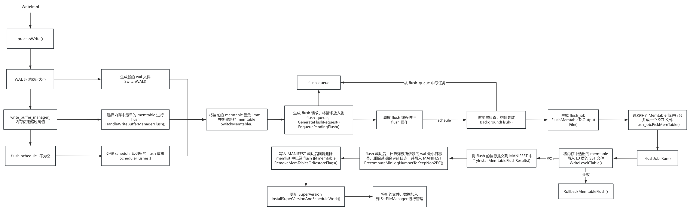
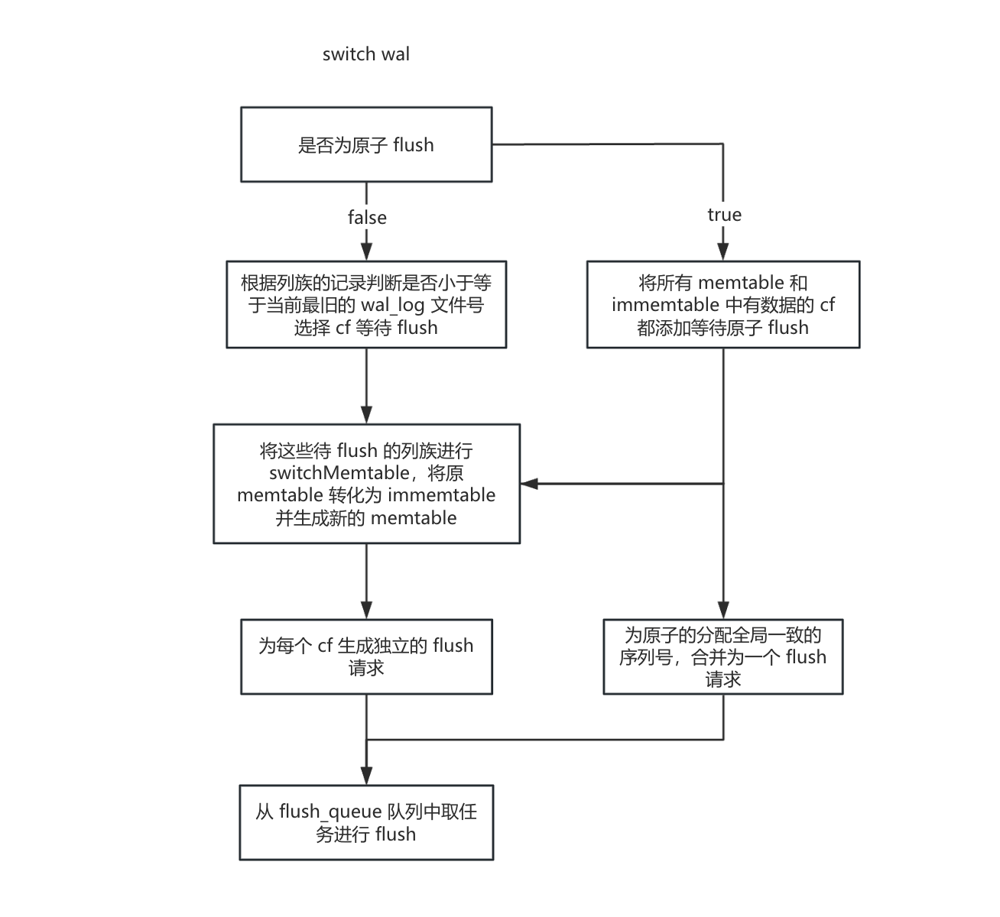
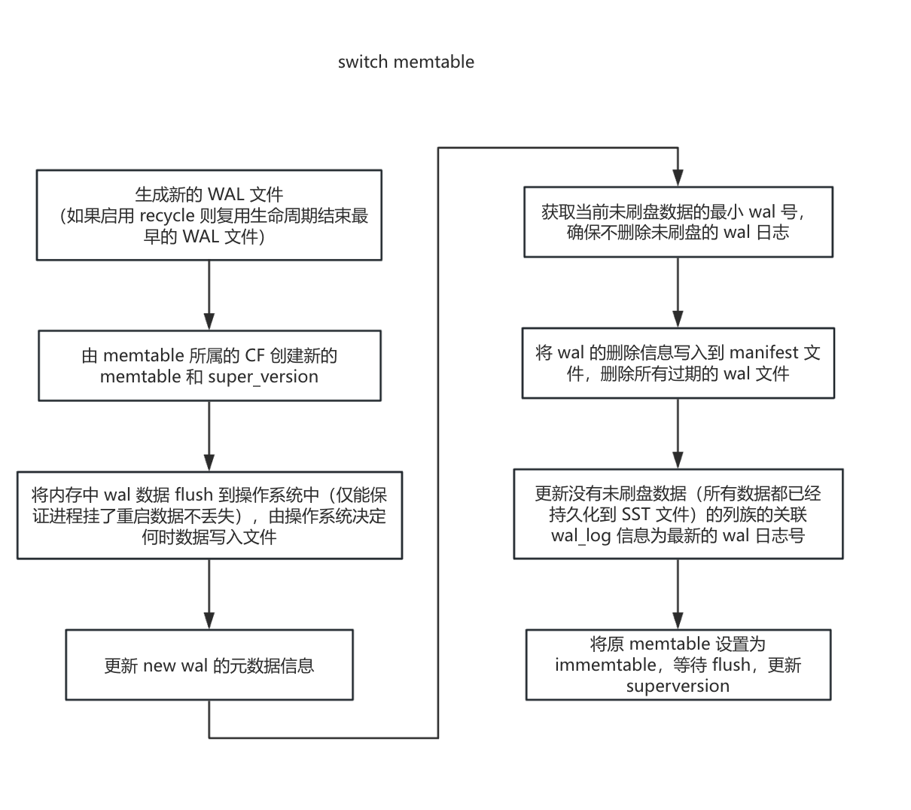

# Flush

Flush（刷盘）是RocksDB的核心机制之一，负责将内存中的数据结构（MemTable）持久化到磁盘的SST文件中。

Flush 流程相关的配置

```
write_buffer_size：单个 memtable 的大小
db_write_buffer_size：db 内所有 memtable 的总大小（包含不同列族）
max_write_buffer_number：某个列族最大 memtable 数量，超过了就会触发 write stall
```

## Flush 流程总揽




#### PreprocessWrite

在 WriteImpl 流程中会通过 PreprocessWrite 尝试 flush

```c++
// 写入前的一些操作，主要判断是否需要切换 WAL 和 memtable
Status DBImpl::PreprocessWrite(const WriteOptions& write_options,
                               LogContext* log_context,
                               WriteContext* write_context) {

  if (UNLIKELY(status.ok() && total_log_size_ > GetMaxTotalWalSize())) {
    InstrumentedMutexLock l(&mutex_);
    const ColumnFamilySet* const column_families =
        versions_->GetColumnFamilySet();
    size_t num_cfs = column_families->NumberOfColumnFamilies();
    if (num_cfs > 1) {
      // 如果是 pipeliine 并发写入 memtable 和 wal 需要等待其他线程写入
      WaitForPendingWrites();
      status = SwitchWAL(write_context);
    }
  }
 
  // ShouldFlush: write_buffer_manager_ 是否启用由 db_write_buffer_size 决定，默认为 0，不启用  
  // 也就是根据当前 write_buffer_manager_ 内存使用情况看是否需要 flush，不启用时返回 false
  if (UNLIKELY(status.ok() && write_buffer_manager_->ShouldFlush())) {
    InstrumentedMutexLock l(&mutex_);
    WaitForPendingWrites();
    status = HandleWriteBufferManagerFlush(write_context);
  }

  if (UNLIKELY(status.ok() && !trim_history_scheduler_.Empty())) {
    // trim_history_scheduler_ 队列里放着已经 flush 但还没有删除的 immemtable，将这些删除
    InstrumentedMutexLock l(&mutex_);
    status = TrimMemtableHistory(write_context);
  }

  if (UNLIKELY(status.ok() && !flush_scheduler_.Empty())) {
    // 从 Schedule 队列里拿任务进行 flush 操作
    InstrumentedMutexLock l(&mutex_);
    WaitForPendingWrites();
    status = ScheduleFlushes(write_context);
  }

  if (UNLIKELY(status.ok() && (write_controller_.IsStopped() ||
                               write_controller_.NeedsDelay()))) {
    // 在后台 Compaction/Flush 跟不上写入速度时，通过主动延迟或停止写入降低写入速率，避免 Level-0 文件堆积
    InstrumentedMutexLock l(&mutex_);
    status = DelayWrite(last_batch_group_size_, write_thread_, write_options);
  }

  // 内存超限检查，暂停所有写入线程，等待后台线程 flush 刷盘释放内存
  if (UNLIKELY(status.ok() && write_buffer_manager_->ShouldStall())) {
    default_cf_internal_stats_->AddDBStats(
        InternalStats::kIntStatsWriteBufferManagerLimitStopsCounts, 1,
        true /* concurrent */);
    if (write_options.no_slowdown) {
      status = Status::Incomplete("Write stall");
    } else {
      InstrumentedMutexLock l(&mutex_);
      WriteBufferManagerStallWrites();
    }
  }
    
  // 如果开启了 sync，需要将 WAL 下刷到磁盘（操作系统可能仅仅将数据写入到 page cache）
  InstrumentedMutexLock l(&log_write_mutex_);
  if (status.ok() && log_context->need_log_sync) {
    // 等待所有正在进行的 WAL 同步操作完成（包括显式 SyncWAL() 调用或隐式刷盘）
    while (logs_.front().IsSyncing()) {
      log_sync_cv_.Wait();
    }
    for (auto& log : logs_) {
      // 标记 WAL 文件为，阻止其他线程发起 SyncWAL() 干扰
      log.PrepareForSync();
    }
  } else {
    log_context->need_log_sync = false;
  }
  // 记录最新 WAL 文件的元数据（文件编号和大小），用于空间管理和崩溃恢复
  log_context->writer = logs_.back().writer;
  log_context->need_log_dir_sync =
      log_context->need_log_dir_sync && !log_dir_synced_;
  log_context->log_file_number_size = std::addressof(alive_log_files_.back());

  return status;
}
```


#### SwitchWAL

wal 文件大小超限，需要将最旧的 wal 中包含的 memtable 数据刷盘



```c++
// WAL 文件大小超过阀值时切换新的 WAL，并触发关联 Memtable 的更新
Status DBImpl::SwitchWAL(WriteContext* write_context) {
  mutex_.AssertHeld();
  Status status;

  // 最旧的的 WAL 文件正在 flush
  if (alive_log_files_.begin()->getting_flushed) {
    return status;
  }
  auto oldest_alive_log = alive_log_files_.begin()->number;
  
  // 处理 2pc 事务未提交的数据阻塞
  bool flush_wont_release_oldest_log = false;
  if (allow_2pc()) {
    // 查找包含未提交事务的最旧 WAL 文件号
    auto oldest_log_with_uncommitted_prep =
        logs_with_prep_tracker_.FindMinLogContainingOutstandingPrep();

    if (oldest_log_with_uncommitted_prep > 0 &&
        oldest_log_with_uncommitted_prep == oldest_alive_log) {
      if (unable_to_release_oldest_log_) {
        return status;
      } else {
        unable_to_release_oldest_log_ = true;
        flush_wont_release_oldest_log = true;
      }
    }
  }
  // 标记为 flush
  if (!flush_wont_release_oldest_log) {
    unable_to_release_oldest_log_ = false;
    alive_log_files_.begin()->getting_flushed = true;
  }

  // 选择需要 flush 的列族 
  autovector<ColumnFamilyData*> cfds;
  if (immutable_db_options_.atomic_flush) {
    // 需要确保跨列族数据的原子性，将当前所有列族中 immemtable 或 memtable 中有数据的 cf 都给添加到 cfds 中
    SelectColumnFamiliesForAtomicFlush(&cfds);
  } else {
    for (auto cfd : *versions_->GetColumnFamilySet()) {
      if (cfd->IsDropped()) {
        continue;
      }
      // 该列族下 min_log_number 小于等于当前最旧的 WAL 文件编号时都需要切换 memtable
      if (cfd->OldestLogToKeep() <= oldest_alive_log) {
        cfds.push_back(cfd);
      }
    }
    // 可能需要同时将统计信息列族带上一起执行 flush
    MaybeFlushStatsCF(&cfds);
  }
  
  WriteThread::Writer nonmem_w;
  if (two_write_queues_) {
    nonmem_write_thread_.EnterUnbatched(&nonmem_w, &mutex_);
  }
  for (const auto cfd : cfds) {
    cfd->Ref();
    // 将当前的 Memtable 置为 Immutable，创建新的 memtable
    status = SwitchMemtable(cfd, write_context);
    cfd->UnrefAndTryDelete();
    if (!status.ok()) {
      break;
    }
  }
  if (two_write_queues_) {
    nonmem_write_thread_.ExitUnbatched(&nonmem_w);
  }

  if (status.ok()) {
    if (immutable_db_options_.atomic_flush) {
      // 分配全局一致的序列号
      AssignAtomicFlushSeq(cfds);
    }
    for (auto cfd : cfds) {
      // 将 flush_requested_ 置为 true，表示该列族的 immemtable list 已经请求了执行 flush
      cfd->imm()->FlushRequested();
      if (!immutable_db_options_.atomic_flush) {
        // 非原子模式：为每个列族独立生成刷新请求
        FlushRequest flush_req;
        GenerateFlushRequest({cfd}, FlushReason::kWalFull, &flush_req);
        EnqueuePendingFlush(flush_req);
      }
    }
    if (immutable_db_options_.atomic_flush) {
      // 原子模式：所有列族合并为一个刷新请求
      FlushRequest flush_req;
      GenerateFlushRequest(cfds, FlushReason::kWalFull, &flush_req);
      EnqueuePendingFlush(flush_req);
    }
    // 尝试启动 flush 或者 compaction，flush 会从 flush_queue_ 队列中取任务
    MaybeScheduleFlushOrCompaction();
  }
  return status;
}
```


####  WriteBuffer 和 Schedule

与上述流程类似，区别仅在于选择 flush 的列族方式

```c++
Status DBImpl::HandleWriteBufferManagerFlush(WriteContext* write_context) {
  mutex_.AssertHeld();
  Status status;

  autovector<ColumnFamilyData*> cfds;
  if (immutable_db_options_.atomic_flush) {
    // 需要确保跨列族数据的原子性，将当前所有列族中 immemtable 或 memtable 中有数据的 cf 都给添加到 cfds 中
    SelectColumnFamiliesForAtomicFlush(&cfds);
  } else {
    ColumnFamilyData* cfd_picked = nullptr;
    SequenceNumber seq_num_for_cf_picked = kMaxSequenceNumber;

    for (auto cfd : *versions_->GetColumnFamilySet()) {
      if (cfd->IsDropped()) {
        continue;
      }
      if (!cfd->mem()->IsEmpty() && !cfd->imm()->IsFlushPendingOrRunning()) {
        // 跳过已经存在 immemtable 等待 flush 的列族，防止 Immutable MemTable 堆积
        // memtable 的创建序号
        uint64_t seq = cfd->mem()->GetCreationSeq();
        if (cfd_picked == nullptr || seq < seq_num_for_cf_picked) {
          // 优先选择创建时间早的 memtable 进行 flush
          cfd_picked = cfd;
          seq_num_for_cf_picked = seq;
        }
      }
    }
    if (cfd_picked != nullptr) {
      cfds.push_back(cfd_picked);
    }
    MaybeFlushStatsCF(&cfds);
  }
  // ...
}

Status DBImpl::ScheduleFlushes(WriteContext* context) {
  autovector<ColumnFamilyData*> cfds;
  if (immutable_db_options_.atomic_flush) {
    SelectColumnFamiliesForAtomicFlush(&cfds);
    for (auto cfd : cfds) {
      cfd->Ref();
    }
    // 由于需要 flush 所有内存中有数据的列族，清空队列防止重复调度
    flush_scheduler_.Clear();
  } else {
    ColumnFamilyData* tmp_cfd;
    // 从 flush_scheduler_ 中取出待 flush 的列族
    while ((tmp_cfd = flush_scheduler_.TakeNextColumnFamily()) != nullptr) {
      cfds.push_back(tmp_cfd);
    }
    MaybeFlushStatsCF(&cfds);
  }
  // ...
}
```


#### SwitchMemtable

将 memtable 切换为 Immuatble meltable，并生成新的 WAL 文件



```c++
Status DBImpl::SwitchMemtable(ColumnFamilyData* cfd, WriteContext* context) {
  mutex_.AssertHeld();
  const ReadOptions read_options;
  const WriteOptions write_options;

  log::Writer* new_log = nullptr;
  MemTable* new_mem = nullptr;
  IOStatus io_s;

  // 对于 write-prepared 和 write-unprepared 事务的处理
  Status s = WriteRecoverableState();
  if (!s.ok()) {
    return s;
  }

  if (two_write_queues_) {
    log_write_mutex_.Lock();
  }
  // 1. 如果当前 WAL 文件非空，需要创建新的 WAL 文件隔离新旧数据写入
  bool creating_new_log = !log_empty_;
  if (two_write_queues_) {
    log_write_mutex_.Unlock();
  }
  uint64_t recycle_log_number = 0;
  if (creating_new_log && immutable_db_options_.recycle_log_file_num &&
      !log_recycle_files_.empty() && IsFileDeletionsEnabled()) {
    // 启用了 recyle 的模式时复用旧 WAL 的文件号
    recycle_log_number = log_recycle_files_.front();
  }
  // 获取全局唯一的文件号
  uint64_t new_log_number =
      creating_new_log ? versions_->NewFileNumber() : logfile_number_;
  const MutableCFOptions mutable_cf_options = *cfd->GetLatestMutableCFOptions();

  // 元数据信息
  MemTableInfo memtable_info;
  memtable_info.cf_name = cfd->GetName();
  memtable_info.first_seqno = cfd->mem()->GetFirstSequenceNumber();
  memtable_info.earliest_seqno = cfd->mem()->GetEarliestSequenceNumber();
  memtable_info.num_entries = cfd->mem()->NumEntries();
  memtable_info.num_deletes = cfd->mem()->NumDeletion();
  if (!cfd->ioptions()->persist_user_defined_timestamps &&
      cfd->user_comparator()->timestamp_size() > 0) {
    const Slice& newest_udt = cfd->mem()->GetNewestUDT();
    memtable_info.newest_udt.assign(newest_udt.data(), newest_udt.size());
  }
  
  // 未刷新的 immemtable 的个数
  int num_imm_unflushed = cfd->imm()->NumNotFlushed();
  // WAL 预分配的大小
  const auto preallocate_block_size =
      GetWalPreallocateBlockSize(mutable_cf_options.write_buffer_size);
  mutex_.Unlock();
  if (creating_new_log) {
    // 创建 WAL 文件
    io_s = CreateWAL(write_options, new_log_number, recycle_log_number,
                     preallocate_block_size, &new_log);
    if (s.ok()) {
      s = io_s;
    }
  }
  if (s.ok()) {
    // 2. 初始化新的 memtable 和 super version
    SequenceNumber seq = versions_->LastSequence();
    new_mem = cfd->ConstructNewMemtable(mutable_cf_options, seq);
    context->superversion_context.NewSuperVersion();
    cfd->mem()->ConstructFragmentedRangeTombstones();
  }

  mutex_.Lock();
  if (recycle_log_number != 0) {
    // 从 log_recycle_files_ 队列中取出待复用的日志号
    log_recycle_files_.pop_front();
  }
  if (s.ok() && creating_new_log) {
    InstrumentedMutexLock l(&log_write_mutex_);
    if (!logs_.empty()) {
      // 3. 将当前 WAL 的内存缓冲区刷到操作系统 page cache 中
      log::Writer* cur_log_writer = logs_.back().writer;
      if (error_handler_.IsRecoveryInProgress()) {
        cur_log_writer->file()->reset_seen_error();
      }
      io_s = cur_log_writer->WriteBuffer(write_options);
      if (s.ok()) {
        s = io_s;
      }
    }
    if (s.ok()) {
      // 4. 更新 new wal 元数据
      logfile_number_ = new_log_number;
      log_empty_ = true;
      log_dir_synced_ = false;
      logs_.emplace_back(logfile_number_, new_log);
      alive_log_files_.emplace_back(logfile_number_);
    }
  }

  // ...

  bool empty_cf_updated = false;
  if (immutable_db_options_.track_and_verify_wals_in_manifest &&
      !immutable_db_options_.allow_2pc && creating_new_log) {
    // 启用 Manifest 跟踪 WAL 生命周期，并且禁用两阶段提交，避免保留 Prepare 阶段的 WAL
    // 5. 计算未刷盘数据的最小 wal 号，确保不删除未刷盘的 wal 日志
    uint64_t min_wal_number_to_keep =
        versions_->PreComputeMinLogNumberWithUnflushedData(logfile_number_);
    if (min_wal_number_to_keep >
        versions_->GetWalSet().GetMinWalNumberToKeep()) {
      // 收集没有未刷盘数据（所有数据都已经持久化到 SST 文件）的列族
      autovector<ColumnFamilyData*> empty_cfs;
      for (auto cf : *versions_->GetColumnFamilySet()) {
        if (cf->IsEmpty()) {
          empty_cfs.push_back(cf);
        }
      }
      
      // 6. 通过 VesionEdit 将删除 WAL 记录写入 Manifest 文件
      VersionEdit wal_deletion;
      // 7. 删除所有序号小于 min_wal_number_to_keep 的文件
      wal_deletion.DeleteWalsBefore(min_wal_number_to_keep);
      s = versions_->LogAndApplyToDefaultColumnFamily(
          read_options, write_options, &wal_deletion, &mutex_,
          directories_.GetDbDir());
      if (!s.ok()) {
        return s;
      }

      for (auto cf : empty_cfs) {
        if (cf->IsEmpty()) {
          // 8. 将这些列族的 WAL 信息关联到新的日志，序列号同步
          cf->SetLogNumber(logfile_number_);
          cf->mem()->SetCreationSeq(versions_->LastSequence());
        }  
      }
      empty_cf_updated = true;
    }
  }
  if (!empty_cf_updated) {
    for (auto cf : *versions_->GetColumnFamilySet()) {
      if (cf->IsEmpty()) {
        if (creating_new_log) {
          cf->SetLogNumber(logfile_number_);
        }
        cf->mem()->SetCreationSeq(versions_->LastSequence());
      }
    }
  }

  // 9.1 标识后续写入将使用新的 WAL 文件
  cfd->mem()->SetNextLogNumber(logfile_number_);
  assert(new_mem != nullptr);
  // 9.2 将 memtable 添加到 immemtable
  cfd->imm()->Add(cfd->mem(), &context->memtables_to_free_);
  // 9.3 设置新创建的 memtable 为当前的列族使用的 memtable，后续写入此结构
  new_mem->Ref();
  cfd->SetMemtable(new_mem);
  // 10. 更新 superversion，内部会尝试触发 flush 和 compaction
  InstallSuperVersionAndScheduleWork(cfd, &context->superversion_context,
                                     mutable_cf_options);

  NotifyOnMemTableSealed(cfd, memtable_info);
  io_s.PermitUncheckedError();
  return s;
}

```


####  FlushRequest

生成 Flush 请求

```c++
void DBImpl::GenerateFlushRequest(const autovector<ColumnFamilyData*>& cfds,
                                  FlushReason flush_reason, FlushRequest* req) {
  assert(req != nullptr);
  req->flush_reason = flush_reason;
  req->cfd_to_max_mem_id_to_persist.reserve(cfds.size());
  for (const auto cfd : cfds) {
    if (nullptr == cfd) {
      continue;
    }
    // max_memtable_id 即最新加入 ImmutableMemtables 的 memtable 的 Id
    uint64_t max_memtable_id = cfd->imm()->GetLatestMemTableID();
    req->cfd_to_max_mem_id_to_persist.emplace(cfd, max_memtable_id);
  }
}
```

将请求加入队列  `flush_queue_`

```c++
bool DBImpl::EnqueuePendingFlush(const FlushRequest& flush_req) {
  mutex_.AssertHeld();
  bool enqueued = false;
  if (reject_new_background_jobs_) {
    return enqueued;
  }
  if (flush_req.cfd_to_max_mem_id_to_persist.empty()) {
    return enqueued;
  }
  if (!immutable_db_options_.atomic_flush) {
    // 非原子请求一个请求只能包含一个列族
    assert(flush_req.cfd_to_max_mem_id_to_persist.size() == 1);
    ColumnFamilyData* cfd =
        flush_req.cfd_to_max_mem_id_to_persist.begin()->first;
    if (!cfd->queued_for_flush() && cfd->imm()->IsFlushPending()) {
      cfd->Ref();
      // flush 操作入队
      cfd->set_queued_for_flush(true);
      ++unscheduled_flushes_;
      flush_queue_.push_back(flush_req);
      enqueued = true;
    }
  } else {
    for (auto& iter : flush_req.cfd_to_max_mem_id_to_persist) {
      ColumnFamilyData* cfd = iter.first;
      cfd->Ref();
    }
    ++unscheduled_flushes_;
    flush_queue_.push_back(flush_req);
    enqueued = true;
  }
  return enqueued;
}
```


#### MaybeScheduleFlushOrCompaction

调度线程执行分配给 Flush

```c++
void DBImpl::MaybeScheduleFlushOrCompaction() {
  mutex_.AssertHeld();
  if (bg_compaction_paused_ > 0) {
    // 后台工作暂停
    return;
  }
  // ...
  
  auto bg_job_limits = GetBGJobLimits();
  bool is_flush_pool_empty =
      env_->GetBackgroundThreads(Env::Priority::HIGH) == 0;
  // 条件：1、HIGH 线程池不为空； 
  //      2、未执行的 flush 任务大于 0（flush_queue_ 队列有任务）  
  //      3、后台正常执行的 flush 任务小于后台限制执行的 flush 任务数
  while (!is_flush_pool_empty && unscheduled_flushes_ > 0 &&
         bg_flush_scheduled_ < bg_job_limits.max_flushes) {
    bg_flush_scheduled_++;
    FlushThreadArg* fta = new FlushThreadArg;
    fta->db_ = this;
    // 使用 HIGH 线程执行 flush，确保内存及时释放，避免写停顿
    fta->thread_pri_ = Env::Priority::HIGH;
    env_->Schedule(&DBImpl::BGWorkFlush, fta, Env::Priority::HIGH, this,
                   &DBImpl::UnscheduleFlushCallback);
    --unscheduled_flushes_;
  }


  // 当 HIGH 线程池为空，后台正常执行 flush 和 compaction 的任务数小于限制的最大 flush 数目  
  // 可以使用 LOW 线程去执行 flush，这样是为了保证优先执行 flush，从而确保写性能
  if (is_flush_pool_empty) {
    while (unscheduled_flushes_ > 0 &&
           bg_flush_scheduled_ + bg_compaction_scheduled_ <
               bg_job_limits.max_flushes) {
      bg_flush_scheduled_++;
      FlushThreadArg* fta = new FlushThreadArg;
      fta->db_ = this;
      fta->thread_pri_ = Env::Priority::LOW;
      env_->Schedule(&DBImpl::BGWorkFlush, fta, Env::Priority::LOW, this,
                     &DBImpl::UnscheduleFlushCallback);
      --unscheduled_flushes_;
    }
  }

  // 可以单独停止 compaction，而不停止 flush
  if (bg_compaction_paused_ > 0) {
    return;
  } else if (error_handler_.IsBGWorkStopped()) {
    return;
  }

  // 当存在用户触发的 RunManualCompaction 时，阻塞自动 Compaction，确保手动任务资源独占
  if (HasExclusiveManualCompaction()) {
    return;
  }

  // 后台 compaction 的任务数小于限制的最大 compaction 任务数，并且有 compaction 任务排队
  while (bg_compaction_scheduled_ + bg_bottom_compaction_scheduled_ <
             bg_job_limits.max_compactions &&
         unscheduled_compactions_ > 0) {
    CompactionArg* ca = new CompactionArg;
    ca->db = this;
    // 使用 LOW 线程执行 compaction
    ca->compaction_pri_ = Env::Priority::LOW;
    ca->prepicked_compaction = nullptr;
    bg_compaction_scheduled_++;
    unscheduled_compactions_--;
    env_->Schedule(&DBImpl::BGWorkCompaction, ca, Env::Priority::LOW, this,
                   &DBImpl::UnscheduleCompactionCallback);
  }
}
```

```c++
void DBImpl::BackgroundCallFlush(Env::Priority thread_pri) {
  bool made_progress = false;
  JobContext job_context(next_job_id_.fetch_add(1), true);

  {
    InstrumentedMutexLock l(&mutex_);
    assert(bg_flush_scheduled_);
    num_running_flushes_++;

    // pending_outputs_ 记录所有正在被后台任务使用的文件号，确保任务结束时从 pending_outputs_ 删除
    std::unique_ptr<std::list<uint64_t>::iterator>
        pending_outputs_inserted_elem(new std::list<uint64_t>::iterator(
            CaptureCurrentFileNumberInPendingOutputs()));
    FlushReason reason;
    bool flush_rescheduled_to_retain_udt = false;
    // 执行 flush
    Status s =
        BackgroundFlush(&made_progress, &job_context, &log_buffer, &reason,
                        &flush_rescheduled_to_retain_udt, thread_pri);
    if (s.IsTryAgain() && flush_rescheduled_to_retain_udt) {
      // 唤醒等待的线程
      bg_cv_.SignalAll();
      mutex_.Unlock();
      // 休眠 100ms 避免忙等
      immutable_db_options_.clock->SleepForMicroseconds(
          100000);  
      mutex_.Lock();
    } else if (!s.ok() && !s.IsShutdownInProgress() &&
               !s.IsColumnFamilyDropped() &&
               reason != FlushReason::kErrorRecovery) {
      // flush 失败
      uint64_t error_cnt =
          default_cf_internal_stats_->BumpAndGetBackgroundErrorCount();
      bg_cv_.SignalAll(); 
      mutex_.Unlock();
      immutable_db_options_.clock->SleepForMicroseconds(1000000);
      mutex_.Lock();
    }

    // 从 pending_outputs_ 中删除 flush 的文件号
    ReleaseFileNumberFromPendingOutputs(pending_outputs_inserted_elem);
    if (!flush_rescheduled_to_retain_udt) {
      // 如果 flush 失败，则需要获取生成的临时文件,后续删除
      FindObsoleteFiles(&job_context, !s.ok() && !s.IsShutdownInProgress() &&
                                          !s.IsColumnFamilyDropped());
    }
    if (job_context.HaveSomethingToClean() ||
        job_context.HaveSomethingToDelete() || !log_buffer.IsEmpty()) {
      mutex_.Unlock();
      if (job_context.HaveSomethingToDelete()) {
        // 物理删除之前获取的临时文件
        PurgeObsoleteFiles(job_context);
      }
      job_context.Clean();
      mutex_.Lock();
    }
    num_running_flushes_--;
    bg_flush_scheduled_--;
    
    // 再次尝试调度
    MaybeScheduleFlushOrCompaction();
    atomic_flush_install_cv_.SignalAll();
    bg_cv_.SignalAll();
  }
}
```


#### BackgroundFlush

```c++
Status DBImpl::BackgroundFlush(bool* made_progress, JobContext* job_context,
                               LogBuffer* log_buffer, FlushReason* reason,
                               bool* flush_rescheduled_to_retain_udt,
                               Env::Priority thread_pri) {
  mutex_.AssertHeld();

  Status status;
  *reason = FlushReason::kOthers;
  // ...

  autovector<BGFlushArg> bg_flush_args;
  std::vector<SuperVersionContext>& superversion_contexts =
      job_context->superversion_contexts;
  autovector<ColumnFamilyData*> column_families_not_to_flush;
   // 取出 flush_queue_ 中所有的 flush 请求，然后放入到 bg_flush_args
  while (!flush_queue_.empty()) {
    // 从队列头部取出 FlushRequest
    FlushRequest flush_req = PopFirstFromFlushQueue();
    FlushReason flush_reason = flush_req.flush_reason;
    if (!error_handler_.GetBGError().ok() && error_handler_.IsBGWorkStopped() &&
        flush_reason != FlushReason::kErrorRecovery &&
        flush_reason != FlushReason::kErrorRecoveryRetryFlush) {
      // 后台线程因错误停止工作且当前请求非 kErrorRecovery，此时丢弃当前请求，仅允许 kErrorRecovery 类继续执行
      status = error_handler_.GetBGError();
      assert(!status.ok());
      *reason = flush_reason;
      for (auto item : flush_req.cfd_to_max_mem_id_to_persist) {
        item.first->UnrefAndTryDelete();
      }
      return status;
    }
    if (!immutable_db_options_.atomic_flush &&
        ShouldRescheduleFlushRequestToRetainUDT(flush_req)) {
      assert(flush_req.cfd_to_max_mem_id_to_persist.size() == 1);
      ColumnFamilyData* cfd =
          flush_req.cfd_to_max_mem_id_to_persist.begin()->first;
      if (cfd->UnrefAndTryDelete()) {
        return Status::OK();
      }
      // 用户定义时间戳要求数据在刷新到磁盘时保持严格的时间顺序
      // 当 ShouldRescheduleFlushRequestToRetainUDT() 检测到立即刷新可能破坏 UDT 顺序
      // 例如：当前 MemTable 包含尚未完全持久化的时间戳区间，时间戳信息仅保存在内存中，会触发重试
      // 需要重新加入到队列中
      EnqueuePendingFlush(flush_req);
      *reason = flush_reason;
      *flush_rescheduled_to_retain_udt = true;
      return Status::TryAgain();
    }
    superversion_contexts.clear();
    superversion_contexts.reserve(
        flush_req.cfd_to_max_mem_id_to_persist.size());

    for (const auto& [cfd, max_memtable_id] :
         flush_req.cfd_to_max_mem_id_to_persist) {
      if (cfd->IsDropped() || !cfd->imm()->IsFlushPending()) {
        // 过滤删除和没有等待 flush 的列族
        column_families_not_to_flush.push_back(cfd);
        continue;
      }
      // 构建 flush 任务的参数
      superversion_contexts.emplace_back(true);
      bg_flush_args.emplace_back(cfd, max_memtable_id,
                                 &(superversion_contexts.back()), flush_reason);
    }
    if (!bg_flush_args.empty() || !column_families_not_to_flush.empty()) {
      break;
    }
  }

  if (!bg_flush_args.empty()) {
    // 将 memtable 刷到 sst 文件
    status = FlushMemTablesToOutputFiles(bg_flush_args, made_progress,
                                         job_context, log_buffer, thread_pri);
    // ...
  }

  return status;
}
```


#### FlushMemTableToOutputFile

```c++
Status DBImpl::FlushMemTableToOutputFile(
    ColumnFamilyData* cfd, const MutableCFOptions& mutable_cf_options,
    bool* made_progress, JobContext* job_context, FlushReason flush_reason,
    SuperVersionContext* superversion_context,
    std::vector<SequenceNumber>& snapshot_seqs,
    SequenceNumber earliest_write_conflict_snapshot,
    SnapshotChecker* snapshot_checker, LogBuffer* log_buffer,
    Env::Priority thread_pri) {
  mutex_.AssertHeld();
  const ReadOptions read_options(Env::IOActivity::kFlush);
  const WriteOptions write_options(Env::IOActivity::kFlush);
  // 如果包含多个列族或者开启 2pc ，需要同步活跃的和已关闭但未删除的 WAL 文件，否则可能会导致同一个 write batch 部分列族提交部分未提交
  const bool needs_to_sync_closed_wals =
      logfile_number_ > 0 &&
      (versions_->GetColumnFamilySet()->NumberOfColumnFamilies() > 1 ||
       allow_2pc());
  // SyncClosedWals() 执行时释放锁，新写入可能触发切换 memtable，所以需要记录当前 max_memtable_id，防止 flush 掉后续新建的 memtable
  uint64_t max_memtable_id =
      needs_to_sync_closed_wals
          ? cfd->imm()->GetLatestMemTableID(false /* for_atomic_flush */)
          : std::numeric_limits<uint64_t>::max();

   // 1. 生成一个 flush 任务
  FlushJob flush_job(
      dbname_, cfd, immutable_db_options_, mutable_cf_options, max_memtable_id,
      file_options_for_compaction_, versions_.get(), &mutex_, &shutting_down_,
      snapshot_seqs, earliest_write_conflict_snapshot, snapshot_checker,
      job_context, flush_reason, log_buffer, directories_.GetDbDir(),
      GetDataDir(cfd, 0U),
      GetCompressionFlush(*cfd->ioptions(), mutable_cf_options), stats_,
      &event_logger_, mutable_cf_options.report_bg_io_stats,
      true /* sync_output_directory */, true /* write_manifest */, thread_pri,
      io_tracer_, cfd->GetSuperVersion()->ShareSeqnoToTimeMapping(), db_id_,
      db_session_id_, cfd->GetFullHistoryTsLow(), &blob_callback_);
  FileMetaData file_meta;

  Status s;
  bool need_cancel = false;
  IOStatus log_io_s = IOStatus::OK();
  if (needs_to_sync_closed_wals) {
    VersionEdit synced_wals;
    bool error_recovery_in_prog = error_handler_.IsRecoveryInProgress();
    mutex_.Unlock();
    // 同步已关闭的 WAL 文件
    log_io_s = SyncClosedWals(write_options, job_context, &synced_wals,
                              error_recovery_in_prog);
    mutex_.Lock();
    if (log_io_s.ok() && synced_wals.IsWalAddition()) {
      log_io_s = status_to_io_status(
        // 将元数据更新到 MANIFEST
          ApplyWALToManifest(read_options, write_options, &synced_wals));
    }
    // ...
  }
  s = log_io_s;

  if (s.ok()) {
    // 2. 基于创建时间选取 memtable，会将选取的 immemtable 合并放入同一个 sst 文件，同时初始化 VersionEdit 和文件元数据
    flush_job.PickMemTable();
    need_cancel = true;
  }

  // 通过 EventListener 接口通知外部系统刷新任务启动
  NotifyOnFlushBegin(cfd, &file_meta, mutable_cf_options, job_context->job_id,
                     flush_reason);

  bool switched_to_mempurge = false;
  if (s.ok()) {
    // 3. 执行 flush 任务
    s = flush_job.Run(&logs_with_prep_tracker_, &file_meta,
                      &switched_to_mempurge, &skip_set_bg_error,
                      &error_handler_);
    need_cancel = false;
  }

  if (!s.ok() && need_cancel) {
    flush_job.Cancel();
  }

  if (s.ok()) {
    // 4. 更新 SuperVersion
    InstallSuperVersionAndScheduleWork(cfd, superversion_context,
                                       mutable_cf_options);
  // ...
  }
  
  if (s.ok() && (!switched_to_mempurge)) {
    // flush 完成通知
    NotifyOnFlushCompleted(cfd, mutable_cf_options,
                           flush_job.GetCommittedFlushJobsInfo());
    // 5. 将新文件加入 SstFileManager 的跟踪列表
    auto sfm = static_cast<SstFileManagerImpl*>(
        immutable_db_options_.sst_file_manager.get());
    if (sfm) {
      std::string file_path = MakeTableFileName(
          cfd->ioptions()->cf_paths[0].path, file_meta.fd.GetNumber());
      sfm->OnAddFile(file_path).PermitUncheckedError();
      if (sfm->IsMaxAllowedSpaceReached()) {
        Status new_bg_error =
            Status::SpaceLimit("Max allowed space was reached");
        error_handler_.SetBGError(new_bg_error, BackgroundErrorReason::kFlush);
      }
    }
  }
  return s;
}
```


#### FlushJob::Run

执行 Flush 操作

```c++
Status FlushJob::Run(LogsWithPrepTracker* prep_tracker, FileMetaData* file_meta,
                     bool* switched_to_mempurge, bool* skipped_since_bg_error,
                     ErrorHandler* error_handler) {
  db_mutex_->AssertHeld();
  assert(pick_memtable_called);
  double mempurge_threshold =
      mutable_cf_options_.experimental_mempurge_threshold;
  // ...
  if ((mempurge_threshold > 0.0) &&
      (flush_reason_ == FlushReason::kWriteBufferFull) && (!mems_.empty()) &&
      MemPurgeDecider(mempurge_threshold) && !(db_options_.atomic_flush)) {
    // mempurge 模式，Immutable MemTable 在内存中进行 compaction，过滤掉过期数据（如覆盖，墓碑标记等）
    cfd_->SetMempurgeUsed();
    mempurge_s = MemPurge();
    // ...
  }
  
  Status s;
  if (mempurge_s.ok()) {
    base_->Unref();
    s = Status::OK();
  } else {
    // 1. 写入 L0 层的 SST 文件
    s = WriteLevel0Table();
  }
  // ...

  if (!s.ok()) {
    // 将 MemTable 从刷盘队列移回 Immutable 列表，等待重试
    cfd_->imm()->RollbackMemtableFlush(
        mems_, /*rollback_succeeding_memtables=*/!db_options_.atomic_flush);
  } else if (write_manifest_) {
    assert(!db_options_.atomic_flush);
    if (!db_options_.atomic_flush &&
        flush_reason_ != FlushReason::kErrorRecovery &&
        flush_reason_ != FlushReason::kErrorRecoveryRetryFlush &&
        error_handler && !error_handler->GetBGError().ok() &&
        error_handler->IsBGWorkStopped()) {
      // 不成功则回滚
      cfd_->imm()->RollbackMemtableFlush(
          mems_, /*rollback_succeeding_memtables=*/!db_options_.atomic_flush);
      s = error_handler->GetBGError();
      if (skipped_since_bg_error) {
        *skipped_since_bg_error = true;
      }
    } else {
      // 2. 将新增 SST 文件记录到 Manifest，更新 VersionEdit，回收成功刷盘的 memtable
      s = cfd_->imm()->TryInstallMemtableFlushResults(
              cfd_, mutable_cf_options_, mems_, prep_tracker, versions_, db_mutex_,
              meta_.fd.GetNumber(), &job_context_->memtables_to_free, db_directory_,
              log_buffer_, &committed_flush_jobs_info_,
              !(mempurge_s.ok()) /* write_edit : true if no mempurge happened (or if aborted),
                              but 'false' if mempurge successful: no new min log number
                              or new level 0 file path to write to manifest. */);
    }
  }
  if (s.ok() && file_meta != nullptr) {
    // 记录 SST 文件元数据信息
    *file_meta = meta_;
  }
  // ...
  return s;
}
```


#### WriteLevel0Table

将 memtable 的数据写入 level0 层的 SST 文件中

```c++
Status FlushJob::WriteLevel0Table() {
  AutoThreadOperationStageUpdater stage_updater(
      ThreadStatus::STAGE_FLUSH_WRITE_L0);
  db_mutex_->AssertHeld();
  Status s;

  // 区分冷热数据
  meta_.temperature = mutable_cf_options_.default_write_temperature;
  file_options_.temperature = meta_.temperature;
  const auto* ucmp = cfd_->internal_comparator().user_comparator();
  assert(ucmp);
  // 时间戳机制
  const size_t ts_sz = ucmp->timestamp_size();
  const bool logical_strip_timestamp =
      ts_sz > 0 && !cfd_->ioptions()->persist_user_defined_timestamps;

  { 
    // 记录当前需要 flush 的 memtable 列表
    std::vector<InternalIterator*> memtables;
    // DeleteRange 分配的迭代器，用于将 kTypeRangeDeletion 类型的数据写入，
    std::vector<std::unique_ptr<FragmentedRangeTombstoneIterator>>
        range_del_iters;
    ReadOptions ro;
    // 强制全局有序遍历
    ro.total_order_seek = true;
    ro.io_activity = Env::IOActivity::kFlush;
    Arena arena; 
    // 遍历 memtable，收集 memtables 和 del_range，确保后续操作能正确关联相同 MemTable 的数据与删除操作
    for (ReadOnlyMemTable* m : mems_) {
      if (logical_strip_timestamp) {
        memtables.push_back(m->NewTimestampStrippingIterator(
            ro, /*seqno_to_time_mapping=*/nullptr, &arena,
            /*prefix_extractor=*/nullptr, ts_sz));
      } else {
        memtables.push_back(
            m->NewIterator(ro, /*seqno_to_time_mapping=*/nullptr, &arena,
                           /*prefix_extractor=*/nullptr));
      }
      auto* range_del_iter =
          logical_strip_timestamp
              ? m->NewTimestampStrippingRangeTombstoneIterator(
                    ro, kMaxSequenceNumber, ts_sz)
              : m->NewRangeTombstoneIterator(ro, kMaxSequenceNumber,
                                             true /* immutable_memtable */);
      if (range_del_iter != nullptr) {
        range_del_iters.emplace_back(range_del_iter);
      }
    }

    { 
      // 将多个 MemTable 的迭代器合并为全局有序的迭代器
      ScopedArenaPtr<InternalIterator> iter(
          NewMergingIterator(&cfd_->internal_comparator(), memtables.data(),
                             static_cast<int>(memtables.size()), &arena));
      // SST 文件的时间戳元数据
      int64_t _current_time = 0;
      auto status = clock_->GetCurrentTime(&_current_time);
      const uint64_t current_time = static_cast<uint64_t>(_current_time);
      uint64_t oldest_key_time = mems_.front()->ApproximateOldestKeyTime();
      uint64_t oldest_ancester_time = std::min(current_time, oldest_key_time);
      meta_.oldest_ancester_time = oldest_ancester_time;
      meta_.file_creation_time = current_time;
      uint64_t num_input_entries = 0;
      uint64_t memtable_payload_bytes = 0;
      uint64_t memtable_garbage_bytes = 0;
      IOStatus io_s;
      const std::string* const full_history_ts_low =
          (full_history_ts_low_.empty()) ? nullptr : &full_history_ts_low_;
      ReadOptions read_options(Env::IOActivity::kFlush);
      read_options.rate_limiter_priority = io_priority;
      const WriteOptions write_options(io_priority, Env::IOActivity::kFlush);
      // 初始化 SST 文件的构建参数
      TableBuilderOptions tboptions(
          *cfd_->ioptions(), mutable_cf_options_, read_options, write_options,
          cfd_->internal_comparator(), cfd_->internal_tbl_prop_coll_factories(),
          output_compression_, mutable_cf_options_.compression_opts,
          cfd_->GetID(), cfd_->GetName(), 0 /* level */,
          current_time /* newest_key_time */, false /* is_bottommost */,
          TableFileCreationReason::kFlush, oldest_key_time, current_time,
          db_id_, db_session_id_, 0 /* target_file_size */,
          meta_.fd.GetNumber(),
          preclude_last_level_min_seqno_ == kMaxSequenceNumber
              ? preclude_last_level_min_seqno_
              : std::min(earliest_snapshot_, preclude_last_level_min_seqno_));
      const SequenceNumber job_snapshot_seq =
          job_context_->GetJobSnapshotSequence();      
      
      // 基于 NewMergingIterator 和 range_del_iters 过滤并输出全局有序的数据，并将数据添加到新生成的 SST 文件中
      s = BuildTable(
          dbname_, versions_, db_options_, tboptions, file_options_,
          cfd_->table_cache(), iter.get(), std::move(range_del_iters), &meta_,
          &blob_file_additions, existing_snapshots_, earliest_snapshot_,
          earliest_write_conflict_snapshot_, job_snapshot_seq,
          snapshot_checker_, mutable_cf_options_.paranoid_file_checks,
          cfd_->internal_stats(), &io_s, io_tracer_,
          BlobFileCreationReason::kFlush, seqno_to_time_mapping_.get(),
          event_logger_, job_context_->job_id, &table_properties_, write_hint,
          full_history_ts_low, blob_callback_, base_, &num_input_entries,
          &memtable_payload_bytes, &memtable_garbage_bytes);
      
    }

    if (s.ok() && output_file_directory_ != nullptr && sync_output_directory_) {
      // 将存储 sst 文件的目录的元数据刷盘
      s = output_file_directory_->FsyncWithDirOptions(
          IOOptions(), nullptr,
          DirFsyncOptions(DirFsyncOptions::FsyncReason::kNewFileSynced));
    }
    db_mutex_->Lock();
  }
  base_->Unref();

  // 如果文件大小为 0，意味着文件已经被删除所以不需要写入到 manifest 中
  const bool has_output = meta_.fd.GetFileSize() > 0;

  if (s.ok() && has_output) {
    // 由于后台线程可能正在 compact，无法直接插入到更高层保证文件间有序，只能将文件写入到 L0 层，允许 L0 层的文件 key 范围可重叠
    // 将新 SST 文件的完整元信息写入 VersionEdit，单个列族的一次 flush 只能产生一个 SST 文件
    edit_->AddFile(0 /* level */, meta_.fd.GetNumber(), meta_.fd.GetPathId(),
                   meta_.fd.GetFileSize(), meta_.smallest, meta_.largest,
                   meta_.fd.smallest_seqno, meta_.fd.largest_seqno,
                   meta_.marked_for_compaction, meta_.temperature,
                   meta_.oldest_blob_file_number, meta_.oldest_ancester_time,
                   meta_.file_creation_time, meta_.epoch_number,
                   meta_.file_checksum, meta_.file_checksum_func_name,
                   meta_.unique_id, meta_.compensated_range_deletion_size,
                   meta_.tail_size, meta_.user_defined_timestamps_persisted);
    edit_->SetBlobFileAdditions(std::move(blob_file_additions));
  }
  // 将本次刷盘的耗时、数据量等性能指标绑定到首个 MemTable
  mems_[0]->SetFlushJobInfo(GetFlushJobInfo());
  // ...
  return s;
}
```


#### TryInstallMemtableFlushResults

将 Flush 的信息保存到 manifest 中

```c++
Status MemTableList::TryInstallMemtableFlushResults(
    ColumnFamilyData* cfd, const MutableCFOptions& mutable_cf_options,
    const autovector<MemTable*>& mems, LogsWithPrepTracker* prep_tracker,
    VersionSet* vset, InstrumentedMutex* mu, uint64_t file_number,
    autovector<MemTable*>* to_delete, FSDirectory* db_directory,
    LogBuffer* log_buffer,
    std::list<std::unique_ptr<FlushJobInfo>>* committed_flush_jobs_info,
    bool write_edits) {
  AutoThreadOperationStageUpdater stage_updater(
      ThreadStatus::STAGE_MEMTABLE_INSTALL_FLUSH_RESULTS);
  mu->AssertHeld();

  const ReadOptions read_options(Env::IOActivity::kFlush);
  Status s;

  // 1. 更改所有成功 Flush 的 MemTable 状态
  for (size_t i = 0; i < mems.size(); ++i) {
    mems[i]->flush_completed_ = true;
    mems[i]->file_number_ = file_number;
  }

  // 2. 分界点: 只有一个线程可以 commit
  if (commit_in_progress_) {
    return s;
  }

  // 进入 commit 流程
  commit_in_progress_ = true;

  while (s.ok()) {
    auto& memlist = current_->memlist_;
    // 3. 遇到 Flush 失败的 memtable 则中断
    if (memlist.empty() || !memlist.back()->flush_completed_) {
      break;
    }

    uint64_t batch_file_number = 0;
    size_t batch_count = 0;
    autovector<VersionEdit*> edit_list;

    // 按照 memtable 创建的顺序（从后向前） scan and commit
    for (auto it = memlist.rbegin(); it != memlist.rend(); ++it) {
      MemTable* m = *it;
      // 3.1 遇到 Flush 失败的 memtable 则中断
      if (!m->flush_completed_) {
        break;
      }
      if (it == memlist.rbegin() || batch_file_number != m->file_number_) {
        // 遇到一个新的 FlushJob，此时 file_number_ 和 edit 都是新的
        // 更新当前 batch 的文件号
        batch_file_number = m->file_number_;
        // 同一个 batch 共享一个 VersionEdit，保存新的 VersionEdit
        edit_list.push_back(&m->edit_);
        std::unique_ptr<FlushJobInfo> info = m->ReleaseFlushJobInfo();
        if (info != nullptr) {
          committed_flush_jobs_info->push_back(std::move(info));
        }
      }
      batch_count++;
    }

    // 3.2 commit 已经 Flush 成功的
    if (batch_count > 0) {
      // 清理过期的 WAL,计算当前还没持久化的最小的 wal 日志号，logfile_num < min_wal_number_to_keep 都应该删除
      uint64_t min_wal_number_to_keep =
          PrecomputeMinLogNumberToKeepNon2PC(vset, *cfd, edit_list);
      VersionEdit wal_deletion;
      wal_deletion.SetMinLogNumberToKeep(min_wal_number_to_keep);
      if (vset->db_options()->track_and_verify_wals_in_manifest) {
        if (min_wal_number_to_keep >
            vset->GetWalSet().GetMinWalNumberToKeep()) {
          wal_deletion.DeleteWalsBefore(min_wal_number_to_keep);
        }
      }
      // wal 的清理单独记录为一个 VersionEdit
      edit_list.push_back(&wal_deletion);

      const auto manifest_write_cb = [this, cfd, batch_count, log_buffer,
                                      to_delete, mu](const Status& status) {
        // manifest 提交之后通过 callback 从 memlist_ 中删除 flushed memtable
        RemoveMemTablesOrRestoreFlags(status, cfd, batch_count, log_buffer,
                                      to_delete, mu);
      };
      // 写入 MANIFEST
      s = vset->LogAndApply(cfd, mutable_cf_options, read_options, edit_list,
                            mu, db_directory, /*new_descriptor_log=*/false,
                            /*column_family_options=*/nullptr,
                            manifest_write_cb);
    }
  }
  // 退出 commit 流程
  commit_in_progress_ = false;
  return s;
}
```

[写入 MANIFEST 详见此章节](https://github.com/LiuRuoyu01/learn-rocksdb/blob/main/ch02/RocksDB_Manifest.md#logandapply)

#### PrecomputeMinLogNumberToKeepNon2PC

计算 `min_wal_number_to_keep`，[预期删除满足  logfile_num < min_wal_number_to_keep 条件的 WAL](https://github.com/LiuRuoyu01/learn-rocksdb/blob/main/ch02/RocksDB_Manifest.md#manifest-%E8%B7%9F%E8%B8%AAwal-%E7%94%9F%E5%91%BD%E5%91%A8%E6%9C%9F)

```c++
uint64_t PrecomputeMinLogNumberToKeepNon2PC(
    VersionSet* vset, const ColumnFamilyData& cfd_to_flush,
    const autovector<VersionEdit*>& edit_list) {
  assert(vset != nullptr);

  // 1. 从当前列族的所有的 VersionEdit 中取出最大的 wal 记录，表示该 flush 操作仅依赖最新的 wal 文件
  uint64_t cf_min_log_number_to_keep = 0;
  for (auto& e : edit_list) {
    if (e->HasLogNumber()) {
      cf_min_log_number_to_keep =
          std::max(cf_min_log_number_to_keep, e->GetLogNumber());
    }
  }
  // 2. 如果 VersionEdit 为记录 WAL，则使用当前列族记录的 wal
  if (cf_min_log_number_to_keep == 0) {
    cf_min_log_number_to_keep = cfd_to_flush.GetLogNumber();
  }

  // 3. 与其余所有列族的日志号进行比较，确保所有列族的未持久化数据均被覆盖
  uint64_t min_log_number_to_keep =
      vset->PreComputeMinLogNumberWithUnflushedData(&cfd_to_flush);
  if (cf_min_log_number_to_keep != 0) {
    min_log_number_to_keep =
        std::min(cf_min_log_number_to_keep, min_log_number_to_keep);
  }
  return min_log_number_to_keep;
}

// 遍历所有其余列族，取 wal 的日志最小值
uint64_t PreComputeMinLogNumberWithUnflushedData(
   const ColumnFamilyData* cfd_to_skip) const {
 uint64_t min_log_num = std::numeric_limits<uint64_t>::max();
 for (auto cfd : *column_family_set_) {
   if (cfd == cfd_to_skip) {
     continue;
   }
   if (min_log_num > cfd->GetLogNumber() && !cfd->IsDropped()) {
     min_log_num = cfd->GetLogNumber();
   }
 }
 return min_log_num;
}
```

