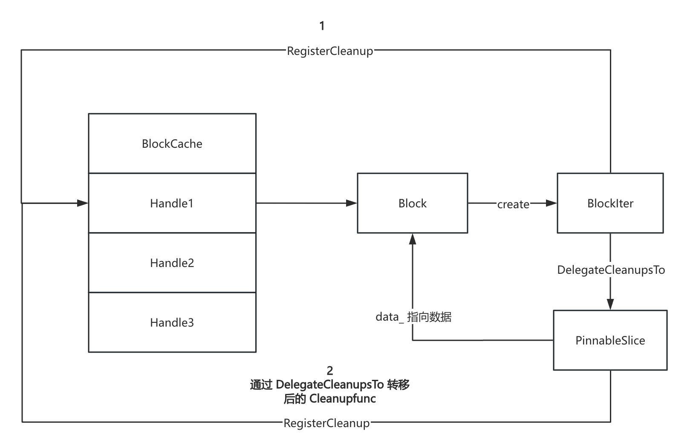

## 读流程

RocksDB 中的读取需要处理的问题是**如何读取最新的数据**。RocksDB 是基于 LSM 树，因此在对数据进行 delete 和 update 时并不会立即执行相应的操作，而是插入一条新数据，数据的最终更新以及删除是在 compact 时执行的。

获取当前列族最新的SuperVersion（包含最新的memtabe、immemtable、sst），然后按顺序分别去读memtable、immemtable、sst，只要在任何一个地方读到目标key就直接返回

rocksdb在读sst文件的时候，在L0层需要遍历所有的SST文件（因为L0的sst文件不是严格有序的），L1开始就采用二分的方式去读

```c++
virtual Status Get(const ReadOptions& options, const Slice& key,
                     std::string* value) final {
  // 从默认列族读
  return Get(options, DefaultColumnFamily(), key, value);
}

virtual inline Status Get(const ReadOptions& options,
                            ColumnFamilyHandle* column_family, const Slice& key,
                            std::string* value) final {
  // 这里用 PinnableSlice 类型的字符串，内部读取的时候减少拷贝
  PinnableSlice pinnable_val(value);
  auto s = Get(options, column_family, key, &pinnable_val);
  ...
}

Status DBImpl::GetImpl(const ReadOptions& read_options, const Slice& key,
                       GetImplOptions& get_impl_options) {
  // ...
    
  // 获取列族元数据 ColumnFamilyData
  auto cfh = static_cast_with_check<ColumnFamilyHandleImpl>(
      get_impl_options.column_family);
  auto cfd = cfh->cfd();

  // 清空缓存的 merge 操作数，确保新一次的查询不回错误使用上一次操作留下的结果
  if (get_impl_options.get_merge_operands_options != nullptr) {
    for (int i = 0; i < get_impl_options.get_merge_operands_options
                            ->expected_max_number_of_operands;
         ++i) {
      get_impl_options.merge_operands[i].Reset();
    }
  }

  // 获取最新的 SuperVersion，并增加引用计数，防止提前释放
  SuperVersion* sv = GetAndRefSuperVersion(cfd);
  if (read_options.timestamp && read_options.timestamp->size() > 0) {
    // 
    const Status s =
        FailIfReadCollapsedHistory(cfd, sv, *(read_options.timestamp));
    if (!s.ok()) {
      ReturnAndCleanupSuperVersion(cfd, sv);
      return s;
    }
  }

  // 表示本次读操作的可见版本，即最多能看到的写入操作的 Sequence Number
  SequenceNumber snapshot;
  if (read_options.snapshot != nullptr) {
    // 显式指定了 snapshot
    if (get_impl_options.callback) {
      // 用于事务上下文的读取隔离，返回事务中最大能看见的版本
      snapshot = get_impl_options.callback->max_visible_seq();
    } else {
      // 获取 snapshot 对象自身的 number_ 字段，表示快照对应的 SequenceNumber
      snapshot =
          static_cast<const SnapshotImpl*>(read_options.snapshot)->number_;
    }
  } else {
    // 默认通过 version_ 获取最新的 sequence
    snapshot = GetLastPublishedSequence();
    if (get_impl_options.callback) {
      // 如果设置了 callback，说明在进行事务读取，需要判断某些 key 在读请求下是否可见
 
      // 通过 snapshot unprep_seq 更新内部的 max_visible_seq，屏蔽掉还没 commit 的写入
      // max_visible_seq = max(max_visible_seq, snapshot)
      get_impl_options.callback->Refresh(snapshot);
      snapshot = get_impl_options.callback->max_visible_seq();
    }
  }
  
  // 启用时间戳功能时，每条 key 实际上是 <user_key, timestamp, sequence>
  // 数据版本就不再单纯靠 sequence number 判断是否可见，需要确保读取操作仅返回符合时间戳约束和快照可见性条件的数据
  // t <= read_opts.timestamp and s <= snapshot.
  SaveAndRestore<ReadCallback*> restore_callback(&get_impl_options.callback);
  const Comparator* ucmp = get_impl_options.column_family->GetComparator();
  if (ucmp->timestamp_size() > 0) {
    read_cb.Refresh(snapshot);
    get_impl_options.callback = &read_cb;
  }


  // 如果之后发现 key 是一个 merge 类型的值，RocksDB 会通过 MergeContext 收集其所有 operands 合并成最终结果。
  MergeContext merge_context;
  merge_context.get_merge_operands_options =
      get_impl_options.get_merge_operands_options;
  SequenceNumber max_covering_tombstone_seq = 0;

  Status s;
  // 构造 key，包含了 user key、snap shot、timestamp
  LookupKey lkey(key, snapshot, read_options.timestamp);

  bool skip_memtable = (read_options.read_tier == kPersistedTier &&
                        has_unpersisted_data_.load(std::memory_order_relaxed));
  bool done = false;
  std::string* timestamp =
      ucmp->timestamp_size() > 0 ? get_impl_options.timestamp : nullptr;
  /*
  read 流程：
  	1. memtable
  	2. immemtable
  	3. sst
  */
  if (!skip_memtable) {
    // 常规的 get 场景，获取 value
    if (get_impl_options.get_value) {
      // 读 memtable
      if (sv->mem->Get(
              lkey,
              get_impl_options.value ? get_impl_options.value->GetSelf()
                                     : nullptr,
              get_impl_options.columns, timestamp, &s, &merge_context,
              &max_covering_tombstone_seq, read_options,
              false /* immutable_memtable */, get_impl_options.callback,
              get_impl_options.is_blob_index)) {
        done = true;

        if (get_impl_options.value) {
          get_impl_options.value->PinSelf();
        }
        // 读 immemtable
      } else if ((s.ok() || s.IsMergeInProgress()) &&
                 sv->imm->Get(lkey,
                              get_impl_options.value
                                  ? get_impl_options.value->GetSelf()
                                  : nullptr,
                              get_impl_options.columns, timestamp, &s,
                              &merge_context, &max_covering_tombstone_seq,
                              read_options, get_impl_options.callback,
                              get_impl_options.is_blob_index)) {
        done = true;

        if (get_impl_options.value) {
          get_impl_options.value->PinSelf();
        }

        RecordTick(stats_, MEMTABLE_HIT);
      }
    } else {
      // 获取原始 Merge Operands 的特殊读取逻辑，不返回最终的 value，而是只收集 MergeOperands 到 merge_context 中，不执行合并操作
      if (sv->mem->Get(lkey, /*value=*/nullptr, /*columns=*/nullptr,
                       /*timestamp=*/nullptr, &s, &merge_context,
                       &max_covering_tombstone_seq, read_options,
                       false /* immutable_memtable */, nullptr, nullptr,
                       false)) {
        done = true;
      } else if ((s.ok() || s.IsMergeInProgress()) &&
                 sv->imm->GetMergeOperands(lkey, &s, &merge_context,
                                           &max_covering_tombstone_seq,
                                           read_options)) {
        done = true;
      }
    }
    if (!s.ok() && !s.IsMergeInProgress() && !s.IsNotFound()) {
      assert(done);
      ReturnAndCleanupSuperVersion(cfd, sv);
      return s;
    }
  }

  PinnedIteratorsManager pinned_iters_mgr;
  if (!done) {
    // 从 sst 文件中查找
    sv->current->Get(
        read_options, lkey, get_impl_options.value, get_impl_options.columns,
        timestamp, &s, &merge_context, &max_covering_tombstone_seq,
        &pinned_iters_mgr,
        get_impl_options.get_value ? get_impl_options.value_found : nullptr,
        nullptr, nullptr,
        get_impl_options.get_value ? get_impl_options.callback : nullptr,
        get_impl_options.get_value ? get_impl_options.is_blob_index : nullptr,
        get_impl_options.get_value);
  }

  {
    size_t size = 0;
    if (s.ok()) {
      const auto& merge_threshold = read_options.merge_operand_count_threshold;
      if (merge_threshold.has_value() &&
          merge_context.GetNumOperands() > merge_threshold.value()) {
        // 判断 merge 操作数是否超过阀值
        s = Status::OkMergeOperandThresholdExceeded();
      }

      if (get_impl_options.get_value) {
        // 常规 get value 的处理逻辑
        
        // 获取 value 或 columns 大小
        if (get_impl_options.value) {
          size = get_impl_options.value->size();
        } else if (get_impl_options.columns) {
          size = get_impl_options.columns->serialized_size();
        }
      } else {
        // merge 的处理逻辑
        
        // 获取 merge 的操作数量
        *get_impl_options.number_of_operands =
            static_cast<int>(merge_context.GetNumOperands());
        if (*get_impl_options.number_of_operands >
            get_impl_options.get_merge_operands_options
                ->expected_max_number_of_operands) {
          // merge 操作数量大于分配的空间
          s = Status::Incomplete(
              Status::SubCode::KMergeOperandsInsufficientCapacity);
        } else {
          bool ref_sv = ShouldReferenceSuperVersion(merge_context);
          if (ref_sv) {
            // merge 操作将多个 operand 暂存到 merge_context 中，operand 里保存的是 Slice
            // 需要延长资源的生命周期，如 SST 文件或未刷新到磁盘的 Memtable
            // 对资源的生命周期进行管理，将所有资源打包成一个对象 GetMergeOperandsState，由 SharedCleanablePtr 统一管理。
            SharedCleanablePtr shared_cleanable;
            GetMergeOperandsState* state = nullptr;
            state = new GetMergeOperandsState();
            state->merge_context = std::move(merge_context);
            state->pinned_iters_mgr = std::move(pinned_iters_mgr);

            // 增加 SuperVersion 的引用计数
            sv->Ref();
            state->sv_handle = new SuperVersionHandle(
                this, &mutex_, sv,
                immutable_db_options_.avoid_unnecessary_blocking_io);

            shared_cleanable.Allocate();
            // 清理逻辑，确保使用完毕后自动释放资源
            shared_cleanable->RegisterCleanup(CleanupGetMergeOperandsState,
                                              state /* arg1 */,
                                              nullptr /* arg2 */);
            for (size_t i = 0; i < state->merge_context.GetOperands().size();
                 ++i) {
              const Slice& sl = state->merge_context.GetOperands()[i];
              size += sl.size();

              // 通过 PinSlice 将每个 Slice 固定 get_impl_options 提供的缓冲区中
              get_impl_options.merge_operands->PinSlice(
                  sl, nullptr /* cleanable */);
              if (i == state->merge_context.GetOperands().size() - 1) {
                // 如果是最后一个操作数，将资源清理的责任完全转移给最后一个操作数关联的 cleanable 对象，当最后一个操作数被用户释放时，其 Cleanable 链自动执行清理回调
                shared_cleanable.MoveAsCleanupTo( get_impl_options.merge_operands);
              } else {
                // 非最后一个操作数，复制清理逻辑到当前操作数关联的 cleanable，确保每个操作数释放时都能独立出发资源回收
                shared_cleanable.RegisterCopyWith(
                    get_impl_options.merge_operands);
              }
              // 递增指针，准备写入下一个操作数
              get_impl_options.merge_operands++;
            }
          
          } else {
            for (const Slice& sl : merge_context.GetOperands()) {
              size += sl.size();
              get_impl_options.merge_operands->PinSelf(sl);
              get_impl_options.merge_operands++;
            }
          }
        }
      }

    }

    // SuperVersion 资源的回收
    ReturnAndCleanupSuperVersion(cfd, sv);

  }
  return s;
}
```

在 [memtable](../ch02/RocksDB_MemTable.md) 和 [sst](../ch02/RocksDB_SST.md) 的章节中对具体的 Get 操作有相关介绍


### PinnableSlice 

PinnableSlice 用于减少数据在引擎内部传递时的内存复制开销

- 先在 BlockCache 中查找，看有没有缓存需要的 Block 对象的指针，如果有就直接返回 Block 对象地址

- 如果 BlockCache 中没找到，则发生磁盘 io，在 sst 文件中读取对应 Block 的内容，构造 Block 对象并将其地址缓存 BlockCache 中

#### 局限性

在处理大量 Value 时，仍然存在着性能问题，如以下的场景

1. 当一个 key 被频繁更新，导致存在大量的 version 时，用户执行一个操作（如范围扫描、带有过滤条件的查询）需要便利这些版本
2. 当存在大量的 Tombstones 时（表示 key 已被删除的特殊标记），操作需要扫描包含大量已删除 key 的区域

操作本身可能只需要最终有效的 value，然而 PinnableSlice 本身不能区分哪些 value 时被最终需要的，导致**即使这些数据不会被实际返回给用户，当这些数据不在 BlockCache 中时，PinnableSlice 为了获取其引用，仍然会触发对这些 value 数据块的磁盘 I/O 读取操作**。


### Cleannable

用户通过 Block 对象获取值，Block 缓存在 BlockCache 中，用户需要确保 Block 不被淘汰。

1. 通过 RegisterCleanup 方法来注册 CleanupFunction，CleanupFunction 用户自定义，一般是完成 Cleannable 对象申请的外部资源释放，例如释放某块之前申请的内存
2. 当其对象被析构时，会依次调用所有之前注册的 CleanupFunction，来完成外部资源释放
3. 两个 Cleannable 子类对象 A，B，可以通过 DelegateCleanupsTo，将 A 注册的所有 CleanupFunction 委托给 B，这样 A 在析构时就不会释放它申请的外部资源，而是等到 B 析构时才释放



Block 有对应的 BlockIter，BlockCache 有 Handle 指向对应的 Block。BlockIter 的生命周期很短，使用其在 Block 中查找指定 key 之后，他的作用域结束。

1. 在 BlockIter 退出作用域之前，会通过 DelegateCleanupsTo 将其CleanupFunction 委托给用户传入的 PinnableSlice，这样便延长了对应 BlockCache 中 Handle 的生命周期，从而延长了对应的 Block 的生命周期，
2. 直到用户的 PinnableSlice 退出作用域时，才最终回调之前 BlockIter 通过 RegisterCleanup 注册的 CleanupFunction 来进行最终的资源释放，
3. 通过这种方式保证 BlockIter 析构时，会 Release 掉 BlockCache 中的对应的 Handle，而 Handle 被 Release 则会回调对应 Block 的 deleter 来最终释放 Block。

```c++
struct Cleanup {
    CleanupFunction function;
    void* arg1;
    void* arg2;
    Cleanup* next;
};

void Cleanable::DelegateCleanupsTo(Cleanable* other) {
  assert(other != nullptr);
  if (cleanup_.function == nullptr) {
    return;
  }
  // 将头部的清理项注册到 other
  Cleanup* c = &cleanup_;
  other->RegisterCleanup(c->function, c->arg1, c->arg2);
  c = c->next;
  while (c != nullptr) {
    // 遍历剩余节点，逐个注册到 other
    Cleanup* next = c->next;
    other->RegisterCleanup(c);
    c = next;
  }
  // 清空当前链表
  cleanup_.function = nullptr;
  cleanup_.next = nullptr;
}

void Cleanable::RegisterCleanup(Cleanable::Cleanup* c) {
  assert(c != nullptr);
  if (cleanup_.function == nullptr) {
    // 当前链表为空，复用函数指针和参数
    cleanup_.function = c->function;
    cleanup_.arg1 = c->arg1;
    cleanup_.arg2 = c->arg2;
    // 删除传入的节点（所有权转移）
    delete c;
  } else {
    // 链表非空，将对象插入头部之后
    c->next = cleanup_.next;
    cleanup_.next = c;
  }
}

void Cleanable::RegisterCleanup(CleanupFunction func, void* arg1, void* arg2) {
  assert(func != nullptr);
  Cleanup* c;
  if (cleanup_.function == nullptr) {
    // 链表为空，复用头节点
    c = &cleanup_;
  } else {
    // 在堆上创建节点，插入头部之后
    c = new Cleanup;
    c->next = cleanup_.next;
    cleanup_.next = c;
  }
  c->function = func;
  c->arg1 = arg1;
  c->arg2 = arg2;
}

```


### SharedCleanablePtr

用于管理 Cleanable 对象生命周期的定制化智能指针

```c++
class SharedCleanablePtr {
public:
  ...
  void RegisterCopyWith(Cleanable* target);
  void MoveAsCleanupTo(Cleanable* target);
  
  Cleanable& operator*() { return *ptr_; }
  Cleanable* operator->() { return ptr_; }

private:
  struct Impl;
  Impl* ptr_ = nullptr;
};


struct SharedCleanablePtr::Impl : public Cleanable {
  std::atomic<unsigned> ref_count{1};  
  void Ref() { ref_count.fetch_add(1, std::memory_order_relaxed); }
  void Unref() {
    if (ref_count.fetch_sub(1, std::memory_order_relaxed) == 1) {
      delete this;
    }
  }
  static void UnrefWrapper(void* arg1, void* /*arg2*/) {
    static_cast<SharedCleanablePtr::Impl*>(arg1)->Unref();
  }
};


void SharedCleanablePtr::RegisterCopyWith(Cleanable* target) {
  if (ptr_) {
    // 增加引用计数，共享所有权，使 target 成为资源的持有者
    ptr_->Ref();
    target->RegisterCleanup(&Impl::UnrefWrapper, ptr_, nullptr);
  }
}

void SharedCleanablePtr::MoveAsCleanupTo(Cleanable* target) {
  if (ptr_) {
    // 将当前资源的清理任务转移给 target
    target->RegisterCleanup(&Impl::UnrefWrapper, ptr_, nullptr);
    // 放弃所有权
    ptr_ = nullptr;
  }
}
```


