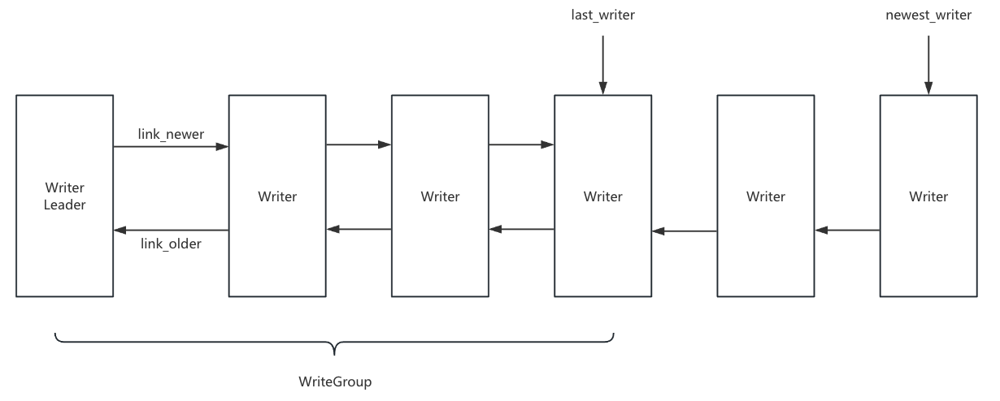
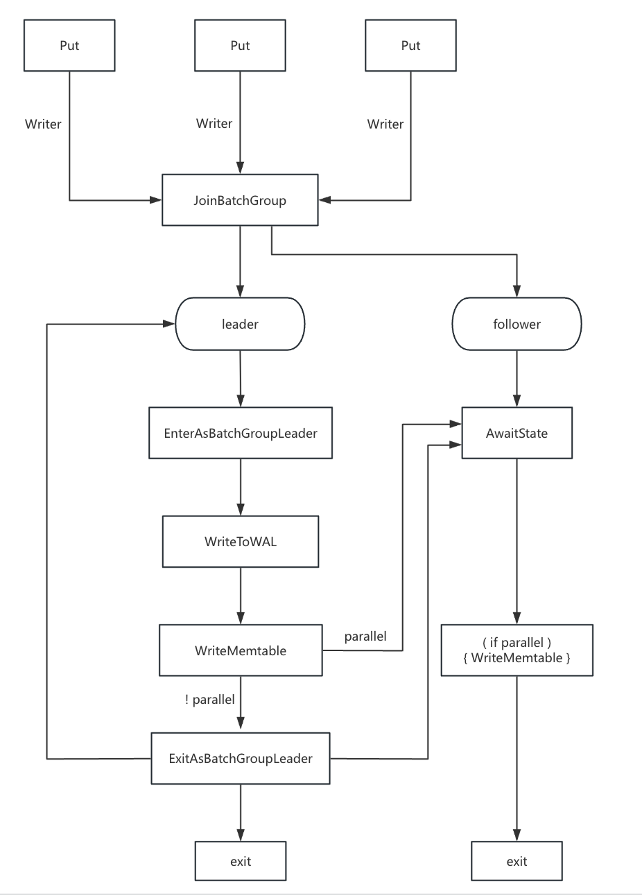

## 写流程

用户通过 DB::Open 方法按 rocksdb::Options 给出的配置打开一个 db 实例，然后调用 DB  实例的 Put 或 Write 方法发出写请求，实现上会统一调用到 DBImpl::WriteImpl 方法。每个写请求会封装成一个 Writer 实例加入写请求双向链表的尾部，如果已经有正在处理的写请求就挂起本线程等待被 group commit 顺带处理，或者被唤醒作为下次 group commit 的 leader 线程去批量处理链表头部的写请求。





### WriteThread

每个 rocksdb::DB 实例有一个 WriteThread 成员来维护写请求队列的状态。每个写请求封装成一个 WriteThread::Writer 实例，依次加入写请求构成的双向链表尾部。

状态转换：

1. 写入请求：
   - 如果成为 leader：`STATE_INIT → STATE_GROUP_LEADER`
   - 如果需要等待 leader：`STATE_INIT → STATE_LOCKED_WAITING`
2. 构建  group：
   - `STATE_GROUP_LEADER → STATE_MEMTABLE_WRITER_LEADER`
3. 执行写入：
   - 顺序写入：`STATE_MEMTABLE_WRITER_LEADER → STATE_COMPLETED`
   - 并行写入：`STATE_INIT → STATE_GROUP_LEADER → STATE_MEMTABLE_WRITER_LEADER → (STATE_PARALLEL_MEMTABLE_WRITER) → STATE_COMPLETED`
4. 完成写入：
   - `STATE_COMPLETED → 线程退出`

```c++
class WriteThread {
  enum State : uint8_t {
    // 新写入任务的初始状态，此时 Writer 正在 JoinBatchGroup
    STATE_INIT = 1,
    STATE_GROUP_LEADER = 2,
    STATE_MEMTABLE_WRITER_LEADER = 4,
    STATE_PARALLEL_MEMTABLE_WRITER = 8,
    STATE_COMPLETED = 16,
    // 等待释放锁或者等待批量写入的结果
    STATE_LOCKED_WAITING = 32,
    // 调用其他 Writer 执行 Memtable 的写入
    STATE_PARALLEL_MEMTABLE_CALLER = 64,
  }
  struct WriteGroup {
    // 双向链表
    Writer* leader = nullptr;
    Writer* last_writer = nullptr;
    // 存储该批量写入组的最后一个写入序列号
    SequenceNumber last_sequence;
    // 存储 WriteGroup 的执行状态,需要用锁保证正在写入的过程中不能修改此状态
    Status status;
    // 当前正在执行写入的线程数量
    std::atomic<size_t> running;
    // 该 WriteGroup 中包含的 Writer 线程数量
    size_t size = 0;
    struct Iterator {
      ...
    }
    ...
  }
  struct Writer{
    // 本次写入的数据
    WriteBatch* batch;
    // 当前 Writer 的状态
    std::atomic<uint8_t> state; 
    // 该 Writer 所属的 WriteGroup
    WriteGroup* write_group;
    // 该 Writer 事务的起始 SequenceNumber
    SequenceNumber sequence;  
    // 双向链表，管理写入队列
    Writer* link_older; 
    Writer* link_newer; 
    ...
  }
  // 单个批量写入事务的最大字节数
  const uint64_t max_write_batch_group_size_bytes;
  // 并行 memtable 写入
  const bool allow_concurrent_memtable_write_;
  // 流水线写入（WAL 和 Mematble 解藕，可以让 MemTable 写入与 WAL 写入并行执行）
  const bool enable_pipelined_write_;
  // 仅在 enable_pipelined_write_ = true 时使用，表示最新等待写入 MemTable 的 Writer
  std::atomic<Writer*> newest_memtable_writer_;
  // WriteGroup 最新加入的 Writer，用来管理 Writer 线程的链表
  std::atomic<Writer*> newest_writer_;
  // 最近被 Writer 使用的事务序列号
  SequenceNumber last_sequence_;
  // 写入阻塞，作为占位符，防止 Follower 线程加入 WriteGroup
  Writer write_stall_dummy_;
  ...
}

// 将 Writer 线程加入 WriteGroup ，并确定该 Writer 线程的角色（Leader 或 Follower）
void WriteThread::JoinBatchGroup(Writer* w) {
  // 将新的 writer 放入到链表尾部，即 newest_writer_ 后面，并成为新的 newest_writer_
  bool linked_as_leader = LinkOne(w, &newest_writer_);
  // 如果是 leader，就设置该 w 为 LEADER 状态
  if (linked_as_leader) {
    SetState(w, STATE_GROUP_LEADER);
  }
  // 如果不是 leader，就阻塞等待，直到该 w 成为 leader 或者已经被其他 leader 完成写入
  // 1. 新的 Leader 选中 w 作为下一个 Leader（上一批写入完成后，w 变成 Leader）
  // 2. w 被 Leader 选中为 Follower(Leader 完成写入或者需要并行写入 Memtable)
  // 3. w 进入 pipelined write 模式（Leader 完成 w 的 WAL 写入，并将 w 放入等待队列）
  if (!linked_as_leader) {
    AwaitState(w,
               STATE_GROUP_LEADER | STATE_MEMTABLE_WRITER_LEADER |
                   STATE_PARALLEL_MEMTABLE_CALLER |
                   STATE_PARALLEL_MEMTABLE_WRITER | STATE_COMPLETED,
               &jbg_ctx);
  }
}

// 将 Writer 连接到 WriteGroup 中
bool WriteThread::LinkOne(Writer* w, std::atomic<Writer*>* newest_writer) {
  Writer* writers = newest_writer->load(std::memory_order_relaxed);
  
  // 此处省略了 write_stall_dummy_ 的逻辑，出现就会阻塞等待唤醒
    
  // 将新的写入 w 添加到 newest_writer 后面
  w->link_older = writers;
  if (newest_writer->compare_exchange_weak(writers, w)) {
    return (writers == nullptr);
  }
}

// 用于确定 Leader 应该包含哪些 Writer，并构建 WriteGroup
size_t WriteThread::EnterAsBatchGroupLeader(Writer* leader,
                                            WriteGroup* write_group) {
  // 若 Leader 的 WriteBatch 小于 1/8 的最大批量写入限制，调整 max_size，防止 Leader 一直等不到足够的 Follower 事务
  size_t size = WriteBatchInternal::ByteSize(leader->batch);
  size_t max_size = max_write_batch_group_size_bytes;
  const uint64_t min_batch_size_bytes = max_write_batch_group_size_bytes / 8;
  if (size <= min_batch_size_bytes) {
    max_size = size + min_batch_size_bytes;
  }

  // 设置 Leader 线程的 WriteGroup，刚开始 group 的头尾指针 leader、last_writer 都指向 leader
  leader->write_group = write_group;
  write_group->leader = leader;
  write_group->last_writer = leader;
  write_group->size = 1;
  
  // 从 newest_writer 开始，连接一组 group 的 writer
  Writer* newest_writer = newest_writer_.load(std::memory_order_acquire);
  CreateMissingNewerLinks(newest_writer);

  Writer* w = leader;
  // WriteGroup 的最后一个 Writer
  Writer* we = leader;
  // 存储不兼容的 Writer，稍后重新加入 Writer 链表
  Writer* rb = nullptr;
  Writer* re = nullptr;

  // 只要当前 w 不是 newest_writer 就会一直循环
  while (w != newest_writer) {
    w = w->link_newer;
     
    // 下面有很多 if 判断，主要是判断当前 w 的属性和 leader 的写入属性是否相同和
    // 是否超过最大写入大小，满足条件就结束 group 的生成
    // 相同写入属性的 writer 才能放在一组，这样才能由 leader 代写
    if (...) {
      // 移除不兼容 Writer 并存入 r_list
      w->link_older->link_newer = w->link_newer;
      if (w->link_newer != nullptr) {
        w->link_newer->link_older = w->link_older;
      }
      if (re == nullptr) {
        rb = re = w;
        w->link_older = nullptr;
      } else {
        w->link_older = re;
        re->link_newer = w;
        re = w;
      }
    } else {
      // w 可以加入 WriteGroup
      we = w;
      // 更新该 group 的大小和 last_writer 的位置
      w->write_group = write_group;
      size += WriteBatchInternal::ByteSize(w->batch);
      write_group->last_writer = w;
      write_group->size++;
    }
  }
  // r_list 重新连接到 WriteGroup 末尾
  if (rb != nullptr) {
    rb->link_older = we;
    re->link_newer = nullptr;
    we->link_newer = rb;
    // 如果 newest_writer_ 已经被别的线程修改，需要将不兼容的 Writer 列表放到
    // 在此次更新 group 过程中新加的 Writer 的前面，保证写入顺序正确
    if (!newest_writer_.compare_exchange_weak(w, re)) {
      while (w->link_older != newest_writer) {
        w = w->link_older;
      }
      w->link_older = re;
    }
  }
  return size;
}

void WriteThread::CreateMissingNewerLinks(Writer* head) {
   // 从后向前，将所有 writer 用 link_older（指向前一个）和 link_newer（指向后一个）连起来，形成双向链表
  while (true) {
    Writer* next = head->link_older;
    if (next == nullptr || next->link_newer != nullptr) {
      assert(next == nullptr || next->link_newer == head);
      break;
    }
    next->link_newer = head;
    head = next;
  }
}

void WriteThread::ExitAsBatchGroupLeader(WriteGroup& write_group,
                                         Status& status) {
  Writer* leader = write_group.leader;
  Writer* last_writer = write_group.last_writer;

  if (enable_pipelined_write_) {
    // pipelined_write 模式下需确保 Writer 线程的执行顺序不会被打乱
    // 解决方案：
    // 1. 在 write_group 之前插入一个 dummy Writer
    // 2. 进行 write_group 的解绑，处理 write_group 中的所有写入者，完成它们的写入
    // 3. 移除 dummy Writer
    Writer dummy;
    Writer* head = newest_writer_.load(std::memory_order_acquire);
    if (head != last_writer ||
        !newest_writer_.compare_exchange_strong(head, &dummy)) {
      // 当前 group 写入期间可能会有新的 writer，同样把所有 writer 双向连接起来
      CreateMissingNewerLinks(head);
      last_writer->link_newer->link_older = &dummy;
      dummy.link_newer = last_writer->link_newer;
    }

    // 设置不需要写入 memtable 的 Writer 状态为 Complete 并从 group 中移除
    for (Writer* w = last_writer; w != leader;) {
      Writer* next = w->link_older;
      w->status = status;
      if (!w->ShouldWriteToMemtable()) {
        CompleteFollower(w, write_group);
      }
      w = next;
    }
    if (!leader->ShouldWriteToMemtable()) {
      CompleteLeader(write_group);
    }

    // 将 WriteGroup 放入到 memtable-writer-list
    if (write_group.size > 0) {
      if (LinkGroup(write_group, &newest_memtable_writer_)) {
        SetState(write_group.leader, STATE_MEMTABLE_WRITER_LEADER);
      }
    }

    // 清理 dummy
    head = newest_writer_.load(std::memory_order_acquire);
    if (head != &dummy ||
        !newest_writer_.compare_exchange_strong(head, nullptr)) {
      // 如果此链表除了当前的 group 之外还有 writer
      CreateMissingNewerLinks(head);
      // 设置第一个 writer 为下一组的 leader
      Writer* new_leader = dummy.link_newer;
      new_leader->link_older = nullptr;
      SetState(new_leader, STATE_GROUP_LEADER);
    }
    // 阻塞当前线程，直到 leader 进入合适状态
    AwaitState(leader,
               STATE_MEMTABLE_WRITER_LEADER | STATE_PARALLEL_MEMTABLE_CALLER |
                   STATE_PARALLEL_MEMTABLE_WRITER | STATE_COMPLETED,
               &eabgl_ctx);
  } else {
    Writer* head = newest_writer_.load(std::memory_order_acquire);
    if (head != last_writer ||
        !newest_writer_.compare_exchange_strong(head, nullptr)) {
      CreateMissingNewerLinks(head);
      // 将当前 group 从链表移除
      last_writer->link_newer->link_older = nullptr;
      // 设置当前完成写入 group 的 last_writer 的下一个 writer 为下一个 group的 leader
      SetState(last_writer->link_newer, STATE_GROUP_LEADER);
    }
    
    //依次遍历当前 group，设置状态为 STATE_COMPLETED，从而唤醒其他 writer
    while (last_writer != leader) {
      last_writer->status = status;
      auto next = last_writer->link_older;
      SetState(last_writer, STATE_COMPLETED);
      last_writer = next;
    }
  }
}

```

### 写入流程

rocksdb 每一次写入操作会**把一次写入（可能含有多个具体的操作）打包成一个 write batch（支持写事务），然后为每个 write batch 配置一个写线程**。rocksdb 支持多线程并发写入，在多个写线程中会选出一个 leader，其他的则为 follower，**由 leader 去负责这一批次的 WAL 写入**，后续根据用户设置不同进行不同操作

- 使用高并发度的设置：leader 线程就会唤醒所有在等待的 follower 线程，然后所有线程一起并发写  memtable，等到所有线程全部写入完成，leader 线程就会唤醒组织下一批写入的正在等待的新 leader 线程，然后退出
- 使用低并发度的设置：leader 线程会按照串行的方式将 WriteBatch 中的操作写入 memtable，然后按照与上述逻辑相同的方式退出。

```c++
Status DB::Put(const WriteOptions& opt, ColumnFamilyHandle* column_family,
               const Slice& key, const Slice& value) {
  // 将 key value 封装到一个 batch 内参与写入
  // 8 字节为 WriteBatch 头部，4 字节用于存储操作计数
  // 1 字节用于存储操作类型，11 字节是为键和值的长度分配的空间
  WriteBatch batch(key.size() + value.size() + 24, 0 /* max_bytes */,
                   opt.protection_bytes_per_key, 0 /* default_cf_ts_sz */);
  Status s = batch.Put(column_family, key, value);
  if (!s.ok()) {
    return s;
  }
  return Write(opt, &batch);
}

Status DBImpl::Write(const WriteOptions& write_options, WriteBatch* my_batch) {
  ...
  return WriteImpl(write_options, my_batch, /*callback=*/nullptr,
                  /*user_write_cb=*/nullptr,
                  /*log_used=*/nullptr);
}

Status DBImpl::WriteImpl(const WriteOptions& write_options,
                         WriteBatch* my_batch, WriteCallback* callback,
                         UserWriteCallback* user_write_cb, uint64_t* log_used,
                         uint64_t log_ref, bool disable_memtable,
                         uint64_t* seq_used, size_t batch_cnt,
                         PreReleaseCallback* pre_release_callback,
                         PostMemTableCallback* post_memtable_callback) {
  // ...
  
  if (two_write_queues_ && disable_memtable) {
    AssignOrder assign_order =
        seq_per_batch_ ? kDoAssignOrder : kDontAssignOrder;
    // 只写入 WAL
    return WriteImplWALOnly(
        &nonmem_write_thread_, write_options, my_batch, callback, user_write_cb,
        log_used, log_ref, seq_used, batch_cnt, pre_release_callback,
        assign_order, kDontPublishLastSeq, disable_memtable);
  }

  // 启用了 unordered_write 时，unordered_write 允许 RocksDB 在不同线程间无序执行写入
  if (immutable_db_options_.unordered_write) {
    const size_t sub_batch_cnt = batch_cnt != 0
                                     ? batch_cnt
                                     : WriteBatchInternal::Count(my_batch);
    uint64_t seq = 0;
   
    // 采用特殊的 WAL 先写模式
    Status status = WriteImplWALOnly(
        &write_thread_, write_options, my_batch, callback, user_write_cb,
        log_used, log_ref, &seq, sub_batch_cnt, pre_release_callback,
        kDoAssignOrder, kDoPublishLastSeq, disable_memtable);
    if (!status.ok()) {
      return status;
    }
    if (seq_used) {
      *seq_used = seq;
    }
    // 写入 memtable
    if (!disable_memtable) {
      status = UnorderedWriteMemtable(write_options, my_batch, callback,
                                      log_ref, seq, sub_batch_cnt);
    }
    return status;
  }

  // 流水线写入模式，将写入采用分批处理
  if (immutable_db_options_.enable_pipelined_write) {
    return PipelinedWriteImpl(write_options, my_batch, callback, user_write_cb,
                              log_used, log_ref, disable_memtable, seq_used);
  }


  // writer 代表写入队列中的一个写操作
  WriteThread::Writer w(write_options, my_batch, callback, user_write_cb,
                        log_ref, disable_memtable, batch_cnt,
                        pre_release_callback, post_memtable_callback);

  // 加入 group 进行批量处理，成为 leader 的 w 会成功返回，否则在内部阻塞等待唤醒
  write_thread_.JoinBatchGroup(&w);
  if (w.state == WriteThread::STATE_PARALLEL_MEMTABLE_CALLER) {
    // 并发写 memtable 情况，均匀分配写入任务
    write_thread_.SetMemWritersEachStride(&w);
  }
  if (w.state == WriteThread::STATE_PARALLEL_MEMTABLE_WRITER) {
     // 并发写 memtable 情况
    if (w.ShouldWriteToMemtable()) {
      ColumnFamilyMemTablesImpl column_family_memtables(
          versions_->GetColumnFamilySet());
      w.status = WriteBatchInternal::InsertInto(
          &w, w.sequence, &column_family_memtables, &flush_scheduler_,
          &trim_history_scheduler_,
          write_options.ignore_missing_column_families, 0 /*log_number*/, this,
          true /*concurrent_memtable_writes*/, seq_per_batch_, w.batch_cnt,
          batch_per_txn_, write_options.memtable_insert_hint_per_batch);
    }

    if (write_thread_.CompleteParallelMemTableWriter(&w)) {
      // 确保所有线程并行写入任务完成后，退出 BatchGroup
      auto last_sequence = w.write_group->last_sequence;
      for (auto* tmp_w : *(w.write_group)) {
        if (tmp_w->post_memtable_callback) {
          Status tmp_s =
              (*tmp_w->post_memtable_callback)(last_sequence, disable_memtable);
        }
      }
      versions_->SetLastSequence(last_sequence);
      MemTableInsertStatusCheck(w.status);
      write_thread_.ExitAsBatchGroupFollower(&w);
    }
    
    // 确保写入 WAL、MemTable 以及回调操作均已完成
    assert(w.state == WriteThread::STATE_COMPLETED);
  }
  
  if (w.state == WriteThread::STATE_COMPLETED) {
    // 前面调用 JoinBatchGroup 后，follower 会阻塞        
    // 等待同 group 的 leader 写完成后，唤醒的 writer 会从这里返回写入操作完成
    return w.FinalStatus();
  }
  
  // 下面只有leader会走到
  assert(w.state == WriteThread::STATE_GROUP_LEADER);
  Status status;
  LogContext log_context(write_options.sync);
  WriteThread::WriteGroup write_group;
  bool in_parallel_group = false;
  uint64_t last_sequence = kMaxSequenceNumber;

  {
    // 进行写入前的准备工作，包括：            
    // WAL 文件大小是否超过 max_total_wal_size，是则需要切换 WAL 文件            
    // memtable 占用内存超过阈值，是则需要 flush
    status = PreprocessWrite(write_options, &log_context, &write_context);
    if (!two_write_queues_) {
      // 获取当前最新的 version 里的最后 sequence，为接下来的写入操作递增赋值 sequence
      last_sequence = versions_->LastSequence();
    }
  }

  // 作为一个 leader 完成该 group 的成员的确定，    
  // 包括 group 大小、writer 个数和连接、last_writer_ 位置
  last_batch_group_size_ =
      write_thread_.EnterAsBatchGroupLeader(&w, &write_group);

  IOStatus io_s;
  Status pre_release_cb_status;
  if (status.ok()) {
    // ... 统计本次写入的一些概要信息
          
    // 计算本次写入要消耗多少 seq（rocksdb 中每个写入操作需要 seq 保证顺序）
    size_t seq_inc = seq_per_batch_ ? valid_batches : total_count;

    // ...

    if (!two_write_queues_) {
      // 使用单队列写入
      if (status.ok() && !write_options.disableWAL) {
        LogFileNumberSize& log_file_number_size =
            *(log_context.log_file_number_size);
         //写WAL
        io_s =
            WriteToWAL(write_group, log_context.writer, log_used,
                       log_context.need_log_sync, log_context.need_log_dir_sync,
                       last_sequence + 1, log_file_number_size);
      }
    } else {
      // 使用两个并行写入队列
      if (status.ok() && !write_options.disableWAL) {
        io_s = ConcurrentWriteToWAL(write_group, log_used, &last_sequence,
                                    seq_inc);
      } else {
        last_sequence = versions_->FetchAddLastAllocatedSequence(seq_inc);
      }
    }
    
    status = io_s;
    const SequenceNumber current_sequence = last_sequence + 1;
    last_sequence += seq_inc;

    if (log_context.need_log_sync) {
      // 同步日志
      VersionEdit synced_wals;
      log_write_mutex_.Lock();
      if (status.ok()) {
        // 写入操作成功，标记 WAL 已经同步到磁盘
        MarkLogsSynced(logfile_number_, log_context.need_log_dir_sync,
                       &synced_wals);
      } else {
        MarkLogsNotSynced(logfile_number_);
      }
      log_write_mutex_.Unlock();
      if (status.ok() && synced_wals.IsWalAddition()) {
        // 将 WAL 的内容同步到 manifest 中
        InstrumentedMutexLock l(&mutex_);
        const ReadOptions read_options;
        status = ApplyWALToManifest(read_options, write_options, &synced_wals);
      }
 
      if (status.ok() && two_write_queues_) {
        // 如果启用了双写队列，自行决定手动持久化还是异步持久化 WAL
        if (manual_wal_flush_) {
          status = FlushWAL(true);
        } else {
          status = SyncWAL();
        }
      }
    }

    if (status.ok()) {
      SequenceNumber next_sequence = current_sequence;
      size_t index = 0;
      for (auto* writer : write_group) {
        // 为每个操作赋值 sequence，确保 Writer 的数据在 MemTable 里的顺序与 WAL 里的一致
        writer->sequence = next_sequence;
        // ... 
        // 计算下一个 seq
        if (seq_per_batch_) {
          next_sequence += writer->batch_cnt;
        } else if (writer->ShouldWriteToMemtable()) {
          next_sequence += WriteBatchInternal::Count(writer->batch);
        }
      }
    }

    if (status.ok()) {
      if (!parallel) {
        // 顺序写 memtable
        w.status = WriteBatchInternal::InsertInto(
            write_group, current_sequence, column_family_memtables_.get(),
            &flush_scheduler_, &trim_history_scheduler_,
            write_options.ignore_missing_column_families,
            0 /*recovery_log_number*/, this, parallel, seq_per_batch_,
            batch_per_txn_);
      } else {
        // 并行写入 memtable
        write_group.last_sequence = last_sequence;
        write_thread_.LaunchParallelMemTableWriters(&write_group);
        in_parallel_group = true;

        if (w.ShouldWriteToMemtable()) {
          ColumnFamilyMemTablesImpl column_family_memtables(
              versions_->GetColumnFamilySet());
          w.status = WriteBatchInternal::InsertInto(
              &w, w.sequence, &column_family_memtables, &flush_scheduler_,
              &trim_history_scheduler_,
              write_options.ignore_missing_column_families, 0 /*log_number*/,
              this, true /*concurrent_memtable_writes*/, seq_per_batch_,
              w.batch_cnt, batch_per_txn_,
              write_options.memtable_insert_hint_per_batch);
        }
      }
      if (seq_used != nullptr) {
        *seq_used = w.sequence;
      }
    }
  }
  // ...
  bool should_exit_batch_group = true;
  if (in_parallel_group) {
    // 在并行写入 memtable 的情况下检查当前线程是否应该退出批次写入组
    should_exit_batch_group = write_thread_.CompleteParallelMemTableWriter(&w);
  }
  if (should_exit_batch_group) {
    if (status.ok()) {
      // last_sequence 是当前写入批次的最后一个 sequence number
      // 更新最新 version 的 last_sequence
      versions_->SetLastSequence(last_sequence);
    }
    MemTableInsertStatusCheck(w.status);
    // 结束当前 group 的收尾工作，包括唤醒本 group 的所有 writer
    write_thread_.ExitAsBatchGroupLeader(write_group, status);
  }
  // ...
}

```

#### Pipeline 模式

流水线写入模式，允许 **WAL 写入和 memtable 写入并行执行**

```c++
Status DBImpl::PipelinedWriteImpl(const WriteOptions& write_options,
                                  WriteBatch* my_batch, WriteCallback* callback,
                                  uint64_t* log_used, uint64_t log_ref,
                                  bool disable_memtable, uint64_t* seq_used) {
  StopWatch write_sw(env_, immutable_db_options_.statistics.get(), DB_WRITE);
  WriteContext write_context;
  WriteThread::Writer w(write_options, my_batch, callback, log_ref,
                        disable_memtable);
  write_thread_.JoinBatchGroup(&w);
  // 判断状态是否为 STATE_GROUP_LEADER
  if (w.state == WriteThread::STATE_GROUP_LEADER) {
    // ...
    // leader 选择其他 writer 加入整个 batch 中
    last_batch_group_size_ =
        write_thread_.EnterAsBatchGroupLeader(&w, &wal_write_group);
    const SequenceNumber current_sequence =
        write_thread_.UpdateLastSequence(versions_->LastSequence()) + 1;
    size_t total_count = 0;
    size_t total_byte_size = 0;
    
    // ...
    // 需要写入 WAL
    if (w.ShouldWriteToWAL()) {
      // ...
      // 写入 WAL
      w.status = WriteToWAL(wal_write_group, log_writer, log_used,
                            need_log_sync, need_log_dir_sync, current_sequence);
    }

    // batch 的 Leader 完成 WAL 的写入后退出
    write_thread_.ExitAsBatchGroupLeader(wal_write_group, w.status);
  }

  // 假如状态为 STATE_MEMTABLE_WRITER_LEADER, 即作为 memtable 的 Leader
  WriteThread::WriteGroup memtable_write_group;
  if (w.state == WriteThread::STATE_MEMTABLE_WRITER_LEADER) {
    PERF_TIMER_GUARD(write_memtable_time);
    // leader 选择其他的 writer 加入整个 batch
    write_thread_.EnterAsMemTableWriter(&w, &memtable_write_group);
    if (memtable_write_group.size > 1 &&
        immutable_db_options_.allow_concurrent_memtable_write) {
      // 假如允许并发写 memtable，leader 唤醒其他 writer 来完成各自的 memtable 写入任务
      write_thread_.LaunchParallelMemTableWriters(&memtable_write_group);
    } else {
      // 否则由 memtable 的 batch 中所设置的 leader 来完成 memtable 的写入
      memtable_write_group.status = WriteBatchInternal::InsertInto(
          memtable_write_group, w.sequence, column_family_memtables_.get(),
          &flush_scheduler_, write_options.ignore_missing_column_families,
          0 /*log_number*/, this, seq_per_batch_);
      versions_->SetLastSequence(memtable_write_group.last_sequence);
      write_thread_.ExitAsMemTableWriter(&w, memtable_write_group);
    }
  }
  if (w.state == WriteThread::STATE_PARALLEL_MEMTABLE_WRITER) {
    assert(w.ShouldWriteToMemtable());
    ColumnFamilyMemTablesImpl column_family_memtables(
        versions_->GetColumnFamilySet());
    // memtable 的写入
    w.status = WriteBatchInternal::InsertInto(
        &w, w.sequence, &column_family_memtables, &flush_scheduler_,
        write_options.ignore_missing_column_families, 0 /*log_number*/, this,
        true /*concurrent_memtable_writes*/);
    // 查看 memtable 的 batch 中的所有 writers 是否已经全部完成了写入
    if (write_thread_.CompleteParallelMemTableWriter(&w)) {
      // 假如全部完成了写入，则以 memtable 的 batch 的 leader 身份设置其他的 writer 状态，
      // 并选择下一个 memtabl 的 batch 的 leader.
      MemTableInsertStatusCheck(w.status);
      versions_->SetLastSequence(w.write_group->last_sequence);
      write_thread_.ExitAsMemTableWriter(&w, *w.write_group);
    }
  }
  if (seq_used != nullptr) {
    *seq_used = w.sequence;
  }
  return w.FinalStatus();
}
```

